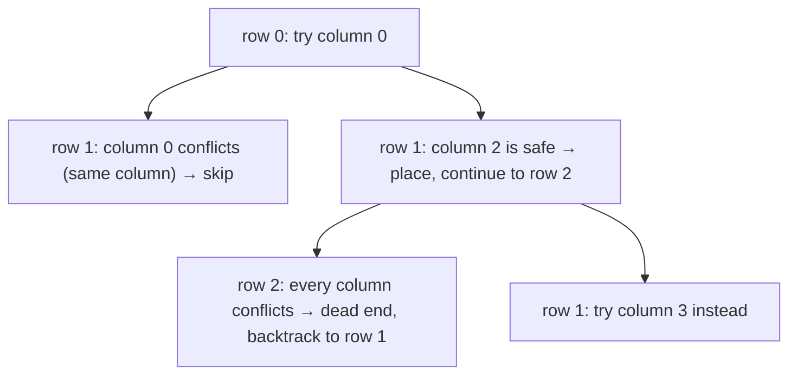

# N-Queens

**Categoría:** Backtracking

## El problema

Colocar N reinas en un tablero de ajedrez N × N de modo que ninguna par se ataque entre sí —
ninguna comparta fila, columna o diagonal. Construir cada posible colocación de una reina por fila
por completo y verificar la validez de cada una solo al final es O(n^n): el número de formas de
asignar una de las `n` columnas a cada una de las `n` filas, verificado únicamente después de que
cada asignación ya ha sido construida por completo.

## La solución

Verificar sobre la marcha en lugar de después. Colocar reinas una fila a la vez; antes de probar
una columna para la *siguiente* fila, confirmar que no entra en conflicto con ninguna reina ya
colocada. En el momento en que se encuentra un conflicto, todo ese subárbol restante — cada
colocación que se habría construido sobre esta solución parcial ya condenada — se abandona de
inmediato, sin llegar a construirse nunca. Ese es el movimiento definitorio del backtracking:
podar lo antes posible, no después del hecho. El árbol de búsqueda realmente explorado termina
siendo una fracción pequeña del espacio n^n completo, aunque nada aquí cambie la clase de
complejidad de peor caso del problema — lo que cambia es cuánto de ese peor caso se visita
realmente en la práctica.



## Ejemplo clásico

[`classic/NQueens`](src/main/java/com/algorithms/backtracking/nqueens/classic/NQueens.java)
implementa la búsqueda por backtracking fila a fila, más `bruteForceCountSolutions` — construir
todo el tablero primero, validar una sola vez al final — incluido específicamente para el
benchmark de abajo.
[`NQueensTest`](src/test/java/com/algorithms/backtracking/nqueens/classic/NQueensTest.java)
verifica los tamaños pequeños de tablero sin solución (2×2 y 3×3 genuinamente no tienen ninguna),
confirma que todas las soluciones de 4 reinas están libres de conflictos internamente verificando
directamente cada par de reinas colocadas, confirma que la fuerza bruta coincide con el
backtracking para 5 reinas y — el clásico número "prueba de que es real" — afirma que 8 reinas
produce exactamente **92** soluciones, el conteo publicado por primera vez por Franz Nauck en 1850
y uno de los resultados más citados en matemática recreativa.

## Ejemplo aplicado: asignación de carriles de liquidación del BACEN

[`applied/SettlementLaneAssignment`](src/main/java/com/algorithms/backtracking/nqueens/applied/SettlementLaneAssignment.java)
mapea directamente una restricción de programación de liquidación a la forma de N-Queens: la
ventana de liquidación de fin de día del BACEN ejecuta N trabajos de conciliación por lotes a
través de N carriles de procesamiento paralelos, donde ningún par de trabajos puede compartir un
carril, y ningún par de trabajos puede colocarse de forma que tanto la distancia de sus intervalos
de tiempo como la distancia de sus carriles sean iguales — el patrón de conflicto diagonal, que
aquí representa dos trabajos que competirían por la misma ventana de bloqueo de ledger aguas
abajo. Trabajo = fila, carril asignado = columna; todo lo que N-Queens ya resuelve se aplica sin
cambios.
[`SettlementLaneAssignmentTest`](src/test/java/com/algorithms/backtracking/nqueens/applied/SettlementLaneAssignmentTest.java)
confirma que 4 trabajos tienen exactamente 2 asignaciones libres de conflicto, y que 2 trabajos no
tienen ninguna.

## Benchmark

```bash
./gradlew :backtracking:n-queens:jmh
```

Ejecución real en esta máquina (JMH 1.37, JDK 26.0.2, 2 iteraciones de calentamiento + 3 de
medición, 1 fork). Los tamaños de tablero se mantienen deliberadamente pequeños — la misma lección
que aprendió por las malas el benchmark de
[longest-common-subsequence](../../dynamic-programming/longest-common-subsequence) de este
repositorio: 8^8 ya está cerca de 16.8 millones, y aumentar `n` mucho más haría que el tiempo de
ejecución de la fuerza bruta explotara:

| Costo | n=6 | n=7 | n=8 |
|---|---:|---:|---:|
| backtracking | 0.005 ms | 0.035 ms | 0.222 ms |
| fuerza bruta | 0.512 ms | 7.491 ms | 208.593 ms |

El crecimiento de la fuerza bruta sigue de cerca su forma combinatoria n^n: pasar de n=6 a n=7
predice aproximadamente `7^7 / 6^6 ≈ 17.65x` y se midió **14.63x**; de n=7 a n=8 predice
aproximadamente `8^8 / 7^7 ≈ 20.37x` y se midió **27.85x**. El propio crecimiento del backtracking
no se reduce a una fórmula única y limpia — cuánto del árbol se poda depende del tamaño del
tablero de una forma que no tiene una expresión cerrada simple — pero se mantuvo dramáticamente
más pequeño en todos los tamaños: **101x** más rápido en n=6, **214x** más rápido en n=7, y
**~940x** más rápido en n=8, para exactamente la misma respuesta de 92 soluciones.

## Cuándo no usarlo

- ¿Solo necesitas saber *si* existe al menos una solución, no enumerarlas todas? Detén la búsqueda
  en la primera solución encontrada en lugar de seguir explorando cada rama — esta implementación
  recopila todas las soluciones porque contarlas (y compararlas con el número 92 conocido) es, en
  sí mismo, parte de lo que demuestra que es correcta.
- ¿El tablero es lo bastante grande como para que incluso el árbol de búsqueda podado siga siendo
  demasiado grande (N-Queens para N grande es un problema de búsqueda genuinamente difícil)?
  Técnicas especializadas — propagación de restricciones, ruptura de simetría, o métodos
  heurísticos/de búsqueda local para N muy grande — escalan más que el backtracking simple.
- ¿Las restricciones no son en realidad exclusividad de fila/columna/diagonal, sino simplemente
  "ningún par de elementos puede compartir una categoría"? Una formulación más simple de
  emparejamiento bipartito o coloreado de grafos puede ajustarse mejor a la forma real del
  problema que forzarlo dentro del planteamiento del tablero de N-Queens.

## Cobertura de pruebas

100% de cobertura de instrucciones, 100% de cobertura de ramas (JaCoCo). Reprodúcelo tú mismo:

```bash
./gradlew :backtracking:n-queens:jacocoTestReport
```

Reporte en `backtracking/n-queens/build/reports/jacoco/test/html/index.html`.

## Lectura complementaria

- Cormen, Leiserson, Rivest & Stein — *Introduction to Algorithms* (CLRS), 3.ª/4.ª ed. — cubre el
  backtracking como una estrategia de búsqueda con poda junto al branch-and-bound, la familia
  general para la cual N-Queens es el ejemplo didáctico canónico.
- Skiena — *The Algorithm Design Manual* — presenta N-Queens directamente como el ejemplo estándar
  resuelto para búsqueda por backtracking, incluyendo la misma estrategia de colocación fila a
  fila que implementa este módulo.
