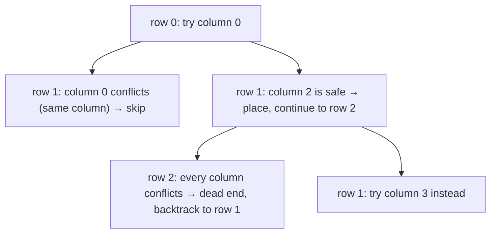

# N-Queens

**Category:** Backtracking

## The problem

Placing N queens on an N × N chessboard so that no two attack each other — no two sharing a row,
a column, or a diagonal. Building every possible one-queen-per-row placement in full and checking
each one's validity only at the end is O(n^n): the number of ways to assign one of `n` columns to
each of `n` rows, checked only after every single assignment has already been fully built.

## The solution

Check as you go instead of after the fact. Place queens one row at a time; before trying a column
for the *next* row, confirm it doesn't conflict with any queen already placed. The moment a
conflict is found, that entire remaining subtree — every placement that would have built on top of
this doomed partial solution — is abandoned immediately, without ever being constructed. That's
backtracking's defining move: prune as early as possible, not after the fact. The actual search
tree explored ends up being a small fraction of the full n^n space, even though nothing here
changes the problem's worst-case complexity class — it changes how much of that worst case is
actually visited in practice.



## Classic example

[`classic/NQueens`](src/main/java/com/algorithms/backtracking/nqueens/classic/NQueens.java)
implements the row-by-row backtracking search plus `bruteForceCountSolutions` — build the whole
board first, validate once at the end — included specifically for the benchmark below.
[`NQueensTest`](src/test/java/com/algorithms/backtracking/nqueens/classic/NQueensTest.java) checks
the small board sizes with no solution (2×2 and 3×3 genuinely have none), verifies all 4-queens
solutions are internally conflict-free by checking every pair of placed queens directly, confirms
brute force agrees with backtracking on 5 queens, and — the classic "prove it's real" number —
asserts 8 queens produces exactly **92** solutions, the count first published by Franz Nauck in
1850 and one of the most-cited results in recreational mathematics.

## Applied example: BACEN settlement lane assignment

[`applied/SettlementLaneAssignment`](src/main/java/com/algorithms/backtracking/nqueens/applied/SettlementLaneAssignment.java)
maps a settlement scheduling constraint onto the N-Queens shape directly: BACEN's end-of-day
settlement window runs N batch reconciliation jobs across N parallel processing lanes, where no
two jobs may share a lane, and no two jobs may be placed such that both their time-slot distance
and their lane distance are equal — the diagonal-conflict pattern, standing in here for two jobs
that would contend for the same downstream ledger-lock window. Job = row, assigned lane = column;
everything N-Queens already solves applies unchanged.
[`SettlementLaneAssignmentTest`](src/test/java/com/algorithms/backtracking/nqueens/applied/SettlementLaneAssignmentTest.java)
confirms 4 jobs have exactly 2 conflict-free assignments, and that 2 jobs have none.

## Benchmark

```bash
./gradlew :backtracking:n-queens:jmh
```

Real run on this machine (JMH 1.37, JDK 26.0.2, 2 warmup + 3 measurement iterations, 1 fork).
Board sizes are kept deliberately small — the same lesson this repo's
[longest-common-subsequence](../../dynamic-programming/longest-common-subsequence) benchmark
learned the hard way: 8^8 is already close to 16.8 million, and growing `n` much further would
make brute force's runtime explode:

| Cost | n=6 | n=7 | n=8 |
|---|---:|---:|---:|
| backtracking | 0.005 ms | 0.035 ms | 0.222 ms |
| brute force | 0.512 ms | 7.491 ms | 208.593 ms |

Brute force's growth tracks its combinatorial n^n shape closely: going from n=6 to n=7 predicts
roughly `7^7 / 6^6 ≈ 17.65x` and measured **14.63x**; n=7 to n=8 predicts roughly
`8^8 / 7^7 ≈ 20.37x` and measured **27.85x**. Backtracking's own growth doesn't reduce to one
clean formula — how much of the tree gets pruned depends on the board size in a way that isn't a
simple closed form — but it stayed dramatically smaller at every size: **101x** faster at n=6,
**214x** faster at n=7, and **~940x** faster at n=8, for the exact same 92-solution answer.

## When not to use it

- Only need to know *whether* at least one solution exists, not enumerate all of them? Stop the
  search at the first solution found instead of continuing to explore every branch — this
  implementation collects every solution because counting them (and comparing against the known
  92) is itself part of what proves it correct.
- The board is large enough that even the pruned search tree is still too large (N-Queens for
  large N is a genuinely hard search problem)? Specialized techniques — constraint propagation,
  symmetry breaking, or heuristic/local-search methods for very large N — scale further than plain
  backtracking.
- The constraints aren't really row/column/diagonal exclusivity at all, just "no two items may
  share a category"? A simpler bipartite-matching or graph-coloring formulation may fit the actual
  problem shape better than forcing it into the N-Queens board framing.

## Test coverage

100% instruction coverage, 100% branch coverage (JaCoCo). Reproduce it yourself:

```bash
./gradlew :backtracking:n-queens:jacocoTestReport
```

Report at `backtracking/n-queens/build/reports/jacoco/test/html/index.html`.

## Further reading

- Cormen, Leiserson, Rivest & Stein — *Introduction to Algorithms* (CLRS), 3rd/4th ed. — covers
  backtracking as a search-and-prune strategy alongside branch-and-bound, the general family
  N-Queens is the canonical teaching example for.
- Skiena — *The Algorithm Design Manual* — presents N-Queens directly as the standard worked
  example for backtracking search, including the same row-by-row placement strategy this module
  implements.
