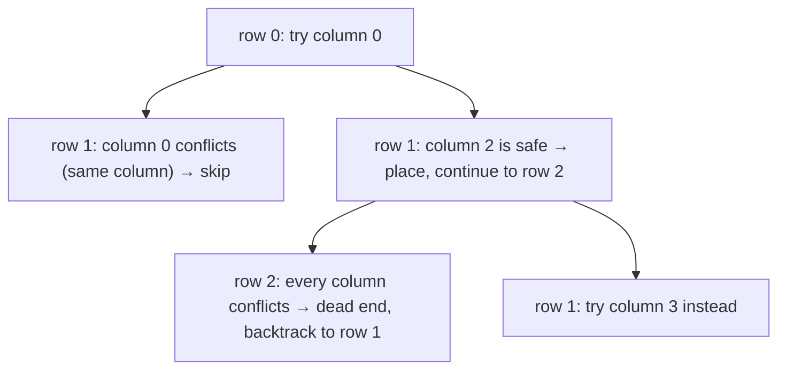

# N-Queens

**Categoria:** Backtracking

## O problema

Posicionar N rainhas em um tabuleiro de xadrez N × N de modo que nenhuma duas se ataquem — nenhuma
compartilhando linha, coluna ou diagonal. Construir todo posicionamento possível de uma rainha por
linha por completo e verificar a validade de cada um apenas no final é O(n^n): o número de
maneiras de atribuir uma das `n` colunas a cada uma das `n` linhas, verificado somente depois que
cada atribuição já foi totalmente construída.

## A solução

Verificar durante o processo em vez de depois dele. Posicionar rainhas uma linha por vez; antes de
tentar uma coluna para a *próxima* linha, confirmar que ela não conflita com nenhuma rainha já
posicionada. No momento em que um conflito é encontrado, toda aquela subárvore restante — cada
posicionamento que seria construído em cima dessa solução parcial já condenada — é abandonada
imediatamente, sem sequer ser construída. Esse é o movimento definidor do backtracking: podar o
mais cedo possível, não depois do fato consumado. A árvore de busca de fato explorada acaba sendo
uma pequena fração do espaço n^n completo, ainda que nada aqui mude a classe de complexidade de
pior caso do problema — o que muda é quanto desse pior caso é de fato visitado na prática.



## Exemplo clássico

[`classic/NQueens`](src/main/java/com/algorithms/backtracking/nqueens/classic/NQueens.java)
implementa a busca por backtracking linha a linha, além de `bruteForceCountSolutions` — construir
o tabuleiro inteiro primeiro, validar apenas no final — incluído especificamente para o benchmark
abaixo.
[`NQueensTest`](src/test/java/com/algorithms/backtracking/nqueens/classic/NQueensTest.java)
verifica os tamanhos pequenos de tabuleiro sem solução (2×2 e 3×3 genuinamente não têm nenhuma),
confirma que todas as soluções de 4 rainhas estão internamente livres de conflitos verificando
diretamente todo par de rainhas posicionadas, confirma que a força bruta concorda com o
backtracking para 5 rainhas e — o clássico número "prova de que é real" — afirma que 8 rainhas
produz exatamente **92** soluções, a contagem publicada pela primeira vez por Franz Nauck em 1850
e um dos resultados mais citados na matemática recreativa.

## Exemplo aplicado: atribuição de faixas de liquidação do BACEN

[`applied/SettlementLaneAssignment`](src/main/java/com/algorithms/backtracking/nqueens/applied/SettlementLaneAssignment.java)
mapeia diretamente uma restrição de agendamento de liquidação para a forma do N-Queens: a janela
de liquidação de fim de dia do BACEN executa N jobs de reconciliação em lote através de N faixas
de processamento paralelas, onde nenhum dois jobs podem compartilhar uma faixa, e nenhum dois jobs
podem ser posicionados de forma que tanto a distância de seus intervalos de tempo quanto a
distância de suas faixas sejam iguais — o padrão de conflito diagonal, representando aqui dois
jobs que disputariam a mesma janela de bloqueio de ledger downstream. Job = linha, faixa atribuída
= coluna; tudo que o N-Queens já resolve se aplica sem alterações.
[`SettlementLaneAssignmentTest`](src/test/java/com/algorithms/backtracking/nqueens/applied/SettlementLaneAssignmentTest.java)
confirma que 4 jobs têm exatamente 2 atribuições livres de conflito, e que 2 jobs não têm nenhuma.

## Benchmark

```bash
./gradlew :backtracking:n-queens:jmh
```

Execução real nesta máquina (JMH 1.37, JDK 26.0.2, 2 iterações de aquecimento + 3 de medição, 1
fork). Os tamanhos de tabuleiro são mantidos deliberadamente pequenos — a mesma lição que o
benchmark de
[longest-common-subsequence](../../dynamic-programming/longest-common-subsequence) deste
repositório aprendeu da forma mais difícil: 8^8 já está próximo de 16.8 milhões, e aumentar `n`
muito mais faria o tempo de execução da força bruta explodir:

| Custo | n=6 | n=7 | n=8 |
|---|---:|---:|---:|
| backtracking | 0.005 ms | 0.035 ms | 0.222 ms |
| força bruta | 0.512 ms | 7.491 ms | 208.593 ms |

O crescimento da força bruta acompanha de perto sua forma combinatória n^n: ir de n=6 para n=7
prevê aproximadamente `7^7 / 6^6 ≈ 17.65x` e o medido foi **14.63x**; de n=7 para n=8 prevê
aproximadamente `8^8 / 7^7 ≈ 20.37x` e o medido foi **27.85x**. O próprio crescimento do
backtracking não se reduz a uma fórmula única e limpa — quanto da árvore é podada depende do
tamanho do tabuleiro de uma forma que não tem uma forma fechada simples — mas ele se manteve
dramaticamente menor em todos os tamanhos: **101x** mais rápido em n=6, **214x** mais rápido em
n=7, e **~940x** mais rápido em n=8, para exatamente a mesma resposta de 92 soluções.

## Quando não usar

- Só precisa saber *se* existe pelo menos uma solução, não enumerar todas elas? Interrompa a busca
  na primeira solução encontrada em vez de continuar explorando cada ramo — esta implementação
  coleta todas as soluções porque contá-las (e comparar com o número 92 conhecido) é, em si, parte
  do que prova que ela está correta.
- O tabuleiro é grande o suficiente para que mesmo a árvore de busca podada ainda seja grande
  demais (N-Queens para N grande é um problema de busca genuinamente difícil)? Técnicas
  especializadas — propagação de restrições, quebra de simetria, ou métodos heurísticos/de busca
  local para N muito grande — escalam mais do que o backtracking simples.
- As restrições não são realmente exclusividade de linha/coluna/diagonal, apenas "nenhum de dois
  itens pode compartilhar uma categoria"? Uma formulação mais simples de correspondência bipartida
  ou coloração de grafos pode se encaixar melhor na forma real do problema do que forçá-lo no
  enquadramento do tabuleiro do N-Queens.

## Cobertura de testes

100% de cobertura de instruções, 100% de cobertura de branches (JaCoCo). Reproduza você mesmo:

```bash
./gradlew :backtracking:n-queens:jacocoTestReport
```

Relatório em `backtracking/n-queens/build/reports/jacoco/test/html/index.html`.

## Leitura complementar

- Cormen, Leiserson, Rivest & Stein — *Introduction to Algorithms* (CLRS), 3ª/4ª ed. — aborda o
  backtracking como uma estratégia de busca com poda ao lado do branch-and-bound, a família geral
  para a qual N-Queens é o exemplo didático canônico.
- Skiena — *The Algorithm Design Manual* — apresenta o N-Queens diretamente como o exemplo padrão
  trabalhado para busca por backtracking, incluindo a mesma estratégia de posicionamento linha a
  linha que este módulo implementa.
