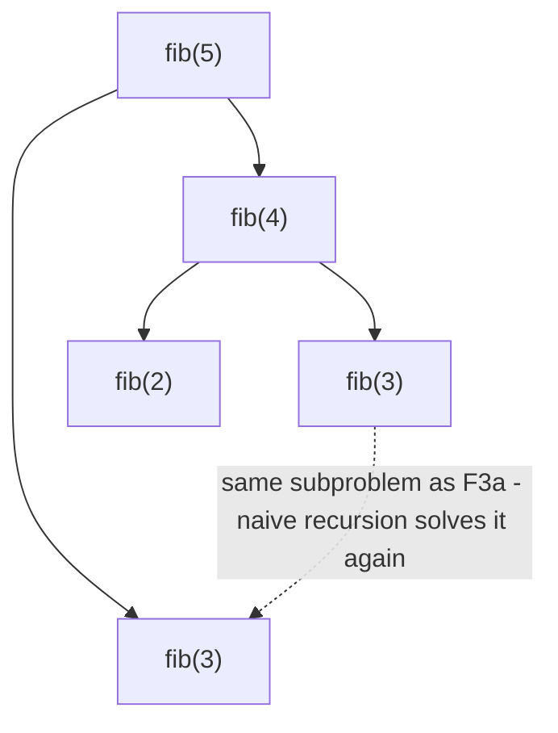

# Fibonacci

**Categoría:** Dynamic Programming

## El problema

`fib(n) = fib(n-1) + fib(n-2)` es una definición de una sola línea — y, traducida literalmente a
código recursivo, es una trampa. Calcular `fib(n-1)` y `fib(n-2)` termina necesitando ambos
`fib(n-2)`, `fib(n-3)`, y así sucesivamente hasta el final — y la recursión ingenua recalcula desde
cero cada uno de esos subproblemas compartidos, cada vez que se necesita. La cantidad de llamadas
redundantes crece exponencialmente con `n`.

## La solución

Note que `fib(k)` solo tiene *un* valor posible para un `k` dado — resuélvalo una vez y reutilice
esa respuesta en todos los lugares donde se necesite, en lugar de recalcularla. La **memoización**
hace esto de arriba hacia abajo: mantiene un caché y, antes de recursar, verifica si ese `n` ya fue
resuelto. La **tabulación** hace lo mismo de abajo hacia arriba: construye
`fib(0), fib(1), fib(2), ..., fib(n)` en un bucle simple, de modo que nada se calcula antes de que
existan sus dependencias. Ambas reducen el costo de exponencial a O(n) — la memoización negándose
a rehacer trabajo, la tabulación nunca teniendo que hacerlo. La tabulación va un paso más allá
aquí: dado que cada `fib(k)` solo necesita los dos valores anteriores, no hace falta mantener una
tabla (ni un mapa de memoización, ni una pila de recursión) — dos variables bastan.



| Enfoque | Costo | Por qué |
|---|---|---|
| Recursión ingenua | O(2^n) | cada subproblema se recalcula desde cero cada vez que se alcanza |
| Memoizado (de arriba hacia abajo + caché) | O(n) | cada uno de los n subproblemas distintos se resuelve exactamente una vez |
| Tabulado (de abajo hacia arriba) | O(n) tiempo, O(1) espacio | la misma garantía de una resolución por subproblema, sin mapa de memoización ni pila de recursión |

## Ejemplo clásico

[`classic/Fibonacci`](src/main/java/com/algorithms/dynamicprogramming/fibonacci/classic/Fibonacci.java)
implementa los tres enfoques uno al lado del otro específicamente para que el benchmark de abajo
pueda medir la misma afirmación de tres formas distintas en la misma máquina. Usa `long` y rechaza
`n > 90` para mantenerse dentro del rango de `long` en lugar de desbordarse silenciosamente.
[`FibonacciTest`](src/test/java/com/algorithms/dynamicprogramming/fibonacci/classic/FibonacciTest.java)
cubre valores base conocidos, que las versiones memoizada y tabulada coinciden con la ingenua en
un rango de entradas, que ambas coinciden entre sí en el límite de desbordamiento `n=90`, y las
protecciones tanto para `n` negativo como para el límite de desbordamiento.

## Ejemplo aplicado: conteo de rutas de pago entre bancos corresponsales

[`applied/PaymentRouteCounter`](src/main/java/com/algorithms/dynamicprogramming/fibonacci/applied/PaymentRouteCounter.java)
cuenta las rutas distintas de exactamente `k` saltos entre bancos corresponsales, de una cuenta a
otra a través de una red de liquidación — la misma forma de subproblemas superpuestos que los
números de Fibonacci de este módulo, aplicada a una pregunta real en lugar de una abstracta. Sin
memoización, contar rutas que pasan por un nodo por el que transitan múltiples caminos parciales
recalcula desde cero, cada vez que se alcanza, todo el conteo de saltos restantes de ese nodo —
exponencial en el presupuesto de saltos, exactamente por la misma razón que lo es el `fib(n)`
ingenuo. Memoizar sobre `(nodo actual, saltos restantes)` reduce eso a un trabajo proporcional a
`tamaño de la red × presupuesto de saltos`.
[`PaymentRouteCounterTest`](src/test/java/com/algorithms/dynamicprogramming/fibonacci/applied/PaymentRouteCounterTest.java)
cubre el conteo de múltiples rutas al mismo destino, el límite de cero saltos (solo cuenta cuando
el origen es igual al destino), una cantidad de saltos inalcanzable, la coincidencia entre las
versiones ingenua y memoizada sobre la misma red, una red cíclica (que demuestra que la
memoización no entra en bucle infinito ante ciclos) y las protecciones ante argumentos
nulos/negativos.

## Benchmark

```bash
./gradlew :dynamic-programming:fibonacci:jmh
```

Ejecución real en esta máquina (JMH 1.37, JDK 26.0.2, 2 iteraciones de warmup + 3 de medición, 1
fork). `n` se mantiene deliberadamente pequeño — el Fibonacci ingenuo en `n=35` ya toma decenas de
milisegundos por llamada, y cualquier valor mayor haría este benchmark imprácticamente lento, lo
cual es en sí mismo parte del punto:

| Costo | n=20 | n=30 | n=35 |
|---|---:|---:|---:|
| ingenuo | 35.92 µs | 4,518.08 µs | 48,460.35 µs |
| memoizado | 0.317 µs | 0.548 µs | 0.619 µs |
| tabulado | 0.007 µs | 0.008 µs | 0.008 µs |

En n=35, el ingenuo es **~78,289x más lento** que el memoizado y **~6,057,544x más lento** que el
tabulado — para exactamente la misma respuesta. El propio crecimiento del ingenuo confirma
directamente la forma exponencial: pasar de n=30 a n=35 (5 pasos más) cuesta aproximadamente
10.7x más tiempo, coincidiendo de cerca con el propio factor de crecimiento por paso de la razón
áurea (`φ ≈ 1.618`, y `1.618^5 ≈ 11.1`) — la propia tasa de crecimiento de forma cerrada de
Fibonacci, apareciendo directamente en el tiempo de ejecución del algoritmo ingenuo. El memoizado
y el tabulado, en cambio, apenas se mueven en el mismo rango — ambos lineales, con el crecimiento
casi nulo e inmensurable del tabulado reflejando que nunca paga el costo de un HashMap ni de una
pila de recursión.

## Cuándo no usarlo

- Recursión ingenua específicamente: nunca, más allá de valores trivialmente pequeños de `n` — el
  benchmark de arriba es el argumento completo. No hay escenario en el que recalcular el mismo
  subproblema un número exponencial de veces sea la decisión de ingeniería correcta, una vez que
  la memoización o la tabulación no cuestan nada extra de escribir.
- ¿Se necesita la secuencia real de valores, no solo `fib(n)`? La tabulación ya produce cada valor
  intermedio en el camino — conserve el arreglo completo en lugar de reducirlo a dos variables si
  se necesita toda la secuencia (no solo el último término).
- ¿Los subproblemas no se superponen realmente para su recurrencia específica? Entonces la
  memoización no tiene nada que ahorrar — es la superposición, no la recursión en sí, lo que la
  recursión ingenua desperdicia.

## Cobertura de pruebas

100% de cobertura de instrucciones, 100% de cobertura de ramas (JaCoCo). Reprodúcelo tú mismo:

```bash
./gradlew :dynamic-programming:fibonacci:jacocoTestReport
```

Informe en `dynamic-programming/fibonacci/build/reports/jacoco/test/html/index.html`.

## Lectura complementaria

- Cormen, Leiserson, Rivest & Stein — *Introduction to Algorithms* (CLRS), 3.ª/4.ª ed.,
  Capítulo 15, "Dynamic Programming" — el tratamiento formal de subproblemas superpuestos y
  subestructura óptima que el benchmark de este módulo demuestra empíricamente.
- Skiena — *The Algorithm Design Manual*, sección sobre Programación Dinámica — describe la
  memoización como "recursión más un caché", exactamente el modelo mental que el método
  `memoized` de este módulo implementa literalmente.
