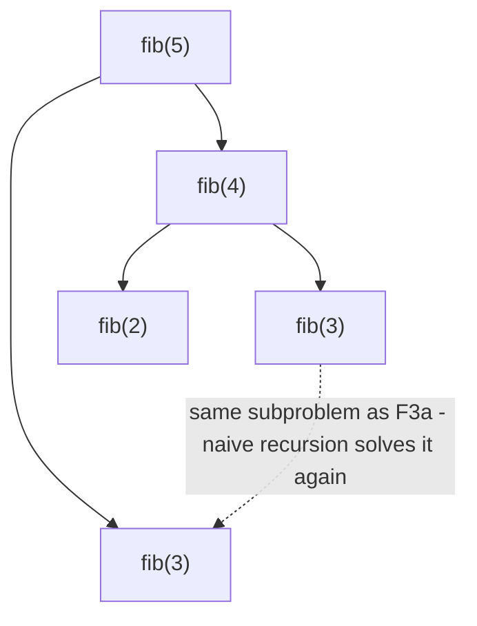

# Fibonacci

**Category:** Dynamic Programming

## The problem

`fib(n) = fib(n-1) + fib(n-2)` is a one-line definition — and translated literally into
recursive code, it's a trap. Computing `fib(n-1)` and `fib(n-2)` both eventually need `fib(n-2)`,
`fib(n-3)`, and so on, all the way down — and the naive recursion recomputes every one of those
shared subproblems from scratch, every single time it's needed. The number of redundant calls
grows exponentially with `n`.

## The solution

Notice that `fib(k)` only ever has *one* possible value for a given `k` — solve it once, and
reuse that answer everywhere it's needed instead of recomputing it. **Memoization** does this
top-down: keep a cache, and before recursing, check whether this `n` has already been solved.
**Tabulation** does the same thing bottom-up: build up `fib(0), fib(1), fib(2), ..., fib(n)` in a
simple loop, so nothing is ever computed before its dependencies exist. Both collapse the cost
from exponential to O(n) — memoization by refusing to redo work, tabulation by never being asked
to. Tabulation goes one step further here: since each `fib(k)` only ever needs the previous two
values, there's no need to keep a table (or a memo map, or a recursion stack) at all — two
variables are enough.



| Approach | Cost | Why |
|---|---|---|
| Naive recursion | O(2^n) | every subproblem gets recomputed from scratch every time it's reached |
| Memoized (top-down + cache) | O(n) | each of the n distinct subproblems is solved exactly once |
| Tabulated (bottom-up) | O(n) time, O(1) space | same one-solve-per-subproblem guarantee, no memo map or recursion stack needed |

## Classic example

[`classic/Fibonacci`](src/main/java/com/algorithms/dynamicprogramming/fibonacci/classic/Fibonacci.java)
implements all three approaches side by side specifically so the benchmark below can measure the
same claim three different ways on the same machine. Uses `long` and rejects `n > 90` to stay
inside `long`'s range rather than silently overflowing.
[`FibonacciTest`](src/test/java/com/algorithms/dynamicprogramming/fibonacci/classic/FibonacciTest.java)
covers known base values, that memoized and tabulated agree with naive across a range of inputs,
that both agree with each other at the `n=90` overflow boundary, and both the negative-`n` and
overflow-boundary rejection guards.

## Applied example: correspondent-bank payment route counting

[`applied/PaymentRouteCounter`](src/main/java/com/algorithms/dynamicprogramming/fibonacci/applied/PaymentRouteCounter.java)
counts the distinct routes of exactly `k` correspondent-bank hops from one account to another
through a settlement network — the identical overlapping-subproblems shape as this module's
Fibonacci numbers, applied to a real question instead of an abstract one. Without memoization,
counting routes through a node that multiple partial paths pass through recomputes that node's
entire remaining-hop count from scratch every time it's reached — exponential in the hop budget,
for exactly the same reason naive `fib(n)` is. Memoizing on `(current node, hops remaining)`
collapses that to work proportional to `network size × hop budget`.
[`PaymentRouteCounterTest`](src/test/java/com/algorithms/dynamicprogramming/fibonacci/applied/PaymentRouteCounterTest.java)
covers counting multiple routes to the same destination, the zero-hop boundary (only counts when
source equals destination), an unreachable hop count, naive and memoized agreeing on the same
network, a cyclic network (proving memoization doesn't infinite-loop on cycles), and the
null/negative-argument guards.

## Benchmark

```bash
./gradlew :dynamic-programming:fibonacci:jmh
```

Real run on this machine (JMH 1.37, JDK 26.0.2, 2 warmup + 3 measurement iterations, 1 fork). `n`
stays deliberately small — naive Fibonacci at `n=35` already takes tens of milliseconds per call,
and anything larger would make this benchmark impractically slow, which is itself part of the
point:

| Cost | n=20 | n=30 | n=35 |
|---|---:|---:|---:|
| naive | 35.92 µs | 4,518.08 µs | 48,460.35 µs |
| memoized | 0.317 µs | 0.548 µs | 0.619 µs |
| tabulated | 0.007 µs | 0.008 µs | 0.008 µs |

At n=35, naive is **~78,289x slower** than memoized and **~6,057,544x slower** than tabulated —
for the exact same answer. Naive's own growth confirms the exponential shape directly: going
from n=30 to n=35 (5 more steps) costs ~10.7x more time, closely matching the golden ratio's own
per-step growth factor (`φ ≈ 1.618`, and `1.618^5 ≈ 11.1`) — Fibonacci's own closed-form growth
rate, showing up directly in the naive algorithm's runtime. Memoized and tabulated, meanwhile,
barely move across the same range — both linear, with tabulated's near-zero, unmeasurable growth
reflecting that it never pays for a HashMap or a recursion stack at all.

## When not to use it

- Naive recursion specifically: never, past trivially small `n` — the benchmark above is the
  entire argument. There's no scenario where recomputing the same subproblem exponentially many
  times is the right engineering choice once memoization or tabulation costs nothing extra to
  write.
- Need the actual sequence of values, not just `fib(n)`? Tabulation already produces every
  intermediate value on the way — keep the full array instead of collapsing to two variables if
  the whole sequence (not just the last term) is needed.
- Subproblems don't actually overlap for your specific recurrence? Then memoization has nothing
  to save — it's the overlap, not the recursion itself, that naive recursion wastes.

## Test coverage

100% instruction coverage, 100% branch coverage (JaCoCo). Reproduce it yourself:

```bash
./gradlew :dynamic-programming:fibonacci:jacocoTestReport
```

Report at `dynamic-programming/fibonacci/build/reports/jacoco/test/html/index.html`.

## Further reading

- Cormen, Leiserson, Rivest & Stein — *Introduction to Algorithms* (CLRS), 3rd/4th ed.,
  Chapter 15, "Dynamic Programming" — the formal treatment of overlapping subproblems and
  optimal substructure this module's benchmark demonstrates empirically.
- Skiena — *The Algorithm Design Manual*, section on Dynamic Programming — frames memoization as
  "recursion plus a cache," the exact mental model this module's `memoized` method implements
  literally.
