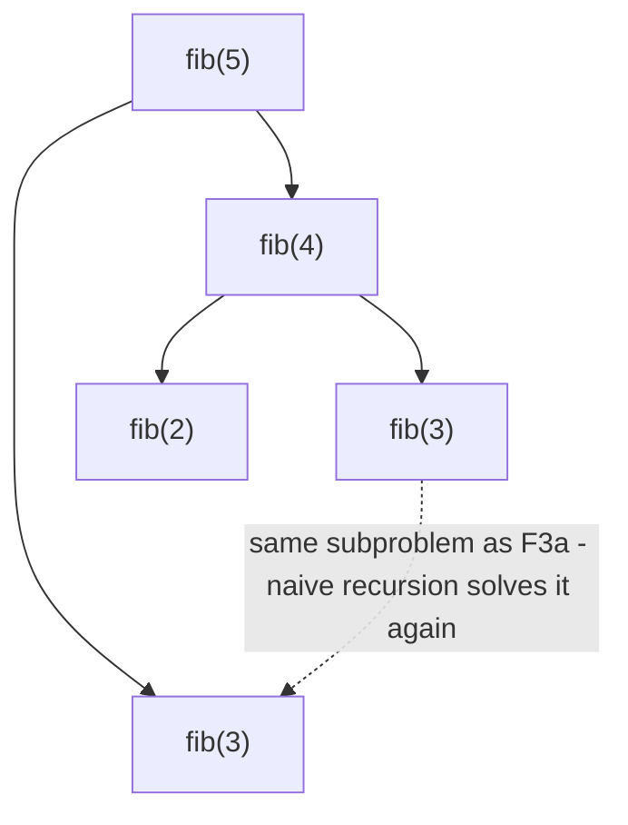

# Fibonacci

**Categoria:** Dynamic Programming

## O problema

`fib(n) = fib(n-1) + fib(n-2)` é uma definição de uma linha — e, traduzida literalmente para
código recursivo, é uma armadilha. Calcular `fib(n-1)` e `fib(n-2)` eventualmente exige `fib(n-2)`,
`fib(n-3)` e assim por diante, até o fim — e a recursão ingênua recalcula do zero cada um desses
subproblemas compartilhados, toda vez que é necessário. O número de chamadas redundantes cresce
exponencialmente com `n`.

## A solução

Perceba que `fib(k)` só tem *um* valor possível para um dado `k` — resolva uma vez e reutilize essa
resposta em todo lugar onde for necessária, em vez de recalculá-la. A **memoização** faz isso de
cima para baixo: mantém um cache e, antes de recursar, verifica se esse `n` já foi resolvido. A
**tabulação** faz a mesma coisa de baixo para cima: constrói `fib(0), fib(1), fib(2), ..., fib(n)`
em um loop simples, de forma que nada é calculado antes que suas dependências existam. Ambas
reduzem o custo de exponencial para O(n) — a memoização recusando-se a refazer trabalho, a
tabulação nunca sendo solicitada a fazê-lo. A tabulação vai um passo além aqui: como cada `fib(k)`
só precisa dos dois valores anteriores, não há necessidade de manter uma tabela (nem um mapa de
memoização, nem uma pilha de recursão) — duas variáveis bastam.



| Abordagem | Custo | Por quê |
|---|---|---|
| Recursão ingênua | O(2^n) | todo subproblema é recalculado do zero toda vez que é alcançado |
| Memoizada (de cima para baixo + cache) | O(n) | cada um dos n subproblemas distintos é resolvido exatamente uma vez |
| Tabulada (de baixo para cima) | O(n) tempo, O(1) espaço | mesma garantia de resolver uma vez por subproblema, sem mapa de memoização nem pilha de recursão |

## Exemplo clássico

[`classic/Fibonacci`](src/main/java/com/algorithms/dynamicprogramming/fibonacci/classic/Fibonacci.java)
implementa as três abordagens lado a lado, especificamente para que o benchmark abaixo possa medir
a mesma afirmação de três formas diferentes na mesma máquina. Usa `long` e rejeita `n > 90` para
permanecer dentro do intervalo de `long` em vez de estourar silenciosamente.
[`FibonacciTest`](src/test/java/com/algorithms/dynamicprogramming/fibonacci/classic/FibonacciTest.java)
cobre valores base conhecidos, que as versões memoizada e tabulada concordam com a ingênua em uma
faixa de entradas, que ambas concordam entre si no limite de estouro `n=90`, e as proteções contra
`n` negativo e contra o limite de estouro.

## Exemplo aplicado: contagem de rotas de pagamento entre bancos correspondentes

[`applied/PaymentRouteCounter`](src/main/java/com/algorithms/dynamicprogramming/fibonacci/applied/PaymentRouteCounter.java)
conta as rotas distintas de exatamente `k` saltos entre bancos correspondentes, de uma conta a
outra através de uma rede de liquidação — a mesma forma de subproblemas sobrepostos dos números de
Fibonacci deste módulo, aplicada a uma pergunta real em vez de uma abstrata. Sem memoização,
contar rotas que passam por um nó por onde passam múltiplos caminhos parciais recalcula do zero,
toda vez que é alcançado, a contagem completa de saltos restantes daquele nó — exponencial no
orçamento de saltos, exatamente pela mesma razão que o `fib(n)` ingênuo é. Memoizar em
`(nó atual, saltos restantes)` reduz isso a um trabalho proporcional a
`tamanho da rede × orçamento de saltos`.
[`PaymentRouteCounterTest`](src/test/java/com/algorithms/dynamicprogramming/fibonacci/applied/PaymentRouteCounterTest.java)
cobre a contagem de múltiplas rotas para o mesmo destino, o limite de zero saltos (só conta quando
origem é igual a destino), uma contagem de saltos inalcançável, a concordância entre as versões
ingênua e memoizada na mesma rede, uma rede cíclica (provando que a memoização não entra em loop
infinito em ciclos) e as proteções contra argumentos nulos/negativos.

## Benchmark

```bash
./gradlew :dynamic-programming:fibonacci:jmh
```

Execução real nesta máquina (JMH 1.37, JDK 26.0.2, 2 iterações de warmup + 3 de medição, 1 fork).
`n` permanece deliberadamente pequeno — a Fibonacci ingênua em `n=35` já leva dezenas de
milissegundos por chamada, e qualquer valor maior tornaria este benchmark impraticavelmente lento,
o que é, em si, parte do ponto:

| Custo | n=20 | n=30 | n=35 |
|---|---:|---:|---:|
| ingênua | 35.92 µs | 4,518.08 µs | 48,460.35 µs |
| memoizada | 0.317 µs | 0.548 µs | 0.619 µs |
| tabulada | 0.007 µs | 0.008 µs | 0.008 µs |

Em n=35, a versão ingênua é **~78,289x mais lenta** que a memoizada e **~6,057,544x mais lenta**
que a tabulada — para exatamente a mesma resposta. O próprio crescimento da versão ingênua
confirma diretamente a forma exponencial: ir de n=30 para n=35 (mais 5 passos) custa
aproximadamente 10.7x mais tempo, batendo de perto com o próprio fator de crescimento por passo da
razão áurea (`φ ≈ 1.618`, e `1.618^5 ≈ 11.1`) — a própria taxa de crescimento de forma fechada de
Fibonacci, aparecendo diretamente no tempo de execução do algoritmo ingênuo. Já as versões
memoizada e tabulada mal se movem na mesma faixa — ambas lineares, com o crescimento quase nulo e
imensurável da tabulada refletindo que ela nunca paga o custo de um HashMap ou de uma pilha de
recursão.

## Quando não usar

- Recursão ingênua especificamente: nunca, além de valores trivialmente pequenos de `n` — o
  benchmark acima é o argumento inteiro. Não há cenário em que recalcular o mesmo subproblema um
  número exponencial de vezes seja a escolha de engenharia correta, uma vez que memoização ou
  tabulação não custam nada extra para escrever.
- Precisa da sequência real de valores, não apenas de `fib(n)`? A tabulação já produz cada valor
  intermediário ao longo do caminho — mantenha o array completo em vez de reduzir a duas
  variáveis, se toda a sequência (não apenas o último termo) for necessária.
- Os subproblemas não se sobrepõem de fato para sua recorrência específica? Então a memoização não
  tem nada a economizar — é a sobreposição, não a recursão em si, que a recursão ingênua
  desperdiça.

## Cobertura de testes

100% de cobertura de instruções, 100% de cobertura de branches (JaCoCo). Reproduza você mesmo:

```bash
./gradlew :dynamic-programming:fibonacci:jacocoTestReport
```

Relatório em `dynamic-programming/fibonacci/build/reports/jacoco/test/html/index.html`.

## Leitura complementar

- Cormen, Leiserson, Rivest & Stein — *Introduction to Algorithms* (CLRS), 3ª/4ª ed.,
  Capítulo 15, "Dynamic Programming" — o tratamento formal de subproblemas sobrepostos e
  subestrutura ótima que o benchmark deste módulo demonstra empiricamente.
- Skiena — *The Algorithm Design Manual*, seção sobre Programação Dinâmica — descreve a
  memoização como "recursão mais um cache", exatamente o modelo mental que o método `memoized`
  deste módulo implementa ao pé da letra.
