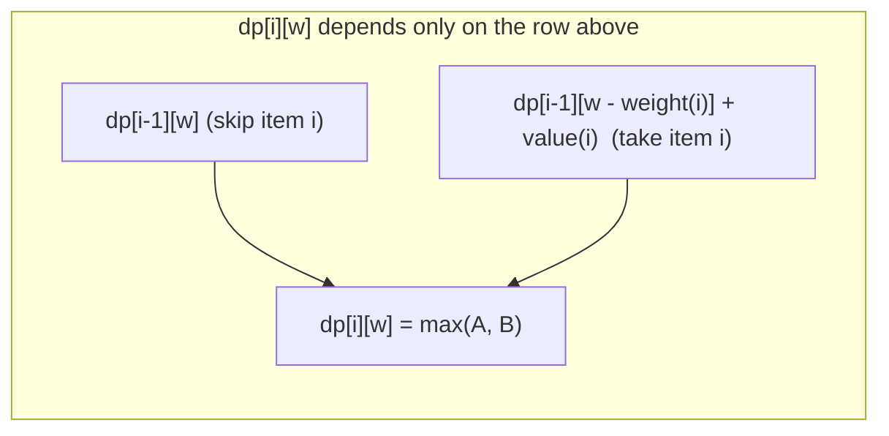

# 0/1 Knapsack

**Categoría:** Dynamic Programming

## El problema

Dado un conjunto de elementos, cada uno con un peso y un valor, y un presupuesto de capacidad, elegir el subconjunto que maximiza el valor total sin exceder el presupuesto — cada elemento se toma por completo o no se toma en absoluto (sin dividir un elemento entre el "0" y el "1" de tomarlo o no, de ahí el nombre). Probar directamente cada subconjunto es O(2^n): incluso para apenas 20-30 elementos, eso ya son decenas de millones a mil millones de combinaciones para verificar.

## La solución

Defina `dp[i][w]` como el mejor valor alcanzable usando solo los primeros `i` elementos dentro de la capacidad `w`. Ese valor siempre depende únicamente de la fila de arriba: o el elemento `i` se descarta (`dp[i][w] = dp[i-1][w]`), o se toma, consumiendo `weight[i]` de la capacidad (`dp[i][w] = dp[i-1][w - weight[i]] + value[i]`) — se usa el que sea mayor entre los dos. Llenar esa tabla de abajo hacia arriba toca cada celda `(item, capacity)` una sola vez: O(n × capacity). Recorriendo la tabla terminada hacia atrás desde `dp[n][capacity]`, comparando cada fila con la de arriba para ver si la inclusión del valor de ese elemento fue lo que hizo mejorar la celda, se recupera exactamente *cuáles* elementos fueron elegidos — sin resolver nada de nuevo.



| Operación | Costo | Por qué |
|---|---|---|
| Llenado de la tabla DP | O(n × capacity) | una decisión de tiempo constante por celda `(item, capacity)` |
| Recuperación de elementos (backtrack) | O(n) | una comparación de fila por elemento, sin volver a resolver |
| Fuerza bruta (todos los subconjuntos) | O(2^n) | ningún subproblema compartido se reutiliza — cada combinación se evalúa de forma independiente |

## Ejemplo clásico

[`classic/Knapsack`](src/main/java/com/algorithms/dynamicprogramming/knapsack/classic/Knapsack.java)
implementa tanto el llenado de la tabla DP con backtracking (`solve`, que retorna un `KnapsackResult` con el valor máximo *y* qué elementos fueron elegidos) como una fuerza bruta recursiva directa (`bruteForceMaxValue`), usada a continuación por el benchmark como referencia de comparación.
[`KnapsackTest`](src/test/java/com/algorithms/dynamicprogramming/knapsack/classic/KnapsackTest.java)
cubre un caso con una combinación óptima única (verificada contra la selección de elementos, no solo contra el valor), capacidad cero, ningún elemento, un único elemento que cabe, un único elemento que no cabe, la fuerza bruta coincidiendo con el resultado del DP en la misma entrada, y las protecciones contra null/longitudes no coincidentes/capacidad negativa.

## Ejemplo aplicado: selección de proyectos de capex en telecomunicaciones

[`applied/CapexProjectSelector`](src/main/java/com/algorithms/dynamicprogramming/knapsack/applied/CapexProjectSelector.java)
selecciona qué proyectos de infraestructura candidatos financiar a partir de un presupuesto anual fijo de capex, maximizando el valor total proyectado — el planteamiento de negocio clásico del 0/1 Knapsack: un proyecto se financia por completo o no se financia en absoluto, no existe financiar el 60% del despliegue de una red de fibra, y el presupuesto es la restricción rígida de capacidad. Las listas reales de proyectos suelen ser lo bastante pequeñas para que el costo de la tabla DP sea trivial en la práctica, pero el problema de selección en sí es exactamente tan combinatoriamente difícil como cualquier otra instancia de Knapsack — elegir proyectos "por mejor ROI primero" (un atajo voraz) no encuentra de forma confiable la combinación óptima, a diferencia de lo que ocurre con el módulo [Coin Change](../../greedy/coin-change) de este repositorio sobre denominaciones de moneda comunes.
[`CapexProjectSelectorTest`](src/test/java/com/algorithms/dynamicprogramming/knapsack/applied/CapexProjectSelectorTest.java)
cubre la selección de la combinación de mayor valor dentro del presupuesto, una lista de candidatos vacía, un presupuesto cero, y la protección contra argumento null.

## Benchmark

```bash
./gradlew :dynamic-programming:knapsack:jmh
```

Ejecución real en esta máquina (JMH 1.37, JDK 26.0.2, 2 iteraciones de warmup + 3 de medición, 1 fork). La cantidad de elementos se mantiene pequeña — la fuerza bruta con 22 elementos ya verifica más de 4 millones de subconjuntos, y cualquier valor mayor haría que este benchmark fuera imprácticamente lento:

| Costo | 15 elementos | 18 elementos | 22 elementos |
|---|---:|---:|---:|
| DP | 2.94 µs | 4.55 µs | 6.66 µs |
| fuerza bruta | 79.53 µs | 840.46 µs | 13,111.05 µs |

Con 22 elementos, la fuerza bruta es **~1,968x más lenta** que el DP para la misma respuesta. El propio crecimiento de la fuerza bruta confirma directamente la forma exponencial: pasar de 15 a 18 elementos (3 más) cuesta ~10.6x más tiempo, y de 18 a 22 (4 más) cuesta ~15.6x más — ambos cercanos al crecimiento `2^3 = 8` y `2^4 = 16` que 2^n predice exactamente. El DP, en cambio, crece suavemente a lo largo del mismo rango — su costo sigue `items × capacity`, no `2^items`.

## Cuándo no usarlo

- ¿Los elementos se pueden dividir fraccionalmente (una "fractional knapsack" — tomar el 60% de un elemento por el 60% de su peso y valor)? Un enfoque voraz (mayor valor por peso primero) es demostrablemente óptimo para esa variante — la dificultad combinatoria que resuelve el DP de este módulo proviene específicamente de la restricción de todo-o-nada.
- ¿La capacidad es enorme en relación con la cantidad de elementos (un presupuesto gigante, pocos candidatos)? El costo `O(n × capacity)` de la tabla DP escala directamente con la capacidad — en ese punto, la fuerza bruta `O(2^n)`, limitada solo por la cantidad de elementos, puede terminar siendo más barata.
- ¿Solo necesita el *valor* óptimo, nunca saber qué elementos lo logran? Omita el paso de backtracking y conserve solo la última fila de la tabla DP — eso reduce a la mitad la memoria que esta implementación usa para también soportar la recuperación de elementos.

## Cobertura de pruebas

100% de cobertura de instrucciones, 100% de cobertura de branches (JaCoCo). Reprodúzcalo usted mismo:

```bash
./gradlew :dynamic-programming:knapsack:jacocoTestReport
```

Informe en `dynamic-programming/knapsack/build/reports/jacoco/test/html/index.html`.

## Lectura complementaria

- Cormen, Leiserson, Rivest & Stein — *Introduction to Algorithms* (CLRS), 3.ª/4.ª ed., los problemas del Capítulo 15 incluyen el 0/1 Knapsack como aplicación directa del argumento de subestructura óptima que el capítulo construye.
- Kleinberg & Tardos — *Algorithm Design*, Capítulo 6, "Dynamic Programming" — trata el Knapsack como un ejemplo resuelto central del patrón de DP "subproblemas indexados por un presupuesto de recurso" que este módulo implementa.
