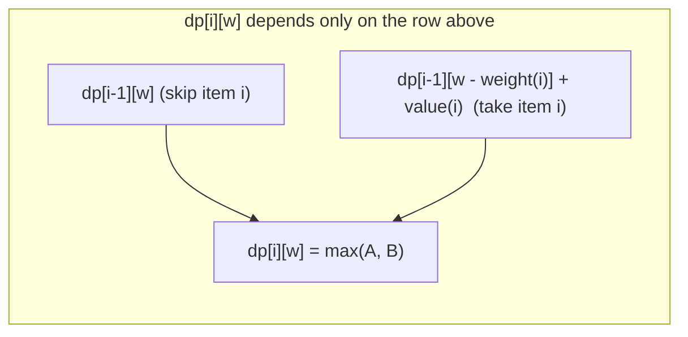

# 0/1 Knapsack

**Category:** Dynamic Programming

## The problem

Given a set of items, each with a weight and a value, and a capacity budget, choose the subset
that maximizes total value without exceeding the budget — each item taken whole or not at all
(no splitting an item across the "0" and "1" of taking it or not, hence the name). Trying every
subset directly is O(2^n): for even a modest 20-30 items, that's tens of millions to a billion
combinations to check.

## The solution

Define `dp[i][w]` as the best value achievable using only the first `i` items within capacity
`w`. That value only ever depends on the row above it: either item `i` is skipped
(`dp[i][w] = dp[i-1][w]`), or it's taken, using up `weight[i]` of the capacity
(`dp[i][w] = dp[i-1][w - weight[i]] + value[i]`) — take whichever of those two is larger. Filling
that table bottom-up touches each `(item, capacity)` cell once: O(n × capacity). Walking back
through the finished table from `dp[n][capacity]`, comparing each row to the one above to see
whether including that item's value was what made the cell improve, recovers exactly *which*
items were chosen — without re-solving anything.



| Operation | Cost | Why |
|---|---|---|
| DP table fill | O(n × capacity) | one constant-time decision per `(item, capacity)` cell |
| Item recovery (backtrack) | O(n) | one row-comparison per item, no re-solving |
| Brute force (every subset) | O(2^n) | no shared subproblems reused — every combination evaluated independently |

## Classic example

[`classic/Knapsack`](src/main/java/com/algorithms/dynamicprogramming/knapsack/classic/Knapsack.java)
implements both the DP table fill plus backtracking (`solve`, returning a `KnapsackResult` with
the max value *and* which items were chosen) and a direct recursive brute force
(`bruteForceMaxValue`) for the benchmark below to measure against.
[`KnapsackTest`](src/test/java/com/algorithms/dynamicprogramming/knapsack/classic/KnapsackTest.java)
covers a case with a unique optimal combination (verified against the item selection, not just
the value), zero capacity, no items, a single item that fits, a single item that doesn't, brute
force agreeing with the DP result on the same input, and the null/mismatched-length/negative-
capacity guards.

## Applied example: telecom capex project selection

[`applied/CapexProjectSelector`](src/main/java/com/algorithms/dynamicprogramming/knapsack/applied/CapexProjectSelector.java)
selects which candidate infrastructure projects to fund out of a fixed annual capex budget,
maximizing total projected value — the textbook business framing of 0/1 knapsack: a project
either gets funded in full or not at all, there's no such thing as funding 60% of a fiber
build-out, and the budget is the hard capacity constraint. Real project lists are small enough
that the DP table's cost is trivial in practice, but the selection problem itself is exactly as
combinatorially hard as any other knapsack instance — picking projects "by best ROI first" (a
greedy shortcut) doesn't reliably find the optimal combination the way it happens to for this
repo's [Coin Change](../../greedy/coin-change) module on ordinary currency denominations.
[`CapexProjectSelectorTest`](src/test/java/com/algorithms/dynamicprogramming/knapsack/applied/CapexProjectSelectorTest.java)
covers selecting the highest-value combination within budget, an empty candidate list, a zero
budget, and the null-argument guard.

## Benchmark

```bash
./gradlew :dynamic-programming:knapsack:jmh
```

Real run on this machine (JMH 1.37, JDK 26.0.2, 2 warmup + 3 measurement iterations, 1 fork).
Item count stays small — brute force at 22 items is already checking over 4 million subsets, and
anything larger would make this benchmark impractically slow:

| Cost | 15 items | 18 items | 22 items |
|---|---:|---:|---:|
| DP | 2.94 µs | 4.55 µs | 6.66 µs |
| brute force | 79.53 µs | 840.46 µs | 13,111.05 µs |

At 22 items, brute force is **~1,968x slower** than DP for the identical answer. Brute force's
own growth confirms the exponential shape directly: going from 15 to 18 items (3 more) costs
~10.6x more time, and 18 to 22 (4 more) costs ~15.6x more — both close to the `2^3 = 8` and
`2^4 = 16` growth exactly 2^n predicts. DP, meanwhile, grows gently across the same range — its
cost tracks `items × capacity`, not `2^items`.

## When not to use it

- Items can be split fractionally (a "fractional knapsack" — take 60% of an item for 60% of its
  weight and value)? A greedy approach (highest value-per-weight first) is provably optimal for
  that variant — the combinatorial hardness this module's DP solves specifically comes from the
  all-or-nothing constraint.
- Capacity is enormous relative to the number of items (a huge budget, few candidates)? The DP
  table's `O(n × capacity)` cost scales with capacity directly — at that point brute force's
  `O(2^n)`, bounded only by item count, can actually be cheaper.
- Only need the optimal *value*, never which items achieve it? Skip the backtracking step and
  keep just the final row of the DP table — halves the memory this implementation uses to also
  support item recovery.

## Test coverage

100% instruction coverage, 100% branch coverage (JaCoCo). Reproduce it yourself:

```bash
./gradlew :dynamic-programming:knapsack:jacocoTestReport
```

Report at `dynamic-programming/knapsack/build/reports/jacoco/test/html/index.html`.

## Further reading

- Cormen, Leiserson, Rivest & Stein — *Introduction to Algorithms* (CLRS), 3rd/4th ed.,
  Chapter 15 problems include 0/1 knapsack as a direct application of the optimal-substructure
  argument the chapter builds.
- Kleinberg & Tardos — *Algorithm Design*, Chapter 6, "Dynamic Programming" — covers knapsack as
  a core worked example of the "subproblems indexed by a resource budget" DP pattern this module
  implements.
