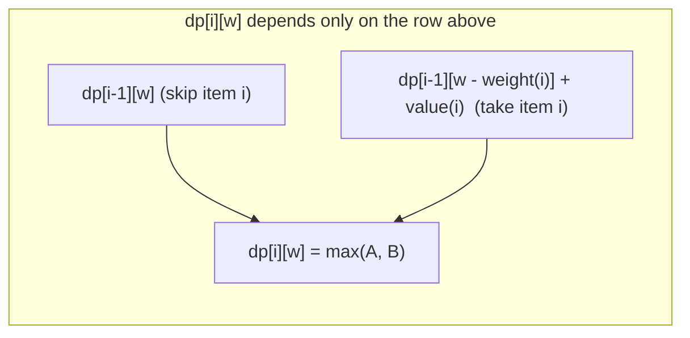

# 0/1 Knapsack

**Categoria:** Dynamic Programming

## O problema

Dado um conjunto de itens, cada um com um peso e um valor, e um orçamento de capacidade, escolha o subconjunto que maximiza o valor total sem exceder o orçamento — cada item é levado por inteiro ou não é levado (sem dividir um item entre o "0" e o "1" de levá-lo ou não, daí o nome). Testar diretamente cada subconjunto é O(2^n): mesmo para apenas 20-30 itens, isso já são dezenas de milhões a um bilhão de combinações para verificar.

## A solução

Defina `dp[i][w]` como o melhor valor alcançável usando apenas os primeiros `i` itens dentro da capacidade `w`. Esse valor sempre depende apenas da linha acima: ou o item `i` é descartado (`dp[i][w] = dp[i-1][w]`), ou é levado, consumindo `weight[i]` da capacidade (`dp[i][w] = dp[i-1][w - weight[i]] + value[i]`) — usa-se o que for maior entre os dois. Preencher essa tabela de baixo para cima toca cada célula `(item, capacity)` uma única vez: O(n × capacity). Percorrendo a tabela pronta de trás para frente a partir de `dp[n][capacity]`, comparando cada linha com a de cima para ver se a inclusão do valor daquele item foi o que fez a célula melhorar, recupera-se exatamente *quais* itens foram escolhidos — sem resolver nada de novo.



| Operação | Custo | Por quê |
|---|---|---|
| Preenchimento da tabela DP | O(n × capacity) | uma decisão de tempo constante por célula `(item, capacity)` |
| Recuperação dos itens (backtrack) | O(n) | uma comparação de linha por item, sem resolver de novo |
| Força bruta (todo subconjunto) | O(2^n) | nenhum subproblema compartilhado é reaproveitado — cada combinação é avaliada de forma independente |

## Exemplo clássico

[`classic/Knapsack`](src/main/java/com/algorithms/dynamicprogramming/knapsack/classic/Knapsack.java)
implementa tanto o preenchimento da tabela DP com backtracking (`solve`, que retorna um `KnapsackResult` com o valor máximo *e* quais itens foram escolhidos) quanto uma força bruta recursiva direta (`bruteForceMaxValue`), usada abaixo pelo benchmark como referência de comparação.
[`KnapsackTest`](src/test/java/com/algorithms/dynamicprogramming/knapsack/classic/KnapsackTest.java)
cobre um caso com uma combinação ótima única (verificada em relação à seleção de itens, não apenas ao valor), capacidade zero, nenhum item, um único item que cabe, um único item que não cabe, a força bruta concordando com o resultado do DP na mesma entrada, e as proteções contra null/comprimentos incompatíveis/capacidade negativa.

## Exemplo aplicado: seleção de projetos de capex em telecom

[`applied/CapexProjectSelector`](src/main/java/com/algorithms/dynamicprogramming/knapsack/applied/CapexProjectSelector.java)
seleciona quais projetos de infraestrutura candidatos financiar a partir de um orçamento anual fixo de capex, maximizando o valor total projetado — o enquadramento de negócio clássico do 0/1 Knapsack: um projeto ou é financiado por completo ou não é financiado, não existe financiar 60% da implantação de uma rede de fibra, e o orçamento é a restrição rígida de capacidade. Listas reais de projetos costumam ser pequenas o suficiente para que o custo da tabela DP seja trivial na prática, mas o problema de seleção em si é exatamente tão combinatoriamente difícil quanto qualquer outra instância de Knapsack — escolher projetos "pelo melhor ROI primeiro" (um atalho guloso) não encontra de forma confiável a combinação ótima, ao contrário do que acontece com o módulo [Coin Change](../../greedy/coin-change) deste repositório sobre denominações de moeda comuns.
[`CapexProjectSelectorTest`](src/test/java/com/algorithms/dynamicprogramming/knapsack/applied/CapexProjectSelectorTest.java)
cobre a seleção da combinação de maior valor dentro do orçamento, uma lista de candidatos vazia, um orçamento zero, e a proteção contra argumento null.

## Benchmark

```bash
./gradlew :dynamic-programming:knapsack:jmh
```

Execução real nesta máquina (JMH 1.37, JDK 26.0.2, 2 iterações de warmup + 3 de medição, 1 fork). A quantidade de itens permanece pequena — a força bruta com 22 itens já verifica mais de 4 milhões de subconjuntos, e qualquer valor maior tornaria este benchmark impraticavelmente lento:

| Custo | 15 itens | 18 itens | 22 itens |
|---|---:|---:|---:|
| DP | 2.94 µs | 4.55 µs | 6.66 µs |
| força bruta | 79.53 µs | 840.46 µs | 13,111.05 µs |

Com 22 itens, a força bruta é **~1,968x mais lenta** que o DP para a mesma resposta. O próprio crescimento da força bruta confirma diretamente o formato exponencial: ir de 15 para 18 itens (3 a mais) custa ~10.6x mais tempo, e de 18 para 22 (4 a mais) custa ~15.6x mais — ambos próximos do crescimento `2^3 = 8` e `2^4 = 16` que 2^n prevê exatamente. O DP, por sua vez, cresce suavemente ao longo do mesmo intervalo — seu custo acompanha `items × capacity`, não `2^items`.

## Quando não usar

- Os itens podem ser divididos fracionalmente (um "fractional knapsack" — levar 60% de um item por 60% de seu peso e valor)? Uma abordagem gulosa (maior valor por peso primeiro) é comprovadamente ótima para essa variante — a dificuldade combinatória que o DP deste módulo resolve vem especificamente da restrição de tudo-ou-nada.
- A capacidade é enorme em relação à quantidade de itens (um orçamento gigante, poucos candidatos)? O custo `O(n × capacity)` da tabela DP escala diretamente com a capacidade — nesse ponto, a força bruta `O(2^n)`, limitada apenas pela quantidade de itens, pode acabar sendo mais barata.
- Só precisa do *valor* ótimo, nunca de quais itens o alcançam? Pule a etapa de backtracking e mantenha apenas a última linha da tabela DP — isso reduz pela metade a memória que esta implementação usa para também suportar a recuperação dos itens.

## Cobertura de testes

100% de cobertura de instruções, 100% de cobertura de branches (JaCoCo). Reproduza você mesmo:

```bash
./gradlew :dynamic-programming:knapsack:jacocoTestReport
```

Relatório em `dynamic-programming/knapsack/build/reports/jacoco/test/html/index.html`.

## Leitura complementar

- Cormen, Leiserson, Rivest & Stein — *Introduction to Algorithms* (CLRS), 3ª/4ª ed., os problemas do Capítulo 15 incluem o 0/1 Knapsack como aplicação direta do argumento de subestrutura ótima que o capítulo constrói.
- Kleinberg & Tardos — *Algorithm Design*, Capítulo 6, "Dynamic Programming" — trata o Knapsack como um exemplo resolvido central do padrão de DP "subproblemas indexados por um orçamento de recurso" que este módulo implementa.
