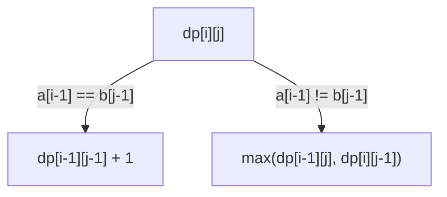

# Longest Common Subsequence

**Categoría:** Dynamic Programming

## El problema

Comparar dos secuencias para encontrar su mayor orden compartido — elementos que aparecen en ambas, en el mismo orden relativo, pero no necesariamente de forma contigua ni en las mismas posiciones. Verificar cada una de las 2^n subsecuencias de una entrada contra la otra para encontrar la más larga que también sea subsecuencia de la segunda es exponencial, y empeora cuanto más difieren las dos entradas.

## La solución

Defina `dp[i][j]` como la longitud de la LCS entre los primeros `i` elementos de `a` y los primeros `j` elementos de `b`. Si `a[i-1]` es igual a `b[j-1]`, ese elemento compartido extiende cualquier LCS que ya existiera para los dos prefijos más cortos: `dp[i][j] = dp[i-1][j-1] + 1`. Si no coinciden, la mejor opción disponible es la que resulte de "descartar el último elemento de `a`" o "descartar el último elemento de `b`", lo que deje una LCS más larga: `dp[i][j] = max(dp[i-1][j], dp[i][j-1])`. Llenar esa tabla de abajo hacia arriba es O(n × m); recorriéndola hacia atrás desde la esquina inferior derecha, reaplicando la misma lógica de coincidencia/no coincidencia de forma inversa, se recupera la subsecuencia real — no solo su longitud.



| Operación | Costo | Por qué |
|---|---|---|
| Llenado de la tabla DP | O(n × m) | una decisión de tiempo constante por celda |
| Recuperación de la subsecuencia (backtrack) | O(n + m) | un paso por celda recorrida hacia atrás, sin volver a resolver |
| Fuerza bruta (sin memoización) | exponencial — se aproxima a C(n+m, n) en el peor caso | cada no coincidencia se ramifica en dos caminos, sin caché para interrumpir un par `(i, j)` repetido |

## Ejemplo clásico

[`classic/Lcs`](src/main/java/com/algorithms/dynamicprogramming/lcs/classic/Lcs.java) es genérico para cualquier tipo de elemento con un `equals` funcional — funciona con `Character[]`, `String[]`, o cualquier tipo de dominio. `longestCommonSubsequence` retorna la subsecuencia realmente recuperada; `length` es un wrapper de conveniencia; `bruteForceLength` es la misma recursión ingenua y no memoizada contra la que advierte el módulo [Fibonacci](../fibonacci) de este repositorio, incluida aquí específicamente para servir de comparación en el benchmark a continuación.
[`LcsTest`](src/test/java/com/algorithms/dynamicprogramming/lcs/classic/LcsTest.java) cubre un caso inequívoco verificado contra la secuencia exacta recuperada, el ejemplo clásico del libro de texto CLRS (`"ABCBDAB"` vs. `"BDCABA"`, LCS de longitud 4), ningún elemento en común, entradas idénticas, una entrada vacía, la fuerza bruta coincidiendo con la longitud del DP en las mismas entradas, y las protecciones contra argumento null.

## Ejemplo aplicado: diff de conciliación de libro mayor bancario

[`applied/LedgerReconciliationDiff`](src/main/java/com/algorithms/dynamicprogramming/lcs/applied/LedgerReconciliationDiff.java)
alinea dos libros mayores de transacciones — un libro mayor interno y el extracto de un banco corresponsal para el mismo período — encontrando la subsecuencia común más larga de referencias de transacción coincidentes que aún conservan el orden relativo original. Las entradas de esa subsecuencia común quedan confirmadas como conciliadas; todo lo demás es una discrepancia de conciliación genuina (presente en un lado, ausente en el otro), y no simplemente un reordenamiento sin relación — la LCS solo *descarta* elementos para encontrar el orden compartido, nunca trata un reordenamiento como una discrepancia de la forma en que lo haría una comparación posicional estricta.
[`LedgerReconciliationDiffTest`](src/test/java/com/algorithms/dynamicprogramming/lcs/applied/LedgerReconciliationDiffTest.java)
cubre una transacción ausente del lado del banco, libros mayores idénticos que concilian por completo, ninguna superposición en absoluto, y las protecciones contra argumento null.

## Benchmark

```bash
./gradlew :dynamic-programming:longest-common-subsequence:jmh
```

Ejecución real en esta máquina (JMH 1.37, JDK 26.0.2, 2 iteraciones de warmup + 3 de medición, 1 fork). Ambas secuencias se extraen de alfabetos *disjuntos* — `a` de `{A,B,C,D}`, `b` de `{W,X,Y,Z}` — de modo que toda comparación de caracteres resulta en no coincidencia, forzando la recursión de fuerza bruta a su verdadero peor caso (una coincidencia colapsa directamente en una única llamada recursiva; una no coincidencia siempre se ramifica en dos caminos):

| Costo | length=8 | length=11 | length=14 |
|---|---:|---:|---:|
| DP | 0.481 µs | 0.852 µs | 1.070 µs |
| fuerza bruta | 60.22 µs | 3,299.02 µs | 185,880.08 µs |

En length=14, la fuerza bruta es **~173,720x más lenta** que el DP para la misma respuesta. El crecimiento coincide con la teoría con una precisión sorprendente: al pasar de length=8 a length=11 (el conteo de llamadas se aproxima a `C(22,11)/C(16,8) ≈ 54.8x`), la fuerza bruta efectivamente midió **~54.8x** más lenta — una coincidencia casi exacta. Al pasar de length=11 a length=14 (`C(28,14)/C(22,11) ≈ 56.9x` previsto), el costo medido creció **~56.3x** — la explosión combinatoria que describe el docstring de este módulo no es una aproximación aquí, es el número que realmente resultó.

## Cuándo no usarlo

- ¿Necesita hacer esto repetidamente sobre el mismo par (o una ventana deslizante de uno), y no como una comparación única? Considere si una estructura de diff incremental/continua amortiza mejor que recalcular la tabla completa O(n × m) desde cero cada vez.
- ¿Solo necesita saber *si* dos secuencias comparten algún orden, sin importar cuál es la más larga ni su contenido? Una verificación de existencia más barata (por ejemplo, una intersección de conjuntos) responde eso sin necesitar la tabla completa.
- ¿Las secuencias son extremadamente largas (n × m crece más allá de lo que cabe cómodamente en memoria)? Las variantes optimizadas en espacio mantienen solo las últimas dos filas de la tabla únicamente para la longitud — esta implementación mantiene la tabla completa específicamente porque también recupera la secuencia, lo cual requiere todo el historial para hacer backtracking.

## Cobertura de pruebas

100% de cobertura de instrucciones, 100% de cobertura de branches (JaCoCo). Reprodúzcalo usted mismo:

```bash
./gradlew :dynamic-programming:longest-common-subsequence:jacocoTestReport
```

Informe en `dynamic-programming/longest-common-subsequence/build/reports/jacoco/test/html/index.html`.

## Lectura complementaria

- Cormen, Leiserson, Rivest & Stein — *Introduction to Algorithms* (CLRS), 3.ª/4.ª ed., Capítulo 15.4, "Longest common subsequence" — el mismo ejemplo `"ABCBDAB"`/`"BDCABA"` que usan los propios tests de este módulo, resuelto por completo.
- Skiena — *The Algorithm Design Manual* — trata la LCS como la ancestra directa de las herramientas de diff reales (`diff`, algoritmos de merge de control de versiones), la misma línea de la que parte el ejemplo aplicado de este módulo.
