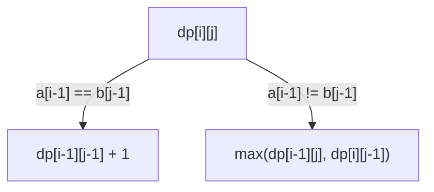

# Longest Common Subsequence

**Category:** Dynamic Programming

## The problem

Comparing two sequences for their longest shared order — elements that appear in both, in the
same relative order, but not necessarily contiguously or at the same positions. Checking every
one of the 2^n subsequences of one input against the other to find the longest one that's also a
subsequence of the second is exponential, and gets worse the harder the two inputs disagree.

## The solution

Define `dp[i][j]` as the LCS length of the first `i` elements of `a` and the first `j` elements
of `b`. If `a[i-1]` equals `b[j-1]`, that shared element extends whatever LCS already existed for
the two shorter prefixes: `dp[i][j] = dp[i-1][j-1] + 1`. If they don't match, the best available
is whichever of "drop the last element of `a`" or "drop the last element of `b`" leaves a longer
LCS: `dp[i][j] = max(dp[i-1][j], dp[i][j-1])`. Filling that table bottom-up is O(n × m); walking
back from the bottom-right corner, re-applying the same match/no-match logic in reverse, recovers
the actual subsequence — not just its length.



| Operation | Cost | Why |
|---|---|---|
| DP table fill | O(n × m) | one constant-time decision per cell |
| Subsequence recovery (backtrack) | O(n + m) | one step per cell walked back through, no re-solving |
| Brute force (no memoization) | exponential — approaches C(n+m, n) in the worst case | every mismatch branches two ways, with no cache to short-circuit a repeated `(i, j)` pair |

## Classic example

[`classic/Lcs`](src/main/java/com/algorithms/dynamicprogramming/lcs/classic/Lcs.java) is generic
over any element type with a working `equals` — works on `Character[]`, `String[]`, or any
domain type. `longestCommonSubsequence` returns the actual recovered subsequence; `length` is a
convenience wrapper; `bruteForceLength` is the same naive, unmemoized recursion this repo's
[Fibonacci](../fibonacci) module warns against, included here specifically for the benchmark
below to measure against.
[`LcsTest`](src/test/java/com/algorithms/dynamicprogramming/lcs/classic/LcsTest.java) covers an
unambiguous case verified against the exact recovered sequence, the classic CLRS textbook example
(`"ABCBDAB"` vs. `"BDCABA"`, LCS length 4), no common elements, identical inputs, an empty input,
brute force agreeing with the DP length on the same inputs, and the null-argument guards.

## Applied example: bank ledger reconciliation diff

[`applied/LedgerReconciliationDiff`](src/main/java/com/algorithms/dynamicprogramming/lcs/applied/LedgerReconciliationDiff.java)
aligns two transaction ledgers — an internal ledger and a correspondent bank's statement for the
same period — by finding the longest common subsequence of matching transaction references still
in their original relative order. Entries in that common subsequence are confirmed reconciled;
everything else is a genuine reconciliation break (present on one side, missing from the other),
not just an unrelated reordering — LCS only ever *drops* elements to find the shared order, it
never treats a reordering as a mismatch the way a strict positional comparison would.
[`LedgerReconciliationDiffTest`](src/test/java/com/algorithms/dynamicprogramming/lcs/applied/LedgerReconciliationDiffTest.java)
covers a transaction missing from the bank side, identical ledgers reconciling completely, no
overlap at all, and the null-argument guards.

## Benchmark

```bash
./gradlew :dynamic-programming:longest-common-subsequence:jmh
```

Real run on this machine (JMH 1.37, JDK 26.0.2, 2 warmup + 3 measurement iterations, 1 fork).
Both sequences drawn from *disjoint* alphabets — `a` from `{A,B,C,D}`, `b` from `{W,X,Y,Z}` — so
every character comparison mismatches, forcing the brute-force recursion into its true worst
case (a match collapses straight to one recursive call; a mismatch always branches two ways):

| Cost | length=8 | length=11 | length=14 |
|---|---:|---:|---:|
| DP | 0.481 µs | 0.852 µs | 1.070 µs |
| brute force | 60.22 µs | 3,299.02 µs | 185,880.08 µs |

At length=14, brute force is **~173,720x slower** than DP for the identical answer. The growth
matches theory with striking precision: going from length=8 to length=11 (the call count
approaches `C(22,11)/C(16,8) ≈ 54.8x`), brute force actually measured **~54.8x** slower — an
almost exact match. Going from length=11 to length=14 (`C(28,14)/C(22,11) ≈ 56.9x` predicted),
the measured cost grew **~56.3x** — the combinatorial blowup this module's docstring describes
isn't an approximation here, it's the number that came back.

## When not to use it

- Need this repeatedly on the same pair (or a sliding window of one), not a one-shot comparison?
  Consider whether a rolling/incremental diff structure amortizes better than recomputing the
  full O(n × m) table from scratch each time.
- Only need to know *whether* two sequences share any order at all, not the longest one or its
  contents? A cheaper existence check (e.g. a set intersection) answers that without the full
  table.
- Sequences are extremely long (n × m grows past what fits comfortably in memory)? Space-
  optimized variants keep only the last two rows of the table for the length alone — this
  implementation keeps the full table specifically because it also recovers the sequence, which
  needs the whole history to backtrack through.

## Test coverage

100% instruction coverage, 100% branch coverage (JaCoCo). Reproduce it yourself:

```bash
./gradlew :dynamic-programming:longest-common-subsequence:jacocoTestReport
```

Report at `dynamic-programming/longest-common-subsequence/build/reports/jacoco/test/html/index.html`.

## Further reading

- Cormen, Leiserson, Rivest & Stein — *Introduction to Algorithms* (CLRS), 3rd/4th ed.,
  Chapter 15.4, "Longest common subsequence" — the exact `"ABCBDAB"`/`"BDCABA"` example this
  module's own tests use, worked through in full.
- Skiena — *The Algorithm Design Manual* — covers LCS as the direct ancestor of real diff tools
  (`diff`, version-control merge algorithms), the same lineage this module's applied example
  draws on.
