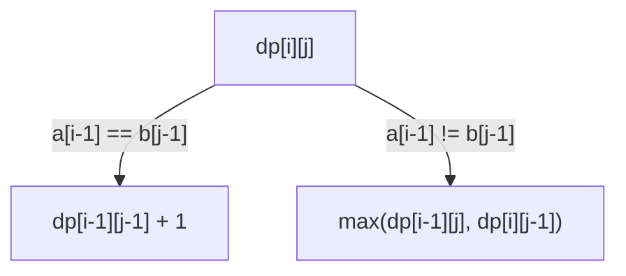

# Longest Common Subsequence

**Categoria:** Dynamic Programming

## O problema

Comparar duas sequências em busca da maior ordem compartilhada entre elas — elementos que aparecem em ambas, na mesma ordem relativa, mas não necessariamente de forma contígua ou nas mesmas posições. Verificar cada uma das 2^n subsequências de uma entrada contra a outra para encontrar a mais longa que também seja subsequência da segunda é exponencial, e piora quanto mais as duas entradas divergem.

## A solução

Defina `dp[i][j]` como o comprimento da LCS entre os primeiros `i` elementos de `a` e os primeiros `j` elementos de `b`. Se `a[i-1]` for igual a `b[j-1]`, esse elemento compartilhado estende qualquer LCS que já existisse para os dois prefixos mais curtos: `dp[i][j] = dp[i-1][j-1] + 1`. Se não houver correspondência, a melhor opção disponível é a que resultar de "descartar o último elemento de `a`" ou "descartar o último elemento de `b`", o que deixar uma LCS mais longa: `dp[i][j] = max(dp[i-1][j], dp[i][j-1])`. Preencher essa tabela de baixo para cima é O(n × m); percorrendo-a de trás para frente a partir do canto inferior direito, reaplicando a mesma lógica de correspondência/não correspondência de forma reversa, recupera-se a subsequência real — não apenas seu comprimento.



| Operação | Custo | Por quê |
|---|---|---|
| Preenchimento da tabela DP | O(n × m) | uma decisão de tempo constante por célula |
| Recuperação da subsequência (backtrack) | O(n + m) | um passo por célula percorrida de volta, sem resolver de novo |
| Força bruta (sem memoização) | exponencial — se aproxima de C(n+m, n) no pior caso | cada não correspondência se ramifica em dois caminhos, sem cache para interromper um par `(i, j)` repetido |

## Exemplo clássico

[`classic/Lcs`](src/main/java/com/algorithms/dynamicprogramming/lcs/classic/Lcs.java) é genérico para qualquer tipo de elemento com um `equals` funcional — funciona com `Character[]`, `String[]`, ou qualquer tipo de domínio. `longestCommonSubsequence` retorna a subsequência realmente recuperada; `length` é um wrapper de conveniência; `bruteForceLength` é a mesma recursão ingênua e não memoizada contra a qual o módulo [Fibonacci](../fibonacci) deste repositório alerta, incluída aqui especificamente para servir de comparação no benchmark abaixo.
[`LcsTest`](src/test/java/com/algorithms/dynamicprogramming/lcs/classic/LcsTest.java) cobre um caso inequívoco verificado em relação à sequência exata recuperada, o exemplo clássico do livro-texto CLRS (`"ABCBDAB"` vs. `"BDCABA"`, LCS de comprimento 4), nenhum elemento em comum, entradas idênticas, uma entrada vazia, a força bruta concordando com o comprimento do DP nas mesmas entradas, e as proteções contra argumento null.

## Exemplo aplicado: diff de reconciliação de livro-razão bancário

[`applied/LedgerReconciliationDiff`](src/main/java/com/algorithms/dynamicprogramming/lcs/applied/LedgerReconciliationDiff.java)
alinha dois livros-razão de transações — um livro-razão interno e o extrato de um banco correspondente para o mesmo período — encontrando a maior subsequência comum de referências de transação coincidentes que ainda mantêm a ordem relativa original. As entradas nessa subsequência comum são consideradas reconciliadas; tudo o mais é uma quebra de reconciliação genuína (presente em um lado, ausente no outro), e não apenas uma reordenação sem relação — a LCS apenas *descarta* elementos para encontrar a ordem compartilhada, nunca trata uma reordenação como uma divergência da forma que uma comparação posicional estrita trataria.
[`LedgerReconciliationDiffTest`](src/test/java/com/algorithms/dynamicprogramming/lcs/applied/LedgerReconciliationDiffTest.java)
cobre uma transação ausente do lado do banco, livros-razão idênticos reconciliando completamente, nenhuma sobreposição, e as proteções contra argumento null.

## Benchmark

```bash
./gradlew :dynamic-programming:longest-common-subsequence:jmh
```

Execução real nesta máquina (JMH 1.37, JDK 26.0.2, 2 iterações de warmup + 3 de medição, 1 fork). As duas sequências são extraídas de alfabetos *disjuntos* — `a` de `{A,B,C,D}`, `b` de `{W,X,Y,Z}` — de forma que toda comparação de caracteres resulta em não correspondência, forçando a recursão de força bruta ao seu verdadeiro pior caso (uma correspondência colapsa diretamente em uma única chamada recursiva; uma não correspondência sempre se ramifica em dois caminhos):

| Custo | length=8 | length=11 | length=14 |
|---|---:|---:|---:|
| DP | 0.481 µs | 0.852 µs | 1.070 µs |
| força bruta | 60.22 µs | 3,299.02 µs | 185,880.08 µs |

Em length=14, a força bruta é **~173,720x mais lenta** que o DP para a mesma resposta. O crescimento corresponde à teoria com precisão impressionante: ao ir de length=8 para length=11 (a contagem de chamadas se aproxima de `C(22,11)/C(16,8) ≈ 54.8x`), a força bruta de fato mediu **~54.8x** mais lenta — uma correspondência quase exata. Ao ir de length=11 para length=14 (`C(28,14)/C(22,11) ≈ 56.9x` previsto), o custo medido cresceu **~56.3x** — a explosão combinatória que a docstring deste módulo descreve não é uma aproximação aqui, é o número que realmente apareceu.

## Quando não usar

- Precisa fazer isso repetidamente no mesmo par (ou em uma janela deslizante de um), e não como uma comparação única? Considere se uma estrutura de diff incremental/contínua amortiza melhor do que recalcular a tabela completa O(n × m) do zero a cada vez.
- Só precisa saber *se* duas sequências compartilham alguma ordem, sem se importar com qual é a mais longa ou seu conteúdo? Uma verificação de existência mais barata (por exemplo, uma interseção de conjuntos) responde a isso sem precisar da tabela completa.
- As sequências são extremamente longas (n × m cresce além do que cabe confortavelmente na memória)? Variantes otimizadas em espaço mantêm apenas as últimas duas linhas da tabela apenas para o comprimento — esta implementação mantém a tabela completa especificamente porque também recupera a sequência, o que exige todo o histórico para o backtracking.

## Cobertura de testes

100% de cobertura de instruções, 100% de cobertura de branches (JaCoCo). Reproduza você mesmo:

```bash
./gradlew :dynamic-programming:longest-common-subsequence:jacocoTestReport
```

Relatório em `dynamic-programming/longest-common-subsequence/build/reports/jacoco/test/html/index.html`.

## Leitura complementar

- Cormen, Leiserson, Rivest & Stein — *Introduction to Algorithms* (CLRS), 3ª/4ª ed., Capítulo 15.4, "Longest common subsequence" — o mesmo exemplo `"ABCBDAB"`/`"BDCABA"` que os próprios testes deste módulo usam, resolvido por completo.
- Skiena — *The Algorithm Design Manual* — trata a LCS como a ancestral direta de ferramentas de diff reais (`diff`, algoritmos de merge de controle de versão), a mesma linhagem da qual o exemplo aplicado deste módulo parte.
