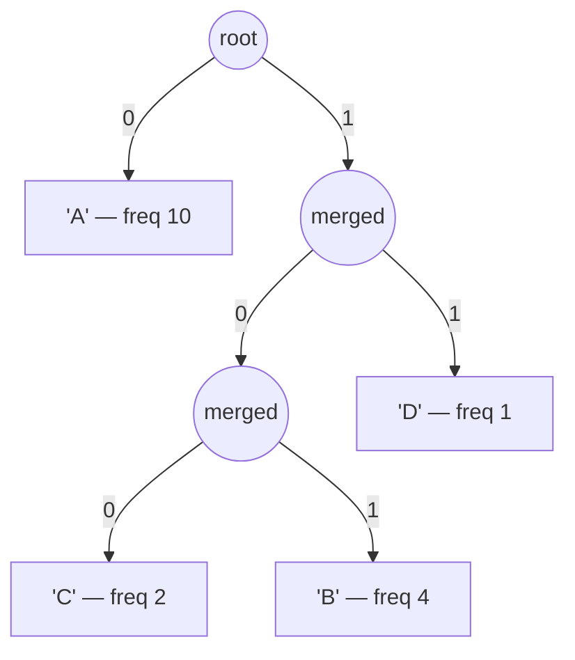

# Huffman Coding

**Categoría:** Greedy

## El problema

Codificar un flujo de símbolos en bits de la forma más compacta posible sin perder ninguna
información — usar un número fijo de bits por símbolo (8 para ASCII simple) desperdicia espacio
cada vez que algunos símbolos aparecen con mucha más frecuencia que otros, que es el caso normal
en texto real y datos de log.

## La solución

Construir un árbol binario de abajo hacia arriba: empezar con una hoja por cada símbolo distinto,
ponderada según su frecuencia de aparición, y luego tomar repetidamente los dos nodos
*actualmente* menos frecuentes y fusionarlos en un nuevo nodo interno cuyo peso es la suma de
ambos — voraz, porque en cada paso se fusionan primero los dos nodos disponibles más pequeños, sin
ningún lookahead. Repetir hasta que quede un solo nodo. El código de cada símbolo es el camino
desde la raíz hasta su hoja (`0` para la izquierda, `1` para la derecha), de modo que los símbolos
fusionados al final — los frecuentes — terminan poco profundos, con códigos cortos, y los símbolos
fusionados temprano — los poco frecuentes — terminan profundos, con códigos largos. Ese orden
voraz de fusión es demostrablemente óptimo entre todos los códigos binarios libres de prefijo
posibles para una distribución de frecuencias conocida: ninguna otra asignación de códigos logra
una longitud media ponderada de código menor. "Libre de prefijo" es también lo que hace que el
resultado sea decodificable a partir de un único flujo de bits continuo, sin separadores — ningún
código es nunca prefijo de otro, así que recorrer el árbol bit a bit siempre termina en exactamente
una hoja antes de que pueda comenzar el siguiente código.



## Ejemplo clásico

[`classic/HuffmanCoding`](src/main/java/com/algorithms/greedy/huffmancoding/classic/HuffmanCoding.java)
expone `encode`/`decode` construidos alrededor de un tipo `Node` privado ordenado por frecuencia
para una `PriorityQueue`, más el caso límite que una implementación hecha desde cero debe resolver
a propósito: un único símbolo distinto nunca dispara una fusión, así que no puede obtener un código
a partir de un camino en el árbol — se maneja explícitamente con un bit `0` por ocurrencia.
[`HuffmanCodingTest`](src/test/java/com/algorithms/greedy/huffmancoding/classic/HuffmanCodingTest.java)
demuestra la fidelidad de ida y vuelta sobre una entrada sesgada, demuestra que ocurrió compresión
real (la cantidad de bits codificados queda por debajo de `length * 8`) y — la propiedad que
realmente define un código de Huffman válido — demuestra que ningún código asignado es prefijo de
otro, verificando cada par directamente, en lugar de simplemente confiar en la construcción.

## Ejemplo aplicado: compresión por lotes de CDR de telecomunicaciones

[`applied/CdrFieldCompressor`](src/main/java/com/algorithms/greedy/huffmancoding/applied/CdrFieldCompressor.java)
comprime un lote de campos de texto de registros de detalle de llamada (CDR, call detail record)
antes de archivarlos — códigos de causa y cadenas de estado que repiten abrumadoramente los mismos
pocos valores (`NORMAL_CLEARING` mucho más que `NETWORK_CONGESTION`), exactamente la forma sesgada
que la codificación de Huffman está diseñada para explotar. `CompressionReport.compressionRatio()`
informa la fracción del número original de bits que realmente usa la forma comprimida.
[`CdrFieldCompressorTest`](src/test/java/com/algorithms/greedy/huffmancoding/applied/CdrFieldCompressorTest.java)
construye un lote realista y sesgado, confirma que la tasa de compresión resulta menor que 1.0,
confirma que la forma comprimida se decodifica exactamente al lote original y verifica la
protección ante valores nulos/vacíos.

## Benchmark

```bash
./gradlew :greedy:huffman-coding:jmh
```

Ejecución real en esta máquina (JMH 1.37, JDK 26.0.2, 2 iteraciones de warmup + 3 de medición, 1
fork). La codificación es O(n + k log k) — una pasada para contar frecuencias, un heap de a lo
sumo `k` símbolos distintos para construir el árbol, y una pasada más para emitir los códigos.
Para texto realista, `k` es fijo y diminuto frente a la longitud de la entrada `n`, así que el
crecimiento debería seguir a `n` de forma casi lineal:

| Longitud de la entrada | Tiempo de codificación |
|---:|---:|
| 1,000 caracteres | 41.45 µs |
| 10,000 caracteres | 393.19 µs |
| 100,000 caracteres | 3,869.94 µs |

Cada incremento de 10x en la longitud de la entrada produjo un incremento aproximado de 10x en el
tiempo de codificación — **9.49x** al pasar de 1,000 a 10,000 caracteres, **9.84x** al pasar de
10,000 a 100,000 — siguiendo de cerca la predicción O(n) en ambos pasos, exactamente lo que debe
verse cuando un término de tamaño de alfabeto es lo bastante pequeño como para despreciarse.

## Cuándo no usarlo

- ¿La distribución de frecuencias no es en realidad sesgada (está cerca de uniforme)? Queda poco
  margen para comprimir — un código de ancho fijo terminará con un tamaño similar, sin la
  sobrecarga de enviar el árbol/tabla de códigos junto con los datos.
- ¿Se necesita compresión adaptativa que se actualice a medida que aparecen nuevos símbolos, sin
  conocer de antemano la distribución de frecuencias completa? La codificación de Huffman estática
  (esta implementación) necesita primero toda la entrada; conviene mirar en su lugar las variantes
  de Huffman adaptativo/dinámico.
- ¿Las frecuencias se conocen y son de tamaño fijo, pero se necesita una codificación más cercana
  a la entropía de lo que permite un número entero de bits por símbolo? La codificación aritmética
  o por rangos puede superar a Huffman por fracciones de bit por símbolo — este repositorio no las
  implementa, pero la referencia de CLRS más abajo cubre ese límite.

## Cobertura de pruebas

100% de cobertura de instrucciones, 100% de cobertura de ramas (JaCoCo). Reprodúcelo tú mismo:

```bash
./gradlew :greedy:huffman-coding:jacocoTestReport
```

Informe en `greedy/huffman-coding/build/reports/jacoco/test/html/index.html`.

## Lectura complementaria

- Cormen, Leiserson, Rivest & Stein — *Introduction to Algorithms* (CLRS), 3.ª/4.ª ed.,
  Capítulo 16.3, "Huffman codes" — incluye la prueba por argumento de intercambio de que el orden
  voraz de fusión es óptimo, y analiza la cota de entropía que referencia la sección "Cuándo no
  usarlo" de este módulo.
- Sedgewick & Wayne — *Algorithms*, 4.ª ed. — cubre la codificación de Huffman directamente junto
  a LZW como estudios de caso emparejados en compresión de datos, con el mismo énfasis en los
  códigos libres de prefijo como la propiedad que hace posible la decodificación en un solo flujo.
