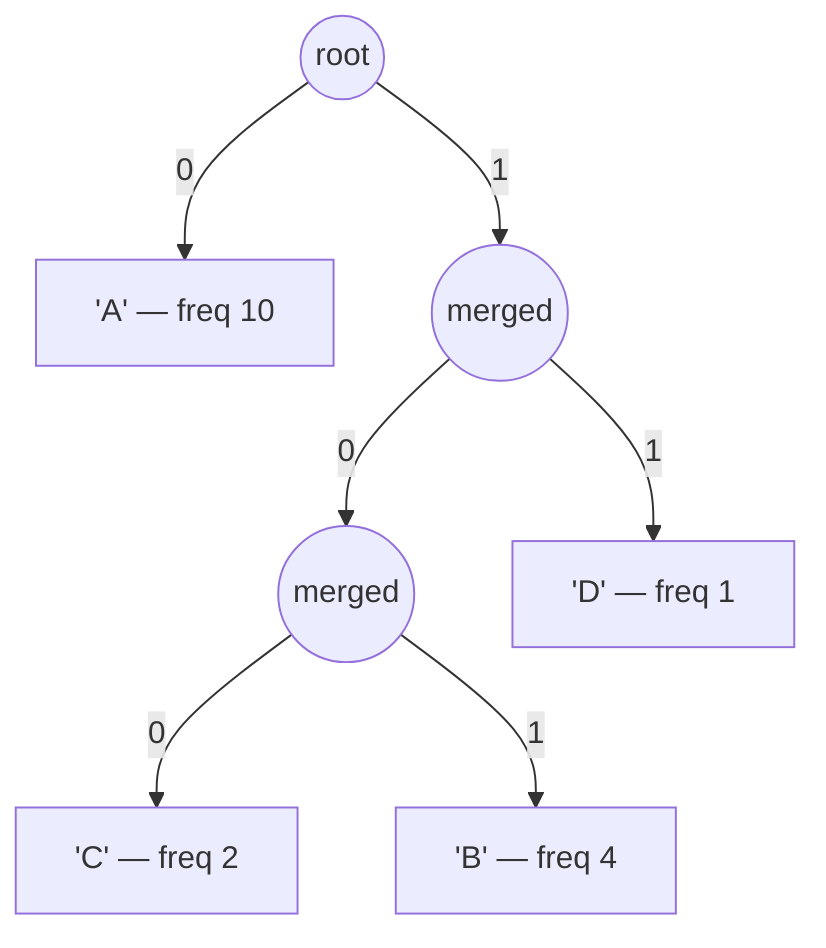

# Huffman Coding

**Category:** Greedy

## The problem

Encoding a stream of symbols into bits as compactly as possible without losing any information —
using a fixed number of bits per symbol (8 for plain ASCII) wastes space whenever some symbols
show up far more often than others, which is the normal case for real text and log data.

## The solution

Build a binary tree bottom-up: start with one leaf per distinct symbol, weighted by how often it
occurs, then repeatedly take the two *currently* least-frequent nodes and merge them into a new
internal node whose weight is their sum — greedy, because the two smallest available nodes are
merged first, on every step, with no lookahead. Do that until one node remains. Each symbol's code
is the path from the root to its leaf (`0` for left, `1` for right), so symbols merged in late —
the frequent ones — end up shallow with short codes, and symbols merged in early — the rare ones —
end up deep with long codes. That greedy merge order is provably optimal among every possible
prefix-free binary code for a known frequency distribution: no other assignment of codes gets a
lower weighted-average code length. "Prefix-free" is also what makes the result decodable at all
from one unbroken bitstream with no separators — no code is ever a prefix of another, so walking
the tree bit by bit always lands on exactly one leaf before the next code can start.



## Classic example

[`classic/HuffmanCoding`](src/main/java/com/algorithms/greedy/huffmancoding/classic/HuffmanCoding.java)
exposes `encode`/`decode` built around a private `Node` type ordered by frequency for a
`PriorityQueue`, plus the edge case a from-scratch implementation has to get right on purpose: a
single distinct symbol never triggers a merge, so it can't get a code from a tree path — it's
handled explicitly with one `0` bit per occurrence.
[`HuffmanCodingTest`](src/test/java/com/algorithms/greedy/huffmancoding/classic/HuffmanCodingTest.java)
proves round-trip fidelity on a skewed input, proves real compression happened (encoded bit count
below `length * 8`), and — the property that actually defines a valid Huffman code — proves no
assigned code is a prefix of any other by checking every pair directly, not just trusting the
construction.

## Applied example: telecom CDR batch compression

[`applied/CdrFieldCompressor`](src/main/java/com/algorithms/greedy/huffmancoding/applied/CdrFieldCompressor.java)
compresses a batch of call detail record (CDR) text fields before archival — cause codes and
status strings that repeat the same handful of values overwhelmingly often
(`NORMAL_CLEARING` far more than `NETWORK_CONGESTION`), which is exactly the skewed shape Huffman
coding is built to exploit. `CompressionReport.compressionRatio()` reports the fraction of the
original bit count the compressed form actually uses.
[`CdrFieldCompressorTest`](src/test/java/com/algorithms/greedy/huffmancoding/applied/CdrFieldCompressorTest.java)
builds a realistic skewed batch, confirms the compression ratio comes back under 1.0, confirms the
compressed form decodes back to the exact original batch, and checks the null/empty guard.

## Benchmark

```bash
./gradlew :greedy:huffman-coding:jmh
```

Real run on this machine (JMH 1.37, JDK 26.0.2, 2 warmup + 3 measurement iterations, 1 fork).
Encoding is O(n + k log k) — one pass to count frequencies, a heap of at most `k` distinct
symbols to build the tree, one more pass to emit codes. For realistic text `k` is fixed and tiny
next to the input length `n`, so growth should track `n` almost linearly:

| Input length | Encode time |
|---:|---:|
| 1,000 chars | 41.45 µs |
| 10,000 chars | 393.19 µs |
| 100,000 chars | 3,869.94 µs |

Each 10x increase in input length produced roughly a 10x increase in encode time — **9.49x**
going from 1,000 to 10,000 characters, **9.84x** going from 10,000 to 100,000 — tracking the O(n)
prediction closely on both steps, exactly what an alphabet-size term small enough to round away
should look like.

## When not to use it

- The frequency distribution isn't actually skewed (close to uniform)? There's little room left
  to compress — a fixed-width code will end up close to the same size, without the overhead of
  shipping the tree/code table alongside the data.
- Need adaptive compression that updates as new symbols are seen, without knowing the full
  frequency distribution up front? Static Huffman coding (this implementation) needs the whole
  input first; look at adaptive/dynamic Huffman variants instead.
- Frequencies are known and fixed size but need coding closer to entropy than an integer number
  of bits per symbol allows? Arithmetic or range coding can beat Huffman by fractional bits per
  symbol — this repo doesn't implement them, but the CLRS reference below covers the boundary.

## Test coverage

100% instruction coverage, 100% branch coverage (JaCoCo). Reproduce it yourself:

```bash
./gradlew :greedy:huffman-coding:jacocoTestReport
```

Report at `greedy/huffman-coding/build/reports/jacoco/test/html/index.html`.

## Further reading

- Cormen, Leiserson, Rivest & Stein — *Introduction to Algorithms* (CLRS), 3rd/4th ed.,
  Chapter 16.3, "Huffman codes" — includes the exchange-argument proof that the greedy merge
  order is optimal, and discusses the entropy bound this module's "When not to use it" section
  references.
- Sedgewick & Wayne — *Algorithms*, 4th ed. — covers Huffman coding directly alongside LZW as
  paired case studies in data compression, with the same emphasis on prefix-free codes as the
  property that makes single-stream decoding possible.
