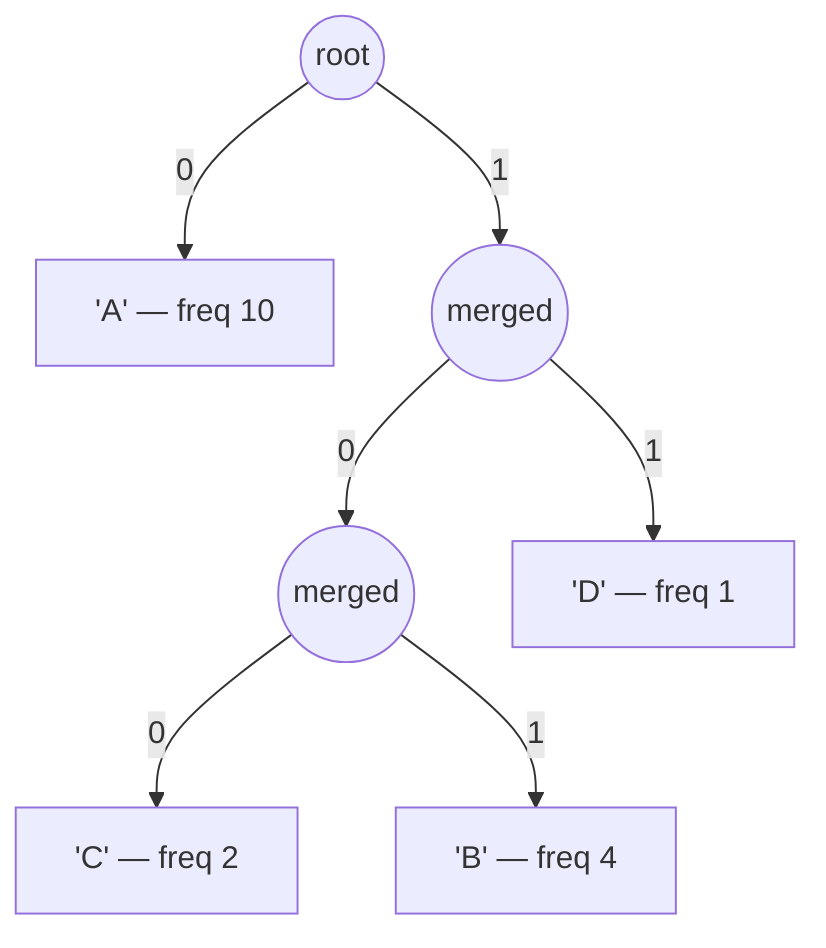

# Huffman Coding

**Categoria:** Greedy

## O problema

Codificar um fluxo de símbolos em bits da forma mais compacta possível sem perder nenhuma
informação — usar um número fixo de bits por símbolo (8 para ASCII simples) desperdiça espaço
sempre que alguns símbolos aparecem com frequência muito maior que outros, o que é o caso normal
em texto real e dados de log.

## A solução

Construir uma árvore binária de baixo para cima: começar com uma folha para cada símbolo distinto,
ponderada por sua frequência de ocorrência, e então repetidamente pegar os dois nós *atualmente*
menos frequentes e mesclá-los em um novo nó interno cujo peso é a soma dos dois — guloso, porque a
cada passo os dois menores nós disponíveis são mesclados primeiro, sem nenhum lookahead. Repetir
até restar um único nó. O código de cada símbolo é o caminho da raiz até sua folha (`0` para a
esquerda, `1` para a direita), de modo que símbolos mesclados por último — os frequentes — acabam
rasos, com códigos curtos, e símbolos mesclados cedo — os raros — acabam profundos, com códigos
longos. Essa ordem gulosa de mesclagem é comprovadamente ótima entre todos os códigos binários
livres de prefixo possíveis para uma distribuição de frequência conhecida: nenhuma outra
atribuição de códigos produz um comprimento médio ponderado de código menor. "Livre de prefixo"
também é o que torna o resultado decodificável a partir de um único fluxo contínuo de bits, sem
separadores — nenhum código é jamais prefixo de outro, então percorrer a árvore bit a bit sempre
termina em exatamente uma folha antes que o próximo código possa começar.



## Exemplo clássico

[`classic/HuffmanCoding`](src/main/java/com/algorithms/greedy/huffmancoding/classic/HuffmanCoding.java)
expõe `encode`/`decode` construídos em torno de um tipo `Node` privado ordenado por frequência
para uma `PriorityQueue`, além do caso extremo que uma implementação feita do zero precisa acertar
de propósito: um único símbolo distinto nunca dispara uma mesclagem, então ele não pode obter um
código a partir de um caminho na árvore — é tratado explicitamente com um bit `0` por ocorrência.
[`HuffmanCodingTest`](src/test/java/com/algorithms/greedy/huffmancoding/classic/HuffmanCodingTest.java)
comprova a fidelidade de ida e volta em uma entrada assimétrica, comprova que houve compressão
real (contagem de bits codificados abaixo de `length * 8`) e — a propriedade que de fato define um
código de Huffman válido — comprova que nenhum código atribuído é prefixo de outro, verificando
cada par diretamente, em vez de simplesmente confiar na construção.

## Exemplo aplicado: compressão em lote de CDRs de telecom

[`applied/CdrFieldCompressor`](src/main/java/com/algorithms/greedy/huffmancoding/applied/CdrFieldCompressor.java)
comprime um lote de campos de texto de registros de detalhes de chamada (CDR — call detail record)
antes do arquivamento — códigos de causa e strings de status que repetem esmagadoramente os mesmos
poucos valores (`NORMAL_CLEARING` muito mais que `NETWORK_CONGESTION`), exatamente a forma
assimétrica que a codificação de Huffman foi feita para explorar. `CompressionReport.compressionRatio()`
reporta a fração da contagem de bits original que a forma comprimida efetivamente usa.
[`CdrFieldCompressorTest`](src/test/java/com/algorithms/greedy/huffmancoding/applied/CdrFieldCompressorTest.java)
constrói um lote realisticamente assimétrico, confirma que a taxa de compressão volta abaixo de
1.0, confirma que a forma comprimida decodifica de volta exatamente para o lote original e
verifica a proteção contra nulo/vazio.

## Benchmark

```bash
./gradlew :greedy:huffman-coding:jmh
```

Execução real nesta máquina (JMH 1.37, JDK 26.0.2, 2 iterações de warmup + 3 de medição, 1 fork).
A codificação é O(n + k log k) — uma passada para contar frequências, um heap de no máximo `k`
símbolos distintos para construir a árvore, mais uma passada para emitir os códigos. Para texto
realista, `k` é fixo e minúsculo em relação ao comprimento da entrada `n`, então o crescimento
deve acompanhar `n` de forma quase linear:

| Comprimento da entrada | Tempo de codificação |
|---:|---:|
| 1,000 caracteres | 41.45 µs |
| 10,000 caracteres | 393.19 µs |
| 100,000 caracteres | 3,869.94 µs |

Cada aumento de 10x no comprimento da entrada produziu um aumento aproximado de 10x no tempo de
codificação — **9.49x** ao ir de 1,000 para 10,000 caracteres, **9.84x** ao ir de 10,000 para
100,000 — acompanhando de perto a previsão O(n) em ambos os passos, exatamente o que se espera
quando o termo de tamanho do alfabeto é pequeno o bastante para ser desprezado.

## Quando não usar

- A distribuição de frequência não é de fato assimétrica (está próxima de uniforme)? Sobra pouco
  espaço para compressão — um código de largura fixa acaba com tamanho parecido, sem a sobrecarga
  de enviar a árvore/tabela de códigos junto com os dados.
- Precisa de compressão adaptativa, que se atualize conforme novos símbolos aparecem, sem
  conhecer a distribuição de frequência completa de antemão? A codificação de Huffman estática
  (esta implementação) precisa da entrada inteira primeiro; considere variantes de Huffman
  adaptativo/dinâmico.
- As frequências são conhecidas e de tamanho fixo, mas é necessária uma codificação mais próxima
  da entropia do que um número inteiro de bits por símbolo permite? Codificação aritmética ou por
  intervalos (range coding) pode superar Huffman em frações de bit por símbolo — este repositório
  não as implementa, mas a referência de CLRS abaixo cobre esse limite.

## Cobertura de testes

100% de cobertura de instruções, 100% de cobertura de branches (JaCoCo). Reproduza você mesmo:

```bash
./gradlew :greedy:huffman-coding:jacocoTestReport
```

Relatório em `greedy/huffman-coding/build/reports/jacoco/test/html/index.html`.

## Leitura complementar

- Cormen, Leiserson, Rivest & Stein — *Introduction to Algorithms* (CLRS), 3ª/4ª ed.,
  Capítulo 16.3, "Huffman codes" — inclui a prova por argumento de troca (exchange argument) de
  que a ordem gulosa de mesclagem é ótima, e discute o limite de entropia referenciado na seção
  "Quando não usar" deste módulo.
- Sedgewick & Wayne — *Algorithms*, 4ª ed. — cobre a codificação de Huffman diretamente ao lado de
  LZW como estudos de caso pareados em compressão de dados, com a mesma ênfase em códigos livres
  de prefixo como a propriedade que torna possível a decodificação em fluxo único.
