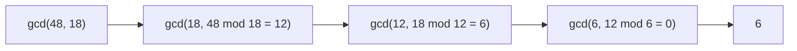

# Euclidean GCD

**Categoría:** Math

## El problema

Encontrar el máximo común divisor (GCD) de dos enteros no negativos — el entero más grande que divide a ambos sin dejar resto. El enfoque directo — contar hacia atrás desde el número más pequeño, probando cada candidato — es O(min(a, b)). Para dos números grandes que resultan ser coprimos (su único divisor común es 1), ese recorrido tiene que llegar hasta 1 sin nada que mostrar antes de eso.

## La solución

Una sola identidad sostiene todo el algoritmo: `gcd(a, b) = gcd(b, a mod b)`. Reemplazar repetidamente el par `(a, b)` por `(b, a mod b)` reduce los números rápidamente — al menos tan rápido como crece la secuencia de Fibonacci, que es el propio peor caso clásico del algoritmo (dos números de Fibonacci consecutivos fuerzan la cantidad máxima posible de pasos para números de ese tamaño). Incluso ese peor caso es de solo O(log(min(a, b))) pasos — muy lejos del recorrido lineal que reemplaza.



## Ejemplo clásico

[`classic/EuclideanGcd`](src/main/java/com/algorithms/math/euclideangcd/classic/EuclideanGcd.java)
implementa el algoritmo iterativo basado en módulo, un `lcm` construido directamente sobre él (`lcm(a, b) = (a / gcd(a, b)) * b`), y `bruteForceGcd`, incluido específicamente para el benchmark a continuación.
[`EuclideanGcdTest`](src/test/java/com/algorithms/math/euclideangcd/classic/EuclideanGcdTest.java)
cubre un par ordinario, las identidades con argumento cero, un número contra sí mismo, un par coprimo, y — un guiño deliberado al propio peor caso clásico del algoritmo — un par de números de Fibonacci consecutivos, además de confirmar que la fuerza bruta coincide con Euclides en todos los casos probados.

## Ejemplo aplicado: proporción de split payment en marketplace vía PIX

[`applied/PaymentSplitReducer`](src/main/java/com/algorithms/math/euclideangcd/applied/PaymentSplitReducer.java)
reduce una regla de split payment de marketplace vía PIX a su mínima expresión — una plataforma que retiene 3,000 unidades base y un vendedor que recibe 7,000 de un total de 10,000 se reduce a la proporción canónica `3:7`, que es exactamente el tipo de representación auditable y mínima que un motor de reglas de liquidación quiere almacenar, en lugar de los números originales (equivalentes, pero innecesariamente grandes).
[`PaymentSplitReducerTest`](src/test/java/com/algorithms/math/euclideangcd/applied/PaymentSplitReducerTest.java)
cubre un split reducible, un split que ya está en su mínima expresión, y la protección contra participaciones no positivas.

## Benchmark

```bash
./gradlew :math:euclidean-gcd:jmh
```

Ejecución real en esta máquina (JMH 1.37, JDK 26.0.2, 2 iteraciones de calentamiento + 3 de medición, 1 fork). Ambos métodos se ejecutan contra pares de enteros consecutivos `(n, n-1)` — siempre coprimos, por lo que su GCD verdadero es siempre `1`. Ese es el peor caso del recorrido de fuerza bruta (nunca encuentra un divisor común antes de tiempo, así que siempre recorre todo hasta el final) y está cerca del mejor caso de Euclides (`n mod (n-1)` es siempre `1`, resolviéndose en esencialmente dos pasos sin importar `n`):

| Costo | n=100 | n=10,000 | n=1,000,000 |
|---|---:|---:|---:|
| Euclides | 0.022 µs | 0.022 µs | 0.022 µs |
| fuerza bruta | 1.10 µs | 110.30 µs | 9,877.36 µs |

Euclides se mantiene completamente estable a lo largo de cuatro órdenes de magnitud de `n` — realmente realiza las mismas dos operaciones de módulo sin importar cuán grandes sean los números. La fuerza bruta sigue su predicción de O(n) casi con exactitud: un aumento de 100x en `n` produjo un aumento de **100.1x** en el costo (100 → 10,000), y un aumento de **89.6x** en el siguiente paso de 100x (10,000 → 1,000,000). En n=1,000,000, la fuerza bruta es **~448,971x más lenta** que Euclides para la misma respuesta.

## Cuándo no usarlo

- ¿Ya tiene las factorizaciones primas de ambos números disponibles por otro motivo? Multiplicar directamente los factores primos compartidos puede ser más simple — el algoritmo de Euclides se justifica específicamente porque encuentra el GCD *sin* factorizar ninguno de los números.
- ¿Necesita el GCD de más de dos números? Aplique el algoritmo de Euclides de a pares — `gcd(a, b, c) = gcd(gcd(a, b), c)` — en lugar de recurrir a una técnica diferente; la identidad se generaliza de forma directa.
- ¿Necesita no solo el GCD, sino también los coeficientes enteros `x, y` tales que `ax + by = gcd(a, b)` (necesarios para inversos modulares, entre otras cosas)? Ese es el algoritmo de Euclides *extendido* — una extensión directa de este, no implementada por separado aquí.

## Cobertura de pruebas

100% de cobertura de instrucciones, 100% de cobertura de branches (JaCoCo). Reprodúzcalo usted mismo:

```bash
./gradlew :math:euclidean-gcd:jacocoTestReport
```

Informe en `math/euclidean-gcd/build/reports/jacoco/test/html/index.html`.

## Lectura complementaria

- Cormen, Leiserson, Rivest & Stein — *Introduction to Algorithms* (CLRS), 3.ª/4.ª ed., Capítulo 31.2, "Greatest common divisor" — demuestra la cota O(log(min(a, b))) mediante el argumento de peor caso de Fibonacci que el propio test de este módulo cita directamente.
- Knuth — *The Art of Computer Programming*, Volume 2, *Seminumerical Algorithms* — la Sección 4.5.2 es el tratamiento clásico y profundo del algoritmo de Euclides, incluyendo sus orígenes históricos como (muy probablemente) el algoritmo no trivial más antiguo todavía en uso común.
