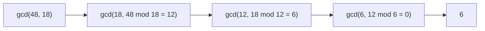

# Euclidean GCD

**Category:** Math

## The problem

Finding the greatest common divisor (GCD) of two non-negative integers — the largest integer
that divides both with no remainder. The direct approach — count down from the smaller number,
testing each candidate — is O(min(a, b)). For two large numbers that happen to be coprime (their
only common divisor is 1), that scan has to run all the way down to 1 with nothing to show for it
early.

## The solution

One identity carries the whole algorithm: `gcd(a, b) = gcd(b, a mod b)`. Repeatedly replacing the
pair `(a, b)` with `(b, a mod b)` shrinks the numbers fast — at least as fast as the Fibonacci
sequence grows, which is the algorithm's own textbook worst case (two consecutive Fibonacci
numbers force the maximum possible number of steps for numbers of that size). That worst case is
still only O(log(min(a, b))) steps — nowhere near the linear scan it replaces.



## Classic example

[`classic/EuclideanGcd`](src/main/java/com/algorithms/math/euclideangcd/classic/EuclideanGcd.java)
implements the iterative modulo-based algorithm, an `lcm` built directly on top of it
(`lcm(a, b) = (a / gcd(a, b)) * b`), and `bruteForceGcd` included specifically for the benchmark
below.
[`EuclideanGcdTest`](src/test/java/com/algorithms/math/euclideangcd/classic/EuclideanGcdTest.java)
covers an ordinary pair, the zero-argument identities, a number against itself, a coprime pair,
and — a deliberate nod to the algorithm's own textbook worst case — a pair of consecutive
Fibonacci numbers, plus confirming brute force agrees with Euclid on every case tested.

## Applied example: PIX marketplace split-payment ratio

[`applied/PaymentSplitReducer`](src/main/java/com/algorithms/math/euclideangcd/applied/PaymentSplitReducer.java)
reduces a PIX marketplace split-payment rule to its lowest terms — a platform keeping 3,000 basis
units and a seller receiving 7,000 out of 10,000 reduces to the canonical `3:7`, which is exactly
the kind of auditable, minimal representation a settlement rule engine wants to store rather than
the original (equivalent, but needlessly large) numbers.
[`PaymentSplitReducerTest`](src/test/java/com/algorithms/math/euclideangcd/applied/PaymentSplitReducerTest.java)
covers a reducible split, an already-lowest-terms split, and the guard against non-positive
shares.

## Benchmark

```bash
./gradlew :math:euclidean-gcd:jmh
```

Real run on this machine (JMH 1.37, JDK 26.0.2, 2 warmup + 3 measurement iterations, 1 fork).
Both methods run against consecutive integer pairs `(n, n-1)` — always coprime, so their true GCD
is always `1`. That's the brute-force scan's worst case (it never finds a common divisor early,
so it always walks all the way down) and close to Euclid's best case (`n mod (n-1)` is always
`1`, resolving in essentially two steps regardless of `n`):

| Cost | n=100 | n=10,000 | n=1,000,000 |
|---|---:|---:|---:|
| Euclid | 0.022 µs | 0.022 µs | 0.022 µs |
| brute force | 1.10 µs | 110.30 µs | 9,877.36 µs |

Euclid stays completely flat across four orders of magnitude of `n` — it really is doing the same
two modulo operations no matter how large the numbers are. Brute force tracks its O(n) prediction
almost exactly: a 100x increase in `n` produced a **100.1x** increase in cost (100 → 10,000), and
an **89.6x** increase on the next 100x step (10,000 → 1,000,000). At n=1,000,000, brute force is
**~448,971x slower** than Euclid for the identical answer.

## When not to use it

- Already have the prime factorizations of both numbers on hand for another reason? Multiplying
  the shared prime factors directly can be simpler — Euclid's algorithm earns its keep specifically
  because it finds the GCD *without* factoring either number.
- Need the GCD of more than two numbers? Fold Euclid's algorithm pairwise — `gcd(a, b, c) =
  gcd(gcd(a, b), c)` — rather than reaching for a different technique; the identity generalizes
  cleanly.
- Need not just the GCD but the integer coefficients `x, y` such that `ax + by = gcd(a, b)`
  (needed for modular inverses, among other things)? That's the *extended* Euclidean algorithm —
  a direct extension of this one, not implemented separately here.

## Test coverage

100% instruction coverage, 100% branch coverage (JaCoCo). Reproduce it yourself:

```bash
./gradlew :math:euclidean-gcd:jacocoTestReport
```

Report at `math/euclidean-gcd/build/reports/jacoco/test/html/index.html`.

## Further reading

- Cormen, Leiserson, Rivest & Stein — *Introduction to Algorithms* (CLRS), 3rd/4th ed.,
  Chapter 31.2, "Greatest common divisor" — proves the O(log(min(a, b))) bound via the Fibonacci
  worst-case argument this module's own test cites directly.
- Knuth — *The Art of Computer Programming*, Volume 2, *Seminumerical Algorithms* — Section 4.5.2
  is the classic deep treatment of Euclid's algorithm, including its historical origins as (very
  likely) the oldest nontrivial algorithm still in common use.
