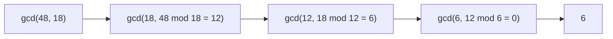

# Euclidean GCD

**Categoria:** Math

## O problema

Encontrar o máximo divisor comum (GCD) de dois inteiros não negativos — o maior inteiro que divide ambos sem deixar resto. A abordagem direta — contar regressivamente a partir do menor número, testando cada candidato — é O(min(a, b)). Para dois números grandes que por acaso são coprimos (seu único divisor comum é 1), essa varredura precisa percorrer tudo até chegar a 1, sem nada a mostrar antes disso.

## A solução

Uma única identidade sustenta todo o algoritmo: `gcd(a, b) = gcd(b, a mod b)`. Substituir repetidamente o par `(a, b)` por `(b, a mod b)` reduz os números rapidamente — pelo menos tão rápido quanto a sequência de Fibonacci cresce, que é o próprio pior caso clássico do algoritmo (dois números de Fibonacci consecutivos forçam o número máximo possível de passos para números daquele tamanho). Mesmo esse pior caso é de apenas O(log(min(a, b))) passos — muito longe da varredura linear que ele substitui.



## Exemplo clássico

[`classic/EuclideanGcd`](src/main/java/com/algorithms/math/euclideangcd/classic/EuclideanGcd.java)
implementa o algoritmo iterativo baseado em módulo, um `lcm` construído diretamente sobre ele (`lcm(a, b) = (a / gcd(a, b)) * b`), e `bruteForceGcd`, incluído especificamente para o benchmark abaixo.
[`EuclideanGcdTest`](src/test/java/com/algorithms/math/euclideangcd/classic/EuclideanGcdTest.java)
cobre um par comum, as identidades com argumento zero, um número contra si mesmo, um par coprimo, e — uma referência deliberada ao próprio pior caso clássico do algoritmo — um par de números de Fibonacci consecutivos, além de confirmar que a força bruta concorda com Euclides em todos os casos testados.

## Exemplo aplicado: proporção de split payment em marketplace via PIX

[`applied/PaymentSplitReducer`](src/main/java/com/algorithms/math/euclideangcd/applied/PaymentSplitReducer.java)
reduz uma regra de split payment de marketplace via PIX à sua forma mais simples — uma plataforma que retém 3,000 unidades base e um vendedor que recebe 7,000 de um total de 10,000 se reduz à proporção canônica `3:7`, que é exatamente o tipo de representação auditável e mínima que um motor de regras de liquidação deve armazenar, em vez dos números originais (equivalentes, mas desnecessariamente grandes).
[`PaymentSplitReducerTest`](src/test/java/com/algorithms/math/euclideangcd/applied/PaymentSplitReducerTest.java)
cobre um split redutível, um split que já está na forma mais simples, e a proteção contra participações não positivas.

## Benchmark

```bash
./gradlew :math:euclidean-gcd:jmh
```

Execução real nesta máquina (JMH 1.37, JDK 26.0.2, 2 iterações de warmup + 3 de medição, 1 fork). Ambos os métodos rodam contra pares de inteiros consecutivos `(n, n-1)` — sempre coprimos, então seu GCD verdadeiro é sempre `1`. Esse é o pior caso da varredura de força bruta (ela nunca encontra um divisor comum antecipadamente, então sempre percorre tudo até o fim) e está próximo do melhor caso de Euclides (`n mod (n-1)` é sempre `1`, resolvendo-se em essencialmente dois passos independentemente de `n`):

| Custo | n=100 | n=10,000 | n=1,000,000 |
|---|---:|---:|---:|
| Euclides | 0.022 µs | 0.022 µs | 0.022 µs |
| força bruta | 1.10 µs | 110.30 µs | 9,877.36 µs |

Euclides permanece completamente estável ao longo de quatro ordens de grandeza de `n` — ele realmente executa as mesmas duas operações de módulo não importa o quão grandes sejam os números. A força bruta acompanha sua previsão de O(n) quase exatamente: um aumento de 100x em `n` produziu um aumento de **100.1x** no custo (100 → 10,000), e um aumento de **89.6x** no passo seguinte de 100x (10,000 → 1,000,000). Em n=1,000,000, a força bruta é **~448,971x mais lenta** que Euclides para a mesma resposta.

## Quando não usar

- Já tem as fatorações primas de ambos os números disponíveis por outro motivo? Multiplicar diretamente os fatores primos compartilhados pode ser mais simples — o algoritmo de Euclides se justifica especificamente porque encontra o GCD *sem* fatorar nenhum dos números.
- Precisa do GCD de mais de dois números? Aplique o algoritmo de Euclides par a par — `gcd(a, b, c) = gcd(gcd(a, b), c)` — em vez de recorrer a uma técnica diferente; a identidade generaliza de forma direta.
- Precisa não só do GCD, mas também dos coeficientes inteiros `x, y` tais que `ax + by = gcd(a, b)` (necessários para inversos modulares, entre outras coisas)? Esse é o algoritmo de Euclides *estendido* — uma extensão direta deste, não implementada separadamente aqui.

## Cobertura de testes

100% de cobertura de instruções, 100% de cobertura de branches (JaCoCo). Reproduza você mesmo:

```bash
./gradlew :math:euclidean-gcd:jacocoTestReport
```

Relatório em `math/euclidean-gcd/build/reports/jacoco/test/html/index.html`.

## Leitura complementar

- Cormen, Leiserson, Rivest & Stein — *Introduction to Algorithms* (CLRS), 3ª/4ª ed., Capítulo 31.2, "Greatest common divisor" — demonstra o limite O(log(min(a, b))) por meio do argumento de pior caso de Fibonacci que o próprio teste deste módulo cita diretamente.
- Knuth — *The Art of Computer Programming*, Volume 2, *Seminumerical Algorithms* — a Seção 4.5.2 é o tratamento clássico e aprofundado do algoritmo de Euclides, incluindo suas origens históricas como (muito provavelmente) o algoritmo não trivial mais antigo ainda em uso comum.
