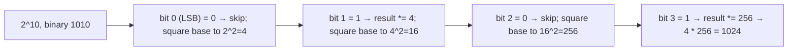

# Fast Exponentiation

**Categoría:** Math

## El problema

Elevar un número a una potencia entera. Multiplicar la base por sí misma una vez por cada unidad
del exponente — la lectura directa de lo que "exponente" siquiera significa — es O(exponente).
Para un exponente grande, eso es una gran cantidad de multiplicaciones para lo que es,
matemáticamente, una cantidad mucho menor de información genuinamente nueva.

## La solución

Exponenciación por cuadrados: `base^n` es igual a `(base^2)^(n/2)` siempre que `n` sea par, así
que elevar la base al cuadrado mientras se reduce el exponente a la mitad llega al mismo
resultado — y esa reducción a la mitad se acumula en cada paso, la misma forma de "duplicación en
reversa" que [Binary Search](../../searching/binary-search) explota en un array ordenado. Para un
exponente impar, primero se extrae un factor de `base` (multiplicado directamente en el resultado
acumulado) para que el exponente restante vuelva a ser par y la reducción a la mitad pueda
continuar. Leer los bits del exponente de menos significativo a más significativo — elevando la
base al cuadrado una vez por bit, e incorporándola al resultado exactamente cuando ese bit está
activo — convierte todo el cálculo en O(log exponente) multiplicaciones en lugar de O(exponente).



## Ejemplo clásico

[`classic/FastExponentiation`](src/main/java/com/algorithms/math/fastexponentiation/classic/FastExponentiation.java)
implementa `power` con el bucle de elevación al cuadrado bit a bit descrito arriba, tratando los
exponentes negativos como el recíproco del resultado con exponente positivo, más `bruteForcePower`
(una multiplicación por unidad de exponente) incluido específicamente para el benchmark de abajo.
[`FastExponentiationTest`](src/test/java/com/algorithms/math/fastexponentiation/classic/FastExponentiationTest.java)
usa `2^10 = 1024` específicamente porque 10 en binario es `1010` — una mezcla de bits activos e
inactivos en un solo caso — más la identidad de exponente cero, cero elevado a una potencia
positiva, exponentes negativos, la fuerza bruta coincidiendo con la exponenciación rápida, y la
protección contra el único caso genuinamente indefinido (cero elevado a una potencia negativa).

## Ejemplo aplicado: proyección de reserva actuarial de aseguradora

[`applied/CompoundGrowthCalculator`](src/main/java/com/algorithms/math/fastexponentiation/applied/CompoundGrowthCalculator.java)
proyecta el valor acumulado de una reserva actuarial después de muchos períodos de capitalización
— `principal * (1 + periodicRate)^periods` — el mismo cálculo de factor de crecimiento, ya sean
los períodos meses en una proyección de reserva o años en un cronograma de anualidad a largo
plazo.
[`CompoundGrowthCalculatorTest`](src/test/java/com/algorithms/math/fastexponentiation/applied/CompoundGrowthCalculatorTest.java)
verifica una proyección de tres períodos contra la fórmula de interés compuesto calculada a mano
(R$1,000 al 5% por 3 períodos → R$1,157.625), las identidades de período cero y principal cero, y
las protecciones (principal negativo, una tasa periódica igual o por debajo de -100%, períodos
negativos).

## Benchmark

```bash
./gradlew :math:fast-exponentiation:jmh
```

Ejecución real en esta máquina (JMH 1.37, JDK 26.0.2, 2 iteraciones de calentamiento + 3 de
medición, 1 fork):

| Costo | exponent=10,000 | exponent=1,000,000 | exponent=100,000,000 |
|---|---:|---:|---:|
| fast exponentiation | 0.015 µs | 0.021 µs | 0.031 µs |
| fuerza bruta | 16.52 µs | 1,643.86 µs | 164,002.01 µs |

La fuerza bruta siguió su predicción O(exponente) casi con exactitud: un aumento de 100x en el
exponente produjo un aumento de **99.5x** en el costo (10,000 → 1,000,000), y luego un aumento de
**99.8x** en el siguiente paso de 100x (1,000,000 → 100,000,000) — una confirmación lineal tan
limpia como cualquiera capturada en este repositorio. La exponenciación rápida apenas se movió
(**1.4x**, luego **1.48x**) — coincidiendo también de cerca con la predicción O(log n):
`log2(1,000,000) / log2(10,000) ≈ 1.5`, y `log2(100,000,000) / log2(1,000,000) ≈ 1.33`. En
exponent=100,000,000, la fuerza bruta es **~5,290,387x más lenta** que la exponenciación rápida
para la misma respuesta.

## Cuándo no usarlo

- ¿El exponente es una constante pequeña y fija conocida en tiempo de compilación (elevar al
  cuadrado, al cubo)? Simplemente escribe la multiplicación directamente — la sobrecarga del
  bucle y la verificación de bits de este algoritmo general no vale la pena para `n=2` o `n=3`.
- ¿Trabajas con enteros enormes donde el desbordamiento importa, no con factores de crecimiento en
  `double`? Usa una variante modular — la misma estructura de elevación al cuadrado con cada
  resultado intermedio reducido módulo `m` — la forma estándar que adopta esta técnica en
  criptografía (RSA, Diffie-Hellman).
- ¿Necesitas también las potencias intermedias (cada `base^k` para `k` de `0` a `n`), no solo el
  resultado final? Un bucle iterativo simple ya produce gratis cada valor intermedio; este
  algoritmo está optimizado específicamente para llegar más rápido a la potencia *final*, no para
  enumerar el camino hasta ahí.

## Cobertura de pruebas

100% de cobertura de instrucciones, 100% de cobertura de ramas (JaCoCo). Reprodúcelo tú mismo:

```bash
./gradlew :math:fast-exponentiation:jacocoTestReport
```

Reporte en `math/fast-exponentiation/build/reports/jacoco/test/html/index.html`.

## Lectura complementaria

- Cormen, Leiserson, Rivest & Stein — *Introduction to Algorithms* (CLRS), 3.ª/4.ª ed., Capítulo
  31.6, "The RSA public-key cryptosystem" — presenta la exponenciación modular por cuadrados como
  la operación que hace que RSA sea computacionalmente viable, la forma criptográfica de la misma
  técnica que este módulo implementa para factores de crecimiento con valores reales.
- Knuth — *The Art of Computer Programming*, Volumen 2, *Seminumerical Algorithms* — la Sección
  4.6.3 cubre los algoritmos de exponenciación en profundidad, incluyendo el enfoque de cadenas de
  adición que generaliza el método binario que usa este módulo.
