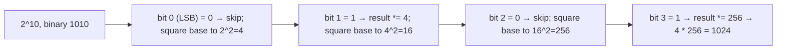

# Fast Exponentiation

**Category:** Math

## The problem

Raising a number to an integer power. Multiplying the base by itself once per unit of the
exponent — the direct reading of what "exponent" even means — is O(exponent). For a large
exponent, that's a large number of multiplications for what is, mathematically, a much smaller
amount of genuinely new information.

## The solution

Exponentiation by squaring: `base^n` equals `(base^2)^(n/2)` whenever `n` is even, so squaring the
base while halving the exponent reaches the same result — and that halving compounds every step,
the same doubling-in-reverse shape [Binary Search](../../searching/binary-search) exploits on a
sorted array. For an odd exponent, one factor of `base` is peeled off first (multiplied directly
into the running result) so the remaining exponent is even again and the halving can continue.
Reading the exponent's bits from least significant to most significant — squaring the base once
per bit, and folding it into the result exactly when that bit is set — turns the whole computation
into O(log exponent) multiplications instead of O(exponent).



## Classic example

[`classic/FastExponentiation`](src/main/java/com/algorithms/math/fastexponentiation/classic/FastExponentiation.java)
implements `power` with the bit-by-bit squaring loop above, handling negative exponents as the
reciprocal of the positive-exponent result, plus `bruteForcePower` (one multiplication per unit of
exponent) included specifically for the benchmark below.
[`FastExponentiationTest`](src/test/java/com/algorithms/math/fastexponentiation/classic/FastExponentiationTest.java)
uses `2^10 = 1024` specifically because 10 in binary is `1010` — a mix of set and unset bits in
one case — plus the zero-exponent identity, zero raised to a positive power, negative exponents,
brute force agreeing with fast exponentiation, and the guard against the one genuinely undefined
case (zero raised to a negative power).

## Applied example: insurer actuarial reserve projection

[`applied/CompoundGrowthCalculator`](src/main/java/com/algorithms/math/fastexponentiation/applied/CompoundGrowthCalculator.java)
projects an actuarial reserve's accumulated value after many compounding periods —
`principal * (1 + periodicRate)^periods` — the same growth-factor computation whether the periods
are months in a reserve projection or years in a long-dated annuity schedule.
[`CompoundGrowthCalculatorTest`](src/test/java/com/algorithms/math/fastexponentiation/applied/CompoundGrowthCalculatorTest.java)
verifies a three-period projection against the compound-interest formula computed by hand
(R$1,000 at 5% for 3 periods → R$1,157.625), the zero-period and zero-principal identities, and
the guard rails (negative principal, a periodic rate at or below -100%, negative periods).

## Benchmark

```bash
./gradlew :math:fast-exponentiation:jmh
```

Real run on this machine (JMH 1.37, JDK 26.0.2, 2 warmup + 3 measurement iterations, 1 fork):

| Cost | exponent=10,000 | exponent=1,000,000 | exponent=100,000,000 |
|---|---:|---:|---:|
| fast exponentiation | 0.015 µs | 0.021 µs | 0.031 µs |
| brute force | 16.52 µs | 1,643.86 µs | 164,002.01 µs |

Brute force tracked its O(exponent) prediction almost exactly: a 100x increase in the exponent
produced a **99.5x** increase in cost (10,000 → 1,000,000), then a **99.8x** increase on the next
100x step (1,000,000 → 100,000,000) — about as clean a linear confirmation as this repo has
captured. Fast exponentiation barely moved (**1.4x**, then **1.48x**) — matching the O(log n)
prediction closely too: `log2(1,000,000) / log2(10,000) ≈ 1.5`, and
`log2(100,000,000) / log2(1,000,000) ≈ 1.33`. At exponent=100,000,000, brute force is
**~5,290,387x slower** than fast exponentiation for the identical answer.

## When not to use it

- The exponent is a small, fixed constant known at compile time (squaring, cubing)? Just write
  the multiplication directly — the loop and bit-checking overhead of this general algorithm
  isn't worth it for `n=2` or `n=3`.
- Working with huge integers where overflow matters, not `double` growth factors? Use a modular
  variant — the same squaring structure with every intermediate result reduced modulo `m` — the
  standard form this technique takes in cryptography (RSA, Diffie-Hellman).
- Need the intermediate powers too (every `base^k` for `k` from `0` to `n`), not just the final
  result? A simple iterative loop already produces every intermediate value for free; this
  algorithm is optimized specifically for reaching the *final* power fastest, not for enumerating
  the path there.

## Test coverage

100% instruction coverage, 100% branch coverage (JaCoCo). Reproduce it yourself:

```bash
./gradlew :math:fast-exponentiation:jacocoTestReport
```

Report at `math/fast-exponentiation/build/reports/jacoco/test/html/index.html`.

## Further reading

- Cormen, Leiserson, Rivest & Stein — *Introduction to Algorithms* (CLRS), 3rd/4th ed.,
  Chapter 31.6, "The RSA public-key cryptosystem" — presents modular exponentiation by squaring
  as the operation that makes RSA computationally feasible at all, the cryptographic form of the
  same technique this module implements for real-valued growth factors.
- Knuth — *The Art of Computer Programming*, Volume 2, *Seminumerical Algorithms* — Section 4.6.3
  covers exponentiation algorithms in depth, including the addition-chain framing that generalizes
  the binary method this module uses.
