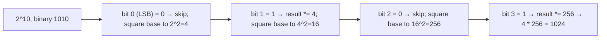

# Fast Exponentiation

**Categoria:** Math

## O problema

Elevar um número a uma potência inteira. Multiplicar a base por si mesma uma vez para cada unidade
do expoente — a leitura direta do que "expoente" sequer significa — é O(expoente). Para um
expoente grande, isso é um número grande de multiplicações para o que é, matematicamente, uma
quantidade muito menor de informação genuinamente nova.

## A solução

Exponenciação por quadrados: `base^n` é igual a `(base^2)^(n/2)` sempre que `n` for par, então
elevar a base ao quadrado enquanto se divide o expoente pela metade alcança o mesmo resultado — e
essa divisão pela metade se acumula a cada passo, a mesma forma de "duplicação em reverso" que
[Binary Search](../../searching/binary-search) explora em um array ordenado. Para um expoente
ímpar, um fator de `base` é retirado primeiro (multiplicado diretamente no resultado corrente)
para que o expoente restante volte a ser par e a divisão pela metade possa continuar. Ler os bits
do expoente do menos significativo para o mais significativo — elevando a base ao quadrado uma vez
por bit, e incorporando-a ao resultado exatamente quando aquele bit está ligado — transforma todo
o cálculo em O(log expoente) multiplicações em vez de O(expoente).



## Exemplo clássico

[`classic/FastExponentiation`](src/main/java/com/algorithms/math/fastexponentiation/classic/FastExponentiation.java)
implementa `power` com o loop de elevação ao quadrado bit a bit descrito acima, tratando expoentes
negativos como o recíproco do resultado com expoente positivo, além de `bruteForcePower` (uma
multiplicação por unidade de expoente) incluído especificamente para o benchmark abaixo.
[`FastExponentiationTest`](src/test/java/com/algorithms/math/fastexponentiation/classic/FastExponentiationTest.java)
usa `2^10 = 1024` especificamente porque 10 em binário é `1010` — uma mistura de bits ligados e
desligados em um único caso — além da identidade de expoente zero, zero elevado a uma potência
positiva, expoentes negativos, a força bruta concordando com a exponenciação rápida, e a proteção
contra o único caso genuinamente indefinido (zero elevado a uma potência negativa).

## Exemplo aplicado: projeção de reserva atuarial de seguradora

[`applied/CompoundGrowthCalculator`](src/main/java/com/algorithms/math/fastexponentiation/applied/CompoundGrowthCalculator.java)
projeta o valor acumulado de uma reserva atuarial após muitos períodos de capitalização —
`principal * (1 + periodicRate)^periods` — o mesmo cálculo de fator de crescimento, sejam os
períodos meses em uma projeção de reserva ou anos em um cronograma de anuidade de longo prazo.
[`CompoundGrowthCalculatorTest`](src/test/java/com/algorithms/math/fastexponentiation/applied/CompoundGrowthCalculatorTest.java)
verifica uma projeção de três períodos contra a fórmula de juros compostos calculada manualmente
(R$1,000 a 5% por 3 períodos → R$1,157.625), as identidades de período zero e principal zero, e as
proteções (principal negativo, uma taxa periódica igual ou abaixo de -100%, períodos negativos).

## Benchmark

```bash
./gradlew :math:fast-exponentiation:jmh
```

Execução real nesta máquina (JMH 1.37, JDK 26.0.2, 2 iterações de aquecimento + 3 de medição, 1
fork):

| Custo | exponent=10,000 | exponent=1,000,000 | exponent=100,000,000 |
|---|---:|---:|---:|
| fast exponentiation | 0.015 µs | 0.021 µs | 0.031 µs |
| força bruta | 16.52 µs | 1,643.86 µs | 164,002.01 µs |

A força bruta acompanhou sua previsão O(expoente) quase exatamente: um aumento de 100x no expoente
produziu um aumento de **99.5x** no custo (10,000 → 1,000,000), depois um aumento de **99.8x** no
próximo passo de 100x (1,000,000 → 100,000,000) — uma confirmação linear tão limpa quanto este
repositório já capturou. A exponenciação rápida praticamente não se moveu (**1.4x**, depois
**1.48x**) — também condizendo de perto com a previsão O(log n): `log2(1,000,000) /
log2(10,000) ≈ 1.5`, e `log2(100,000,000) / log2(1,000,000) ≈ 1.33`. Em exponent=100,000,000, a
força bruta é **~5,290,387x mais lenta** que a exponenciação rápida para a mesma resposta.

## Quando não usar

- O expoente é uma constante pequena e fixa conhecida em tempo de compilação (elevar ao quadrado,
  ao cubo)? Basta escrever a multiplicação diretamente — a sobrecarga do loop e da verificação de
  bits deste algoritmo geral não vale a pena para `n=2` ou `n=3`.
- Trabalhando com inteiros enormes onde o overflow importa, não fatores de crescimento em
  `double`? Use uma variante modular — a mesma estrutura de elevação ao quadrado com cada
  resultado intermediário reduzido módulo `m` — a forma padrão que essa técnica assume em
  criptografia (RSA, Diffie-Hellman).
- Precisa também das potências intermediárias (cada `base^k` para `k` de `0` a `n`), não apenas do
  resultado final? Um loop iterativo simples já produz de graça todo valor intermediário; este
  algoritmo é otimizado especificamente para chegar mais rápido à potência *final*, não para
  enumerar o caminho até lá.

## Cobertura de testes

100% de cobertura de instruções, 100% de cobertura de branches (JaCoCo). Reproduza você mesmo:

```bash
./gradlew :math:fast-exponentiation:jacocoTestReport
```

Relatório em `math/fast-exponentiation/build/reports/jacoco/test/html/index.html`.

## Leitura complementar

- Cormen, Leiserson, Rivest & Stein — *Introduction to Algorithms* (CLRS), 3ª/4ª ed., Capítulo
  31.6, "The RSA public-key cryptosystem" — apresenta a exponenciação modular por quadrados como a
  operação que torna o RSA computacionalmente viável, a forma criptográfica da mesma técnica que
  este módulo implementa para fatores de crescimento de valores reais.
- Knuth — *The Art of Computer Programming*, Volume 2, *Seminumerical Algorithms* — a Seção 4.6.3
  aborda algoritmos de exponenciação em profundidade, incluindo a formulação por cadeias de adição
  que generaliza o método binário usado por este módulo.
