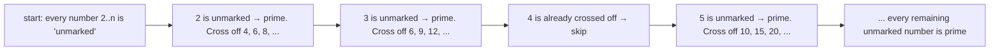

# Sieve of Eratosthenes

**Categoría:** Math

## El problema

Encontrar todos los números primos hasta un límite. Probar cada número individualmente — división
por tentativa, verificando los divisores candidatos hasta su raíz cuadrada — es O(sqrt(k)) por
número, O(n × sqrt(n)) en total a lo largo de todo el rango. La mayor parte de ese trabajo se
desperdicia: para cuando se llega a un número compuesto grande, su menor factor primo casi con
certeza ya fue encontrado al verificar un número mucho más pequeño anteriormente en el rango.

## La solución

Invertir la pregunta: en lugar de preguntar "¿este número es primo?" un número a la vez, empezar
desde cada primo ya encontrado y tachar todos sus múltiplos en un solo barrido. Un número solo se
tacha una vez por cada uno de sus factores primos distintos, y la suma de esos barridos a lo largo
de todo el rango — la suma de `1/p` sobre cada primo `p` hasta `n` — converge a `log log n`, uno
de los límites más ajustados y sorprendentes del análisis clásico de algoritmos. Costo total:
O(n log log n), lo bastante cercano a lineal como para tratarse como lineal en la práctica.



## Ejemplo clásico

[`classic/SieveOfEratosthenes`](src/main/java/com/algorithms/math/sieveoferatosthenes/classic/SieveOfEratosthenes.java)
hace el barrido comenzando el tachado de cada primo en `candidate * candidate` en lugar de
`candidate * 2` — todo múltiplo menor de `candidate` ya fue tachado por un factor primo menor, así
que empezar ahí evita trabajo redundante sin cambiar el resultado. También incluido:
`bruteForcePrimesUpTo`, división por tentativa aplicada a cada candidato individualmente,
específicamente para el benchmark de abajo.
[`SieveOfEratosthenesTest`](src/test/java/com/algorithms/math/sieveoferatosthenes/classic/SieveOfEratosthenesTest.java)
verifica la sieve contra la conocida lista de primos hasta 30, los casos límite (los límites por
debajo de 2 no tienen primos; 2 es el único primo par), y confirma que la fuerza bruta coincide
con la sieve en todos los casos probados.

## Ejemplo aplicado: dimensionamiento de caché de deduplicación de plataforma antifraude

[`applied/HashBucketSizer`](src/main/java/com/algorithms/math/sieveoferatosthenes/applied/HashBucketSizer.java)
encuentra el menor primo mayor o igual a una capacidad solicitada, para dimensionar la caché de
deduplicación en streaming de una plataforma antifraude — un hash set que rastrea IDs de eventos
de transacciones vistos recientemente. Un array de buckets de tamaño primo distribuye los valores
de hash de forma más uniforme que un tamaño potencia de dos, lo cual importa aquí específicamente
porque los IDs de eventos suelen generarse con patrones predecibles (contadores secuenciales, IDs
con prefijo de timestamp) que colisionan contra tamaños de tabla potencia de dos de forma
estructurada y no aleatoria. La búsqueda está acotada por el postulado de Bertrand — siempre
existe un primo estrictamente entre `n` y `2n` para `n > 1` — así que hacer la sieve hasta
`2 * minimumCapacity` siempre garantiza encontrar uno.
[`HashBucketSizerTest`](src/test/java/com/algorithms/math/sieveoferatosthenes/applied/HashBucketSizerTest.java)
cubre una capacidad potencia de dos (1,024 → el siguiente primo, 1,031), una capacidad que ya es
prima, y la protección contra capacidades por debajo de 2.

## Benchmark

```bash
./gradlew :math:sieve-of-eratosthenes:jmh
```

Ejecución real en esta máquina (JMH 1.37, JDK 26.0.2, 2 iteraciones de calentamiento + 3 de
medición, 1 fork):

| Costo | limit=1,000 | limit=10,000 | limit=100,000 |
|---|---:|---:|---:|
| sieve | 3.37 µs | 38.92 µs | 421.49 µs |
| fuerza bruta | 24.74 µs | 565.35 µs | 10,220.86 µs |

La sieve creció de forma casi lineal con `limit` — **11.56x** y **10.83x** a lo largo de los dos
pasos de 10x — exactamente lo que debería verse con un factor `log log n`: apenas se mueve en
estos rangos. La fuerza bruta creció notablemente más rápido en ambos pasos (**22.85x**,
**18.08x**) — consistente en dirección con el factor extra `sqrt(n)`, que predice aproximadamente
31.6x por paso de 10x, aunque los márgenes de error de esta ejecución en particular son lo
bastante amplios (±23 a ±596 µs) como para no sobreinterpretar el multiplicador exacto; la
*dirección y la separación* son la parte confiable. En limit=100,000, la fuerza bruta es **~24x
más lenta** que la sieve para la misma lista de primos.

## Cuándo no usarlo

- ¿Solo necesitas probar si un único número, posiblemente muy grande, es primo — no enumerar todo
  un rango? La división por tentativa hasta su raíz cuadrada (o una prueba de primalidad como
  Miller-Rabin para números muy grandes) es la herramienta correcta; hacer la sieve de todo un
  rango para responder una sola pregunta de pertenencia desperdicia la memoria que la sieve
  necesita para almacenar todos los números hasta el límite.
- ¿El límite es extremadamente grande y la memoria es la restricción limitante? Una sieve
  segmentada procesa el rango en bloques de tamaño fijo en lugar de asignar un array del tamaño
  del límite completo — no implementada por separado aquí, pero una extensión directa de esta
  misma idea de tachado.
- ¿Necesitas la *factorización* prima de los números, no solo cuáles son primos? Una sieve puede
  adaptarse para registrar el menor factor primo de cada número durante el mismo barrido, pero esa
  es una salida diferente (aunque estrechamente relacionada) a la que produce este módulo.

## Cobertura de pruebas

100% de cobertura de instrucciones, 100% de cobertura de ramas (JaCoCo). Reprodúcelo tú mismo:

```bash
./gradlew :math:sieve-of-eratosthenes:jacocoTestReport
```

Reporte en `math/sieve-of-eratosthenes/build/reports/jacoco/test/html/index.html`.

## Lectura complementaria

- Cormen, Leiserson, Rivest & Stein — *Introduction to Algorithms* (CLRS), 3.ª/4.ª ed. — cubre la
  sieve como ejemplo fundacional en algoritmos de teoría de números, con la misma optimización de
  "empezar a tachar desde el cuadrado" que implementa este módulo.
- Skiena — *The Algorithm Design Manual* — presenta la sieve junto a una discusión más amplia
  sobre cuándo la división por tentativa es suficiente (unas pocas verificaciones de primalidad)
  frente a cuándo una sieve se justifica (enumerar todo un rango), directamente relevante para la
  sección "Cuándo no usarlo" de este módulo.
