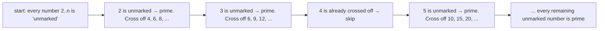

# Sieve of Eratosthenes

**Category:** Math

## The problem

Finding every prime number up to a limit. Testing each number individually — trial division,
checking candidate divisors up to its square root — is O(sqrt(k)) per number, O(n × sqrt(n))
total across the whole range. Most of that work is wasted: by the time a large composite number
is reached, its smallest prime factor was almost certainly already found while checking a much
smaller number earlier in the range.

## The solution

Flip the question around: instead of asking "is this number prime?" one number at a time, start
from every prime found so far and cross off all of its multiples in one sweep. A number only ever
gets crossed off once for each of its distinct prime factors, and the sum of those sweeps across
the whole range — the sum of `1/p` over every prime `p` up to `n` — converges to `log log n`, one
of the tightest, most striking bounds in classical algorithm analysis. Total cost: O(n log log n),
close enough to linear that it's often treated as linear in practice.



## Classic example

[`classic/SieveOfEratosthenes`](src/main/java/com/algorithms/math/sieveoferatosthenes/classic/SieveOfEratosthenes.java)
sieves starting each prime's crossing-off sweep at `candidate * candidate` rather than
`candidate * 2` — every smaller multiple of `candidate` was already crossed off by a smaller
prime factor, so starting there skips redundant work without changing the result. Also included:
`bruteForcePrimesUpTo`, trial division applied to every candidate individually, specifically for
the benchmark below.
[`SieveOfEratosthenesTest`](src/test/java/com/algorithms/math/sieveoferatosthenes/classic/SieveOfEratosthenesTest.java)
checks the sieve against the well-known list of primes up to 30, the boundary cases (limits below
2 have no primes; 2 is the only even prime), and confirms brute force agrees with the sieve on
every case tested.

## Applied example: fraud platform dedup cache sizing

[`applied/HashBucketSizer`](src/main/java/com/algorithms/math/sieveoferatosthenes/applied/HashBucketSizer.java)
finds the smallest prime at or above a requested capacity, for sizing a fraud platform's streaming
deduplication cache — a hash set tracking recently-seen transaction event IDs. A prime-sized
bucket array spreads hash values more evenly than a power-of-two size does, which matters here
specifically because event IDs are often generated with predictable patterns (sequential counters,
timestamp-prefixed IDs) that collide against power-of-two table sizes in a structured, non-random
way. The search is bounded by Bertrand's postulate — a prime always exists strictly between `n`
and `2n` for `n > 1` — so sieving up to `2 * minimumCapacity` is always guaranteed to find one.
[`HashBucketSizerTest`](src/test/java/com/algorithms/math/sieveoferatosthenes/applied/HashBucketSizerTest.java)
covers a power-of-two capacity (1,024 → the next prime, 1,031), a capacity that's already prime,
and the guard against capacities below 2.

## Benchmark

```bash
./gradlew :math:sieve-of-eratosthenes:jmh
```

Real run on this machine (JMH 1.37, JDK 26.0.2, 2 warmup + 3 measurement iterations, 1 fork):

| Cost | limit=1,000 | limit=10,000 | limit=100,000 |
|---|---:|---:|---:|
| sieve | 3.37 µs | 38.92 µs | 421.49 µs |
| brute force | 24.74 µs | 565.35 µs | 10,220.86 µs |

The sieve grew close to linearly with `limit` — **11.56x** and **10.83x** across the two 10x
steps — exactly what a `log log n` factor should look like: it barely moves across these ranges.
Brute force grew noticeably faster on both steps (**22.85x**, **18.08x**) — directionally
consistent with the extra `sqrt(n)` factor predicting roughly 31.6x per 10x step, though this
particular run's error bars are wide enough (±23 to ±596 µs) that the exact multiplier shouldn't
be over-read; the *direction and separation* are the reliable part. At limit=100,000, brute force
is **~24x slower** than the sieve for the identical list of primes.

## When not to use it

- Only need to test whether one single, possibly very large number is prime — not enumerate a
  whole range? Trial division up to its square root (or a primality test like Miller-Rabin for
  very large numbers) is the right tool; sieving an entire range to answer one membership question
  wastes the memory the sieve needs to hold every number up to the limit.
- The limit is extremely large and memory is the binding constraint? A segmented sieve processes
  the range in fixed-size blocks instead of allocating one array the size of the whole limit — not
  implemented separately here, but a direct extension of this same crossing-off idea.
- Need the prime *factorization* of numbers, not just which numbers are prime? A sieve can be
  adapted to record each number's smallest prime factor during the same sweep, but that's a
  different (if closely related) output than this module produces.

## Test coverage

100% instruction coverage, 100% branch coverage (JaCoCo). Reproduce it yourself:

```bash
./gradlew :math:sieve-of-eratosthenes:jacocoTestReport
```

Report at `math/sieve-of-eratosthenes/build/reports/jacoco/test/html/index.html`.

## Further reading

- Cormen, Leiserson, Rivest & Stein — *Introduction to Algorithms* (CLRS), 3rd/4th ed. — covers
  the sieve as a foundational example in number-theoretic algorithms, with the same
  "start crossing off at the square" optimization this module implements.
- Skiena — *The Algorithm Design Manual* — presents the sieve alongside a broader discussion of
  when trial division is fine (a handful of primality checks) versus when a sieve pays for itself
  (enumerating a whole range), directly relevant to this module's "When not to use it" section.
