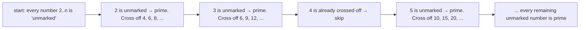

# Sieve of Eratosthenes

**Categoria:** Math

## O problema

Encontrar todo número primo até um limite. Testar cada número individualmente — divisão por
tentativa, verificando os divisores candidatos até sua raiz quadrada — é O(sqrt(k)) por número,
O(n × sqrt(n)) no total ao longo de todo o intervalo. Boa parte desse trabalho é desperdiçada: no
momento em que um grande número composto é alcançado, seu menor fator primo quase certamente já
foi encontrado ao verificar um número muito menor anteriormente no intervalo.

## A solução

Inverter a pergunta: em vez de perguntar "esse número é primo?" um número de cada vez, começar a
partir de cada primo já encontrado e riscar todos os seus múltiplos em uma única varredura. Um
número só é riscado uma vez para cada um de seus fatores primos distintos, e a soma dessas
varreduras ao longo de todo o intervalo — a soma de `1/p` sobre cada primo `p` até `n` — converge
para `log log n`, um dos limites mais precisos e marcantes da análise clássica de algoritmos.
Custo total: O(n log log n), próximo o suficiente de linear para ser tratado como linear na
prática.



## Exemplo clássico

[`classic/SieveOfEratosthenes`](src/main/java/com/algorithms/math/sieveoferatosthenes/classic/SieveOfEratosthenes.java)
faz a varredura começando o riscamento de múltiplos de cada primo em `candidate * candidate` em
vez de `candidate * 2` — todo múltiplo menor de `candidate` já foi riscado por um fator primo
menor, então começar ali evita trabalho redundante sem alterar o resultado. Também incluído:
`bruteForcePrimesUpTo`, divisão por tentativa aplicada a cada candidato individualmente,
especificamente para o benchmark abaixo.
[`SieveOfEratosthenesTest`](src/test/java/com/algorithms/math/sieveoferatosthenes/classic/SieveOfEratosthenesTest.java)
verifica a sieve contra a conhecida lista de primos até 30, os casos de borda (limites abaixo de 2
não têm primos; 2 é o único primo par), e confirma que a força bruta concorda com a sieve em todos
os casos testados.

## Exemplo aplicado: dimensionamento de cache de deduplicação de plataforma antifraude

[`applied/HashBucketSizer`](src/main/java/com/algorithms/math/sieveoferatosthenes/applied/HashBucketSizer.java)
encontra o menor primo maior ou igual a uma capacidade solicitada, para dimensionar o cache de
deduplicação em streaming de uma plataforma antifraude — um hash set rastreando IDs de eventos de
transação vistos recentemente. Um array de buckets de tamanho primo distribui os valores de hash
de forma mais uniforme do que um tamanho potência de dois, o que importa aqui especificamente
porque os IDs de eventos costumam ser gerados com padrões previsíveis (contadores sequenciais, IDs
prefixados com timestamp) que colidem contra tamanhos de tabela potência de dois de forma
estruturada e não aleatória. A busca é limitada pelo postulado de Bertrand — um primo sempre
existe estritamente entre `n` e `2n` para `n > 1` — então fazer a sieve até `2 * minimumCapacity`
sempre garante encontrar um.
[`HashBucketSizerTest`](src/test/java/com/algorithms/math/sieveoferatosthenes/applied/HashBucketSizerTest.java)
cobre uma capacidade potência de dois (1,024 → o próximo primo, 1,031), uma capacidade que já é
prima, e a proteção contra capacidades abaixo de 2.

## Benchmark

```bash
./gradlew :math:sieve-of-eratosthenes:jmh
```

Execução real nesta máquina (JMH 1.37, JDK 26.0.2, 2 iterações de aquecimento + 3 de medição, 1
fork):

| Custo | limit=1,000 | limit=10,000 | limit=100,000 |
|---|---:|---:|---:|
| sieve | 3.37 µs | 38.92 µs | 421.49 µs |
| força bruta | 24.74 µs | 565.35 µs | 10,220.86 µs |

A sieve cresceu de forma próxima à linear com `limit` — **11.56x** e **10.83x** ao longo dos dois
passos de 10x — exatamente o que um fator `log log n` deveria parecer: mal se move nesses
intervalos. A força bruta cresceu visivelmente mais rápido em ambos os passos (**22.85x**,
**18.08x**) — consistente em direção com o fator extra `sqrt(n)`, que prevê aproximadamente 31.6x
por passo de 10x, embora as margens de erro desta execução específica sejam largas o suficiente
(±23 a ±596 µs) para que o multiplicador exato não deva ser superinterpretado; a *direção e a
separação* são a parte confiável. Em limit=100,000, a força bruta é **~24x mais lenta** que a
sieve para a mesma lista de primos.

## Quando não usar

- Só precisa testar se um único número, possivelmente muito grande, é primo — não enumerar um
  intervalo inteiro? Divisão por tentativa até sua raiz quadrada (ou um teste de primalidade como
  Miller-Rabin para números muito grandes) é a ferramenta certa; fazer a sieve de um intervalo
  inteiro para responder uma única pergunta de pertencimento desperdiça a memória que a sieve
  precisa para armazenar todo número até o limite.
- O limite é extremamente grande e a memória é a restrição limitante? Uma sieve segmentada
  processa o intervalo em blocos de tamanho fixo em vez de alocar um array do tamanho do limite
  inteiro — não implementada separadamente aqui, mas uma extensão direta dessa mesma ideia de
  riscamento.
- Precisa da *fatoração* prima dos números, não apenas quais números são primos? Uma sieve pode
  ser adaptada para registrar o menor fator primo de cada número durante a mesma varredura, mas
  isso é uma saída diferente (embora intimamente relacionada) da que este módulo produz.

## Cobertura de testes

100% de cobertura de instruções, 100% de cobertura de branches (JaCoCo). Reproduza você mesmo:

```bash
./gradlew :math:sieve-of-eratosthenes:jacocoTestReport
```

Relatório em `math/sieve-of-eratosthenes/build/reports/jacoco/test/html/index.html`.

## Leitura complementar

- Cormen, Leiserson, Rivest & Stein — *Introduction to Algorithms* (CLRS), 3ª/4ª ed. — aborda a
  sieve como exemplo fundamental em algoritmos de teoria dos números, com a mesma otimização de
  "começar a riscar a partir do quadrado" que este módulo implementa.
- Skiena — *The Algorithm Design Manual* — apresenta a sieve junto a uma discussão mais ampla
  sobre quando a divisão por tentativa é suficiente (algumas poucas verificações de primalidade)
  versus quando uma sieve se paga (enumerar um intervalo inteiro), diretamente relevante para a
  seção "Quando não usar" deste módulo.
