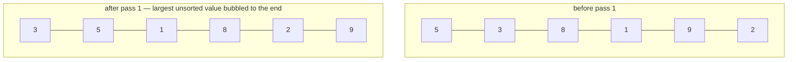

# Bubble Sort

**Categoría:** Sorting

## El problema

Ordenar un lote pequeño de datos que ya están casi ordenados no debería requerir la sobrecarga
constante de un algoritmo de propósito general con O(n log n) garantizado — y una ordenación
ingenua, que siempre hace la misma cantidad de trabajo sin importar cuán ordenada ya esté la
entrada, desperdicia esa oportunidad. Lo que realmente varía de una llamada a otra no es solo el
tamaño de la entrada, es *cuán lejos* está la entrada de estar ordenada.

## La solución

Recorra repetidamente el array comparando pares adyacentes e intercambiando los que están fuera
de orden — el mayor valor aún no colocado "burbujea" hasta su posición correcta al final de cada
pasada. El único detalle que hace que esto valga la pena enseñar: registrar si una pasada hizo
*algún* intercambio, y detenerse en el momento en que una pasada completa no hace ninguno. Esa
única verificación de salida anticipada es lo que hace que el algoritmo sea **adaptativo** —
O(n) en una entrada ya ordenada, y con el costo escalando según cuánto desorden hay realmente
presente, en lugar de pagar siempre el O(n²) completo, que es lo que un bubble sort sin la salida
anticipada — o un equivalente como el selection sort puro — paga incondicionalmente.



| Caso | Costo | Por qué |
|---|---|---|
| Mejor caso (ya ordenado) | O(n) | una sola pasada no hace ningún intercambio, la verificación de salida anticipada se detiene de inmediato |
| Peor caso (orden inverso) | O(n²) | cada una de las n−1 pasadas hace un intercambio, ninguna puede salir anticipadamente |
| Promedio / casi ordenado | entre O(n) y O(n²) | el costo sigue cuánto están realmente fuera de lugar los elementos, no solo n |

## Ejemplo clásico

[`classic/BubbleSort`](src/main/java/com/algorithms/sorting/bubblesort/classic/BubbleSort.java)
es una implementación genérica, impulsada por `Comparator` — sin el atajo de
`Arrays.sort`/`Collections.sort`. Hacerla genérica sobre `Comparator<? super T>` en lugar de fijar
`int[]` es lo que permite que el ejemplo aplicado de abajo reutilice este mismo método `sort` en
un tipo de dominio, en lugar de necesitar una segunda implementación paralela.
[`BubbleSortTest`](src/test/java/com/algorithms/sorting/bubblesort/classic/BubbleSortTest.java)
cubre un array desordenado, un array ya ordenado, un array en orden inverso (los dos extremos que
mide el benchmark de abajo), duplicados, un array de un solo elemento y un array vacío, un
comparador personalizado (descendente), y ambas protecciones contra argumento nulo.

## Ejemplo aplicado: corrección del libro mayor diario en un mainframe legado

[`applied/DailyLedgerReorder`](src/main/java/com/algorithms/sorting/bubblesort/applied/DailyLedgerReorder.java)
modela un patrón real con el que los trabajos por lotes de mainframes legados todavía se topan:
el archivo del libro mayor de ayer se cerró ya ordenado por hora de contabilización, y ahora una
única entrada de corrección tardía necesita reinsertarse en su posición correcta antes de que el
lote pueda reprocesarse. Agregar la corrección y volver a ejecutar bubble sort sobre todo el lote
(todavía casi completamente ordenado) es una elección legítima precisamente *porque* la
perturbación es pequeña y localizada — la adaptabilidad de bubble sort significa que el costo
real depende de cuán fuera de lugar está esa única corrección, no del tamaño de todo el lote.
[`DailyLedgerReorderTest`](src/test/java/com/algorithms/sorting/bubblesort/applied/DailyLedgerReorderTest.java)
cubre una corrección que pertenece al medio, una que pertenece al inicio mismo, una que pertenece
al final mismo (el caso trivial en que ya está en su lugar), y ambas protecciones contra
argumento nulo.

## Benchmark

```bash
./gradlew :sorting:bubble-sort:jmh
```

Ejecución real en esta máquina (JMH 1.37, JDK 26.0.2, 2 iteraciones de calentamiento + 3 de
medición, 1 fork). Tres órdenes de entrada en cada tamaño: ya ordenado, casi ordenado (una
pequeña cantidad de intercambios de *pares adyacentes* dispersos por el array — desorden
genuinamente localizado, no solo un puñado de intercambios aleatorios de largo alcance, que
pueden reproducir accidentalmente una perturbación similar al peor caso incluso con una cantidad
"pequeña" de intercambios), y completamente aleatorio:

| Costo de ordenamiento | size=100 | size=1,000 | size=10,000 |
|---|---:|---:|---:|
| ya ordenado | 0.099 µs | 0.750 µs | 10.363 µs |
| casi ordenado | 0.232 µs | 1.997 µs | 40.054 µs |
| aleatorio | 17.971 µs | 2,198.934 µs | 337,009.203 µs |

En size=10,000, el caso aleatorio es **~32.527x más lento** que el caso ya ordenado, y
**~8.414x más lento** que el caso casi ordenado — en exactamente el mismo código, la única
variable es cuán ordenada ya estaba la entrada. Esa es la afirmación de adaptabilidad de "La
solución" de arriba, convertida en un número medido en lugar de una aseveración: esto es
precisamente lo que el CLRS de Cormen, Leiserson, Rivest & Stein establece de forma abstracta en
el Problema 2-2 ("Correctness of bubblesort") — O(n) en el mejor caso, O(n²) en el peor caso —
hecho concreto en esta máquina. El intervalo de confianza del caso aleatorio en size=10,000 es
amplio (el ruido de JVM/GC a escala de milisegundos de un solo dígito domina una carga de trabajo
O(n²) de ese tamaño en una máquina de desarrollo compartida) — la brecha de más de ~1,000x entre
los órdenes es la señal confiable aquí, no el último dígito de ningún número individual.

## Cuándo no usarlo

- ¿Necesita una ordenación de propósito general con un límite garantizado de O(n log n) sin
  importar el orden de la entrada? Use [Merge Sort](../merge-sort) o [Quick Sort](../quick-sort)
  de este repositorio en su lugar — el peor caso O(n²) de bubble sort lo convierte en una opción
  predeterminada genuinamente mala en el momento en que no se puede confiar en que el orden de la
  entrada ya sea favorable.
- ¿Ordenando un conjunto de datos grande y genuinamente desordenado? El benchmark de arriba
  muestra exactamente cuánto se degrada esto — no existe un tamaño en el que "bubble sort en
  orden aleatorio" sea la elección de ingeniería correcta frente a una alternativa O(n log n).
- El valor real de esta implementación es estrecho y específico: lotes pequeños que ya están casi
  ordenados, o contextos (enseñanza, trabajos por lotes legados estrictamente auditables) en los
  que la simplicidad del algoritmo importa más que su techo asintótico.

## Cobertura de pruebas

100% de cobertura de instrucciones, 100% de cobertura de ramas (JaCoCo). Reprodúzcalo usted
mismo:

```bash
./gradlew :sorting:bubble-sort:jacocoTestReport
```

Informe en `sorting/bubble-sort/build/reports/jacoco/test/html/index.html`.

## Lectura complementaria

- Cormen, Leiserson, Rivest & Stein — *Introduction to Algorithms* (CLRS), 3.ª/4.ª ed.,
  Problema 2-2, "Correctness of bubblesort" — el tratamiento formal canónico que el benchmark de
  este módulo mide directamente.
- Sedgewick & Wayne — *Algorithms*, 4.ª ed., sección 2.1, "Elementary Sorts" — cubre bubble sort
  junto con selection sort e insertion sort, con la misma distinción de adaptabilidad que este
  módulo pone en el centro.
