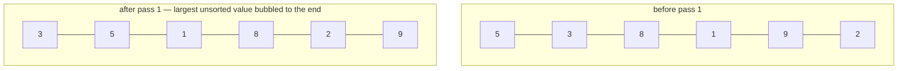

# Bubble Sort

**Category:** Sorting

## The problem

Sorting a small batch of already-mostly-ordered data shouldn't need a general-purpose,
guaranteed-O(n log n) algorithm's constant overhead — and a naive sort that always does the
same amount of work regardless of how ordered the input already is wastes that opportunity. What
actually varies from one call to the next isn't just the size of the input, it's *how far* the
input already is from sorted.

## The solution

Repeatedly walk the array comparing adjacent pairs and swapping the ones that are out of order —
the largest not-yet-placed value "bubbles" to its correct position by the end of each pass. The
one detail that makes this worth teaching at all: track whether a pass made *any* swap, and stop
the moment a full pass makes zero of them. That single early-exit check is what makes the
algorithm **adaptive** — O(n) on already-sorted input, and scaling with how much disorder is
actually present rather than always paying the full O(n²), which is what a bubble sort without
the early exit — or an equivalent like plain selection sort — pays unconditionally.



| Case | Cost | Why |
|---|---|---|
| Best (already sorted) | O(n) | a single pass makes zero swaps, the early-exit check stops immediately |
| Worst (reverse sorted) | O(n²) | every one of the n−1 passes makes a swap, none can exit early |
| Average / nearly sorted | between O(n) and O(n²) | cost tracks how far out of place elements actually are, not just n |

## Classic example

[`classic/BubbleSort`](src/main/java/com/algorithms/sorting/bubblesort/classic/BubbleSort.java)
is a generic, `Comparator`-driven implementation — no `Arrays.sort`/`Collections.sort` shortcut.
Making it generic over `Comparator<? super T>` instead of hardcoding `int[]` is what lets the
applied example below reuse this exact same `sort` method on a domain type instead of needing a
second, parallel implementation.
[`BubbleSortTest`](src/test/java/com/algorithms/sorting/bubblesort/classic/BubbleSortTest.java)
covers an unordered array, an already-sorted array, a reverse-sorted array (the two extremes the
benchmark below measures), duplicates, a single-element and an empty array, a custom
(descending) comparator, and both null-argument guards.

## Applied example: legacy mainframe daily ledger correction

[`applied/DailyLedgerReorder`](src/main/java/com/algorithms/sorting/bubblesort/applied/DailyLedgerReorder.java)
models a real shape legacy mainframe batch jobs still run into: yesterday's ledger file closed
already sorted by posting time, and now a single late correction entry needs to be spliced back
into its correct position before the batch can be reprocessed. Appending the correction and
re-running bubble sort over the whole (still almost entirely sorted) batch is a legitimate choice
specifically *because* the disruption is small and localized — bubble sort's adaptivity means the
real cost tracks how far out of place that one correction is, not the size of the whole batch.
[`DailyLedgerReorderTest`](src/test/java/com/algorithms/sorting/bubblesort/applied/DailyLedgerReorderTest.java)
covers a correction that belongs in the middle, one that belongs at the very start, one that
belongs at the very end (the trivial already-in-place case), and both null-argument guards.

## Benchmark

```bash
./gradlew :sorting:bubble-sort:jmh
```

Real run on this machine (JMH 1.37, JDK 26.0.2, 2 warmup + 3 measurement iterations, 1 fork).
Three input orderings at each size: already sorted, nearly sorted (a small number of
*adjacent-pair* swaps scattered through the array — genuinely localized disorder, not just a
handful of random long-range swaps, which can accidentally reproduce worst-case-like disruption
even at a "small" swap count), and fully random:

| Sort cost | size=100 | size=1,000 | size=10,000 |
|---|---:|---:|---:|
| already sorted | 0.099 µs | 0.750 µs | 10.363 µs |
| nearly sorted | 0.232 µs | 1.997 µs | 40.054 µs |
| random | 17.971 µs | 2,198.934 µs | 337,009.203 µs |

At size=10,000, the random case is **~32,527x slower** than the already-sorted case, and
**~8,414x slower** than the nearly-sorted case — on the exact same code, the only variable is how
ordered the input already was. That's the adaptivity claim from "The solution" above, turned
into a measured number instead of an assertion: this is precisely what Cormen, Leiserson,
Rivest & Stein's CLRS states abstractly in Problem 2-2 ("Correctness of bubblesort") — O(n) best
case, O(n²) worst case — made concrete on this machine. The random case's confidence interval at
size=10,000 is wide (single-digit-millisecond-scale JVM/GC noise dominates an O(n²) workload at
that size on a shared dev machine) — the ~1,000x-plus gap between orderings is the reliable
signal here, not the last digit of any individual number.

## When not to use it

- Need a general-purpose sort with a guaranteed O(n log n) bound regardless of input order? Use
  [Merge Sort](../merge-sort) or [Quick Sort](../quick-sort) from this repo instead — bubble
  sort's O(n²) worst case makes it a genuinely bad default the moment input order can't be
  trusted to already be favorable.
- Sorting a large, genuinely unordered dataset? The benchmark above shows exactly how badly this
  degrades — there's no size at which "random-order bubble sort" is the right engineering choice
  over an O(n log n) alternative.
- This implementation's real value is narrow and specific: small batches that are already
  nearly sorted, or contexts (teaching, tightly auditable legacy batch jobs) where the algorithm's
  simplicity matters more than its asymptotic ceiling.

## Test coverage

100% instruction coverage, 100% branch coverage (JaCoCo). Reproduce it yourself:

```bash
./gradlew :sorting:bubble-sort:jacocoTestReport
```

Report at `sorting/bubble-sort/build/reports/jacoco/test/html/index.html`.

## Further reading

- Cormen, Leiserson, Rivest & Stein — *Introduction to Algorithms* (CLRS), 3rd/4th ed.,
  Problem 2-2, "Correctness of bubblesort" — the canonical formal treatment this module's
  benchmark measures directly.
- Sedgewick & Wayne — *Algorithms*, 4th ed., section 2.1, "Elementary Sorts" — covers bubble
  sort alongside selection and insertion sort, with the same adaptivity distinction this module
  makes central.
