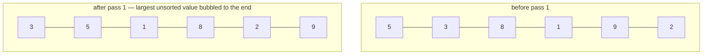

# Bubble Sort

**Categoria:** Sorting

## O problema

Ordenar um pequeno lote de dados já quase ordenados não deveria exigir a sobrecarga constante de
um algoritmo genérico com O(n log n) garantido — e uma ordenação ingênua, que sempre faz a mesma
quantidade de trabalho independentemente de quão ordenada a entrada já está, desperdiça essa
oportunidade. O que realmente varia de uma chamada para outra não é apenas o tamanho da entrada,
é *o quão longe* a entrada já está de estar ordenada.

## A solução

Percorra repetidamente o array comparando pares adjacentes e trocando os que estão fora de ordem —
o maior valor ainda não posicionado "borbulha" até sua posição correta ao final de cada passada.
O único detalhe que torna isso digno de ser ensinado: rastrear se uma passada fez *alguma* troca,
e parar no momento em que uma passada completa não faz nenhuma. Essa única verificação de saída
antecipada é o que torna o algoritmo **adaptativo** — O(n) em uma entrada já ordenada, com o
custo escalando conforme a desordem realmente presente, em vez de sempre pagar o O(n²) completo,
que é o que um bubble sort sem a saída antecipada — ou um equivalente como o selection sort puro —
paga incondicionalmente.



| Caso | Custo | Por quê |
|---|---|---|
| Melhor caso (já ordenado) | O(n) | uma única passada não faz nenhuma troca, a verificação de saída antecipada para imediatamente |
| Pior caso (ordem inversa) | O(n²) | cada uma das n−1 passadas faz uma troca, nenhuma consegue sair antecipadamente |
| Médio / quase ordenado | entre O(n) e O(n²) | o custo acompanha o quanto os elementos estão realmente fora do lugar, não apenas n |

## Exemplo clássico

[`classic/BubbleSort`](src/main/java/com/algorithms/sorting/bubblesort/classic/BubbleSort.java)
é uma implementação genérica, orientada por `Comparator` — sem atalho de
`Arrays.sort`/`Collections.sort`. Torná-la genérica sobre `Comparator<? super T>` em vez de fixar
`int[]` é o que permite que o exemplo aplicado abaixo reutilize exatamente esse mesmo método
`sort` em um tipo de domínio, em vez de precisar de uma segunda implementação paralela.
[`BubbleSortTest`](src/test/java/com/algorithms/sorting/bubblesort/classic/BubbleSortTest.java)
cobre um array desordenado, um array já ordenado, um array em ordem inversa (os dois extremos que
o benchmark abaixo mede), duplicatas, um array de um único elemento e um array vazio, um
comparador customizado (decrescente), e as duas proteções contra argumento nulo.

## Exemplo aplicado: correção do livro-razão diário de um mainframe legado

[`applied/DailyLedgerReorder`](src/main/java/com/algorithms/sorting/bubblesort/applied/DailyLedgerReorder.java)
modela um padrão real que os jobs em lote de mainframes legados ainda enfrentam: o arquivo do
livro-razão de ontem foi fechado já ordenado por horário de lançamento, e agora um único
lançamento de correção atrasado precisa ser reinserido em sua posição correta antes que o lote
possa ser reprocessado. Anexar a correção e reexecutar o bubble sort sobre o lote inteiro (ainda
quase totalmente ordenado) é uma escolha legítima justamente *porque* a perturbação é pequena e
localizada — a adaptatividade do bubble sort significa que o custo real acompanha o quão fora do
lugar está essa única correção, não o tamanho do lote inteiro.
[`DailyLedgerReorderTest`](src/test/java/com/algorithms/sorting/bubblesort/applied/DailyLedgerReorderTest.java)
cobre uma correção que pertence ao meio, uma que pertence bem ao início, uma que pertence bem ao
final (o caso trivial em que já está no lugar certo), e as duas proteções contra argumento nulo.

## Benchmark

```bash
./gradlew :sorting:bubble-sort:jmh
```

Execução real nesta máquina (JMH 1.37, JDK 26.0.2, 2 iterações de aquecimento + 3 de medição, 1
fork). Três ordenações de entrada em cada tamanho: já ordenado, quase ordenado (um pequeno número
de trocas de *pares adjacentes* espalhadas pelo array — desordem genuinamente localizada, não
apenas um punhado de trocas aleatórias de longo alcance, que podem acidentalmente reproduzir uma
perturbação semelhante ao pior caso mesmo com uma quantidade "pequena" de trocas), e totalmente
aleatório:

| Custo de ordenação | size=100 | size=1,000 | size=10,000 |
|---|---:|---:|---:|
| já ordenado | 0.099 µs | 0.750 µs | 10.363 µs |
| quase ordenado | 0.232 µs | 1.997 µs | 40.054 µs |
| aleatório | 17.971 µs | 2,198.934 µs | 337,009.203 µs |

Em size=10,000, o caso aleatório é **~32.527x mais lento** que o caso já ordenado, e
**~8.414x mais lento** que o caso quase ordenado — no mesmíssimo código, a única variável é o
quão ordenada a entrada já estava. Essa é a afirmação de adaptatividade de "A solução" acima,
transformada em um número medido em vez de uma assertiva: é exatamente o que o CLRS de Cormen,
Leiserson, Rivest & Stein afirma de forma abstrata no Problema 2-2 ("Correctness of bubblesort")
— O(n) no melhor caso, O(n²) no pior caso — tornado concreto nesta máquina. O intervalo de
confiança do caso aleatório em size=10,000 é amplo (ruído de JVM/GC na escala de milissegundos de
um único dígito domina uma carga de trabalho O(n²) nesse tamanho, em uma máquina de
desenvolvimento compartilhada) — a diferença de mais de ~1.000x entre as ordenações é o sinal
confiável aqui, não o último dígito de qualquer número individual.

## Quando não usar

- Precisa de uma ordenação de propósito geral com limite garantido de O(n log n)
  independentemente da ordem da entrada? Use [Merge Sort](../merge-sort) ou [Quick Sort](../quick-sort)
  deste repositório — o pior caso O(n²) do bubble sort o torna uma escolha padrão genuinamente
  ruim no momento em que a ordem da entrada não pode ser considerada confiavelmente favorável.
- Ordenando um conjunto de dados grande e genuinamente desordenado? O benchmark acima mostra
  exatamente o quanto isso degrada — não existe um tamanho no qual "bubble sort em ordem
  aleatória" seja a escolha de engenharia certa em vez de uma alternativa O(n log n).
- O valor real desta implementação é estreito e específico: lotes pequenos que já estão quase
  ordenados, ou contextos (ensino, jobs em lote legados rigorosamente auditáveis) em que a
  simplicidade do algoritmo importa mais do que seu teto assintótico.

## Cobertura de testes

100% de cobertura de instruções, 100% de cobertura de branches (JaCoCo). Reproduza você mesmo:

```bash
./gradlew :sorting:bubble-sort:jacocoTestReport
```

Relatório em `sorting/bubble-sort/build/reports/jacoco/test/html/index.html`.

## Leitura complementar

- Cormen, Leiserson, Rivest & Stein — *Introduction to Algorithms* (CLRS), 3ª/4ª ed.,
  Problema 2-2, "Correctness of bubblesort" — o tratamento formal canônico que o benchmark
  deste módulo mede diretamente.
- Sedgewick & Wayne — *Algorithms*, 4ª ed., seção 2.1, "Elementary Sorts" — cobre bubble sort
  junto com selection sort e insertion sort, com a mesma distinção de adaptatividade que este
  módulo coloca no centro.
