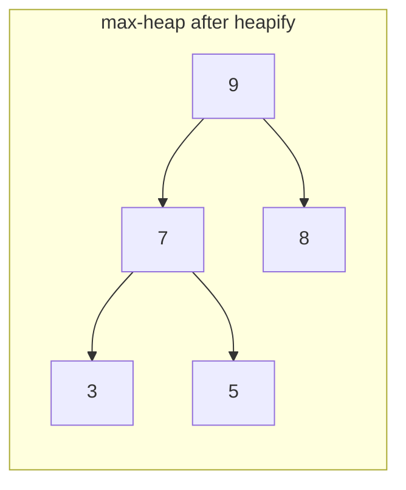

# Heap Sort

**Categoría:** Sorting

## El problema

El [Merge Sort](../merge-sort) de este repositorio garantiza O(n log n), pero necesita un buffer
auxiliar O(n). El [Quick Sort](../quick-sort) ordena in-place con O(n log n) en el caso promedio,
pero incluso con un pivote aleatorio el peor caso sigue siendo matemáticamente real. Ninguno de
los dos ofrece *ambas* garantías a la vez — un límite que se cumple incondicionalmente, y memoria
auxiliar cero.

## La solución

Trata el propio array como un heap binario. Primero, reorganízalo in-place como un max-heap
(bottom-up, O(n) en total), de modo que el valor más grande aún no colocado siempre esté en el
índice 0. Luego, intercambia repetidamente esa raíz con el último slot aún no ordenado y aplica
sift-down a la nueva raíz para restaurar la propiedad de heap, reduciendo en uno la región "que
todavía es un heap" en cada iteración. Cada sift-down toca como máximo `log2(size)` niveles, hecho
n veces: O(n log n), y como un heap binario almacenado en un array no necesita punteros ni una
estructura separada — las relaciones padre/hijo son pura aritmética de índices —, todo sucede en
el array original, con asignación auxiliar cero.



| Operación | Costo | Por qué |
|---|---|---|
| `sort` | O(n log n), en todos los casos | heapify es O(n); n extracciones, cada una un sift-down O(log n) |
| espacio | O(1) auxiliar | el heap vive en el array original — sin buffer, a diferencia de [Merge Sort](../merge-sort) |

## Ejemplo clásico

[`classic/HeapSort`](src/main/java/com/algorithms/sorting/heapsort/classic/HeapSort.java) es
genérico sobre `Comparator<? super T>` — sin atajo de `Arrays.sort`/`Collections.sort`, y tampoco
`java.util.PriorityQueue`, ya que todo el punto es construir el heap directamente sobre el array
que se está ordenando, en lugar de usar una estructura separada.
[`HeapSortTest`](src/test/java/com/algorithms/sorting/heapsort/classic/HeapSortTest.java) cubre
un array desordenado, ya ordenado, ordenado a la inversa, con duplicados, tanto un array de tamaño
impar como uno de tamaño par (ejercitando las ramas de sift-down solo-izquierda e
izquierda+derecha), un array de un solo elemento y un array vacío, un comparador personalizado
(descendente), y ambas protecciones contra argumento nulo.

## Ejemplo aplicado: ordenamiento de alarmas en equipos de borde de telecomunicaciones

[`applied/NetworkAlarmSort`](src/main/java/com/algorithms/sorting/heapsort/applied/NetworkAlarmSort.java)
ordena un lote de alarmas de red por severidad, de mayor a menor, en equipos de borde de
telecomunicaciones con recursos limitados — el único lugar entre los módulos de ordenamiento de
este repositorio donde "O(n log n) garantizado" y "memoria auxiliar cero" importan al mismo
tiempo, no solo uno u otro. El buffer O(n) del merge sort arriesga una asignación que el
presupuesto ajustado de RAM del dispositivo no siempre puede absorber; incluso el riesgo de peor
caso de un quicksort aleatorizado es una restricción de procesamiento en tiempo real que este
bucle de manejo de alarmas no puede aceptar. El heap sort es el único ordenamiento de este
repositorio que no renuncia a ninguna de las dos garantías.
[`NetworkAlarmSortTest`](src/test/java/com/algorithms/sorting/heapsort/applied/NetworkAlarmSortTest.java)
cubre el ordenamiento descendente por severidad, que el array de entrada permanece intacto, y la
protección contra argumento nulo.

## Benchmark

```bash
./gradlew :sorting:heap-sort:jmh
```

Ejecución real en esta máquina (JMH 1.37, JDK 26.0.2, 2 iteraciones de warmup + 3 de medición, 1
fork). Mismos tres órdenes y tamaños que el benchmark de Merge Sort de este repositorio:

| Costo de ordenamiento | size=100 | size=1,000 | size=10,000 |
|---|---:|---:|---:|
| ya ordenado | 6.953 µs | 121.772 µs | 1,759.917 µs |
| casi ordenado | 7.208 µs | 128.645 µs | 1,676.061 µs |
| aleatorio | 6.658 µs | 149.769 µs | 2,247.465 µs |

Misma historia que [Merge Sort](../merge-sort): los tres órdenes quedan dentro de ~1.3x entre sí
en todos los tamaños — la forma del heap depende de cuántos elementos hay, no del orden en que
llegaron, así que la garantía se mantiene sin importar el orden de entrada. El crecimiento también
confirma el O(n log n): el caso aleatorio pasa de size=1,000 a size=10,000 (10x los datos) a
~15.0x el costo, lo que coincide con el ~13.3x que predice la forma O(n log n), no el ~100x que
mostraría un ordenamiento cuadrático. Comparando números absolutos con [Merge Sort](../merge-sort)
y [Quick Sort](../quick-sort) en esta misma máquina en size=10,000 (heap sort ~1,676–2,247 µs vs.
~935–1,683 µs de merge sort y ~1,002–2,171 µs de quicksort): heap sort se mantiene en el mismo
rango, pero no es el más rápido de los tres — la razón conocida es la localidad de caché. Los
saltos de índice padre/hijo de un heap binario (`2i+1`, `2i+2`) tocan la memoria de forma menos
predecible que los recorridos secuenciales de merge sort o el particionamiento localizado de
quicksort, así que heap sort típicamente pierde una carrera de factor constante que gana en el
papel (mismo Big-O), pero no siempre en tiempo real de ejecución. Misma garantía, costo del mundo
real que el Big-O por sí solo no captura.

## Cuándo no usarlo

- ¿No necesitas realmente la garantía in-place y quieres el mejor tiempo de ejecución en el caso
  típico? El [Quick Sort](../quick-sort) suele superar al heap sort en entradas no adversariales,
  por el motivo de localidad de caché explicado arriba.
- ¿Necesitas estabilidad (que los elementos iguales mantengan su orden original)? El heap sort no
  la ofrece — el [Merge Sort](../merge-sort) sí.
- ¿Ya tienes a mano la estructura [Heap / Priority Queue](https://github.com/leon-lourenco/data-structures-project/tree/master/trees/heap)
  de este repositorio por otro motivo (por ejemplo, tráfico continuo de insert/extract-min, no un
  ordenamiento puntual)? Reutilízala directamente en lugar de rehacer el heapify de un array
  simple desde cero aquí.

## Cobertura de pruebas

100% de cobertura de instrucciones, 100% de cobertura de ramas (JaCoCo). Reprodúcelo tú mismo:

```bash
./gradlew :sorting:heap-sort:jacocoTestReport
```

Informe en `sorting/heap-sort/build/reports/jacoco/test/html/index.html`.

## Lectura complementaria

- Cormen, Leiserson, Rivest & Stein — *Introduction to Algorithms* (CLRS), 3.ª/4.ª ed.,
  Capítulo 6, "Heapsort" — el tratamiento formal del límite O(n) del build-heap (no el ingenuo
  O(n log n) que sugeriría un conteo de inserción por elemento) y el bucle de extracción que
  implementa este módulo.
- Sedgewick & Wayne — *Algorithms*, 4.ª ed., Capítulo 2.4, "Priority Queues" — cubre el heap
  sort junto con la API más amplia de priority queue de la que se construye.
