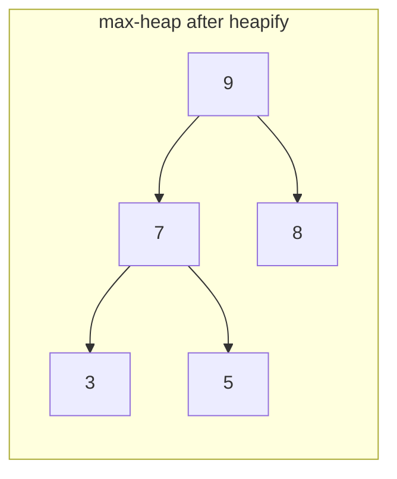

# Heap Sort

**Category:** Sorting

## The problem

This repo's [Merge Sort](../merge-sort) guarantees O(n log n) but needs an O(n) auxiliary
buffer. [Quick Sort](../quick-sort) sorts in place with average-case O(n log n), but even with a
randomized pivot the worst case is still mathematically real. Neither one gives *both*
guarantees at once — a bound that holds unconditionally, and zero auxiliary memory.

## The solution

Treat the array itself as a binary heap. First rearrange it in place into a max-heap (bottom-up,
O(n) total), so the largest not-yet-placed value always sits at index 0. Then repeatedly swap
that root with the last not-yet-sorted slot and sift the new root back down to restore the heap
property, shrinking the "still a heap" region by one each time. Every sift-down touches at most
`log2(size)` levels, done n times: O(n log n), and because a binary heap stored in an array needs
no pointers and no separate structure — parent/child relationships are pure index arithmetic —
the whole thing happens in the original array with zero auxiliary allocation.



| Operation | Cost | Why |
|---|---|---|
| `sort` | O(n log n), every case | heapify is O(n); n extractions, each an O(log n) sift-down |
| space | O(1) auxiliary | the heap lives in the original array — no buffer, unlike [Merge Sort](../merge-sort) |

## Classic example

[`classic/HeapSort`](src/main/java/com/algorithms/sorting/heapsort/classic/HeapSort.java) is
generic over `Comparator<? super T>` — no `Arrays.sort`/`Collections.sort` shortcut, and no
`java.util.PriorityQueue` either, since the whole point is building the heap directly on top of
the array being sorted rather than a separate structure.
[`HeapSortTest`](src/test/java/com/algorithms/sorting/heapsort/classic/HeapSortTest.java) covers
an unordered array, already-sorted, reverse-sorted, duplicates, both an odd- and an even-sized
array (exercises both the left-only and left+right sift-down branches), a single-element and an
empty array, a custom (descending) comparator, and both null-argument guards.

## Applied example: telecom edge-equipment alarm sort

[`applied/NetworkAlarmSort`](src/main/java/com/algorithms/sorting/heapsort/applied/NetworkAlarmSort.java)
sorts a batch of network alarms by severity, highest first, on constrained telecom edge
equipment — the one place among this repo's sorting modules where "guaranteed O(n log n)" and
"zero auxiliary memory" both matter at the same time, not just one or the other. Merge sort's
O(n) buffer risks an allocation the device's tight RAM budget can't always absorb; even a
randomized quicksort's worst-case risk is a real-time-processing constraint this alarm-handling
loop can't accept. Heap sort is the one sort in this repo that gives up neither guarantee.
[`NetworkAlarmSortTest`](src/test/java/com/algorithms/sorting/heapsort/applied/NetworkAlarmSortTest.java)
covers descending ordering by severity, that the input array is left untouched, and the
null-argument guard.

## Benchmark

```bash
./gradlew :sorting:heap-sort:jmh
```

Real run on this machine (JMH 1.37, JDK 26.0.2, 2 warmup + 3 measurement iterations, 1 fork).
Same three orderings and sizes as this repo's Merge Sort benchmark:

| Sort cost | size=100 | size=1,000 | size=10,000 |
|---|---:|---:|---:|
| already sorted | 6.953 µs | 121.772 µs | 1,759.917 µs |
| nearly sorted | 7.208 µs | 128.645 µs | 1,676.061 µs |
| random | 6.658 µs | 149.769 µs | 2,247.465 µs |

Same story as [Merge Sort](../merge-sort): all three orderings land within ~1.3x of each other
at every size — heap shape depends on how many elements there are, not what order they arrived
in, so the guarantee holds regardless of input order. Growth confirms O(n log n) too: random goes
from size=1,000 to size=10,000 (10x the data) at ~15.0x the cost, matching the ~13.3x an
O(n log n) shape predicts, not the ~100x a quadratic sort would show. Comparing absolute numbers
against [Merge Sort](../merge-sort) and [Quick Sort](../quick-sort) on this same machine at
size=10,000 (heap sort ~1,676–2,247 µs vs. merge sort's ~935–1,683 µs and quicksort's
~1,002–2,171 µs): heap sort runs in the same ballpark but isn't the fastest of the three — the
well-known reason is cache locality. A binary heap's parent/child index jumps (`2i+1`, `2i+2`)
touch memory less predictably than merge sort's sequential scans or quicksort's localized
partitioning, so heap sort typically loses a constant-factor race it wins on paper (same Big-O)
but not always in wall-clock time. Same guarantee, real-world cost that Big-O alone doesn't
capture.

## When not to use it

- Don't actually need the in-place guarantee, and want the best typical-case wall-clock time?
  [Quick Sort](../quick-sort) usually edges out heap sort on non-adversarial input, for the
  cache-locality reason explained above.
- Need stability (equal elements keeping their original order)? Heap sort doesn't provide it —
  [Merge Sort](../merge-sort) does.
- Already have this repo's [Heap / Priority Queue](https://github.com/leon-lourenco/data-structures-project/tree/master/trees/heap)
  structure in hand for a different reason (e.g. ongoing insert/extract-min traffic, not a
  one-shot sort)? Reuse it directly instead of re-heapifying a plain array from scratch here.

## Test coverage

100% instruction coverage, 100% branch coverage (JaCoCo). Reproduce it yourself:

```bash
./gradlew :sorting:heap-sort:jacocoTestReport
```

Report at `sorting/heap-sort/build/reports/jacoco/test/html/index.html`.

## Further reading

- Cormen, Leiserson, Rivest & Stein — *Introduction to Algorithms* (CLRS), 3rd/4th ed.,
  Chapter 6, "Heapsort" — the formal treatment of build-heap's O(n) bound (not the naive
  O(n log n) a per-element insert count would suggest) and the extraction loop this module
  implements.
- Sedgewick & Wayne — *Algorithms*, 4th ed., Chapter 2.4, "Priority Queues" — covers heap
  sort alongside the broader priority-queue API it's built from.
