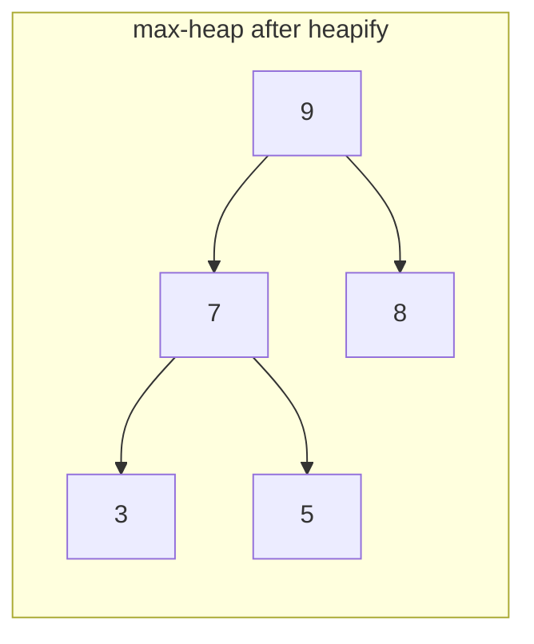

# Heap Sort

**Categoria:** Sorting

## O problema

O [Merge Sort](../merge-sort) deste repositório garante O(n log n), mas precisa de um buffer
auxiliar O(n). O [Quick Sort](../quick-sort) ordena in-place com O(n log n) em média, mas mesmo
com um pivô randomizado o pior caso continua matematicamente real. Nenhum dos dois oferece
*ambas* as garantias ao mesmo tempo — um limite que vale incondicionalmente, e memória auxiliar
zero.

## A solução

Trate o próprio array como um heap binário. Primeiro, reorganize-o in-place em um max-heap
(bottom-up, O(n) no total), de modo que o maior valor ainda não posicionado sempre esteja no
índice 0. Depois, troque repetidamente essa raiz com o último slot ainda não ordenado e faça o
sift-down da nova raiz para restaurar a propriedade de heap, reduzindo em um a região "ainda é um
heap" a cada iteração. Todo sift-down toca no máximo `log2(size)` níveis, feito n vezes: O(n log
n), e como um heap binário armazenado em um array não precisa de ponteiros nem de uma estrutura
separada — as relações pai/filho são pura aritmética de índices —, tudo acontece no array
original, com alocação auxiliar zero.



| Operação | Custo | Por quê |
|---|---|---|
| `sort` | O(n log n), em todos os casos | heapify é O(n); n extrações, cada uma um sift-down O(log n) |
| espaço | O(1) auxiliar | o heap vive no array original — sem buffer, diferente do [Merge Sort](../merge-sort) |

## Exemplo clássico

[`classic/HeapSort`](src/main/java/com/algorithms/sorting/heapsort/classic/HeapSort.java) é
genérico sobre `Comparator<? super T>` — sem atalho de `Arrays.sort`/`Collections.sort`, e também
sem `java.util.PriorityQueue`, já que todo o ponto é construir o heap diretamente sobre o array
que está sendo ordenado, em vez de usar uma estrutura separada.
[`HeapSortTest`](src/test/java/com/algorithms/sorting/heapsort/classic/HeapSortTest.java) cobre
um array desordenado, já ordenado, ordenado ao contrário, com duplicatas, tanto um array de
tamanho ímpar quanto um de tamanho par (exercitando os ramos de sift-down apenas-esquerda e
esquerda+direita), um array de um único elemento e um array vazio, um comparador customizado
(decrescente), e as duas proteções contra argumento nulo.

## Exemplo aplicado: ordenação de alarmes em equipamentos de borda de telecom

[`applied/NetworkAlarmSort`](src/main/java/com/algorithms/sorting/heapsort/applied/NetworkAlarmSort.java)
ordena um lote de alarmes de rede por severidade, do maior para o menor, em equipamento de borda
de telecom com recursos restritos — o único lugar entre os módulos de ordenação deste repositório
onde "O(n log n) garantido" e "memória auxiliar zero" importam ao mesmo tempo, não apenas um ou
outro. O buffer O(n) do merge sort arrisca uma alocação que o orçamento apertado de RAM do
dispositivo nem sempre consegue absorver; mesmo o risco de pior caso de um quicksort randomizado
é uma restrição de processamento em tempo real que esse loop de tratamento de alarmes não pode
aceitar. O heap sort é a única ordenação deste repositório que não abre mão de nenhuma das duas
garantias.
[`NetworkAlarmSortTest`](src/test/java/com/algorithms/sorting/heapsort/applied/NetworkAlarmSortTest.java)
cobre a ordenação decrescente por severidade, o fato de que o array de entrada permanece
intocado, e a proteção contra argumento nulo.

## Benchmark

```bash
./gradlew :sorting:heap-sort:jmh
```

Execução real nesta máquina (JMH 1.37, JDK 26.0.2, 2 iterações de warmup + 3 de medição, 1
fork). Mesmas três ordenações e tamanhos do benchmark de Merge Sort deste repositório:

| Custo da ordenação | size=100 | size=1,000 | size=10,000 |
|---|---:|---:|---:|
| já ordenado | 6.953 µs | 121.772 µs | 1,759.917 µs |
| quase ordenado | 7.208 µs | 128.645 µs | 1,676.061 µs |
| aleatório | 6.658 µs | 149.769 µs | 2,247.465 µs |

Mesma história do [Merge Sort](../merge-sort): as três ordenações ficam dentro de ~1.3x uma da
outra em todos os tamanhos — o formato do heap depende de quantos elementos existem, não da ordem
em que chegaram, então a garantia se mantém independentemente da ordem de entrada. O crescimento
confirma o O(n log n) também: o caso aleatório vai de size=1,000 para size=10,000 (10x os dados) a
~15.0x o custo, batendo com o ~13.3x que o formato O(n log n) prevê, não o ~100x que uma ordenação
quadrática mostraria. Comparando números absolutos com [Merge Sort](../merge-sort) e [Quick
Sort](../quick-sort) nesta mesma máquina em size=10,000 (heap sort ~1,676–2,247 µs vs. ~935–1,683
µs do merge sort e ~1,002–2,171 µs do quicksort): o heap sort fica na mesma faixa, mas não é o
mais rápido dos três — o motivo bem conhecido é localidade de cache. Os saltos de índice
pai/filho de um heap binário (`2i+1`, `2i+2`) tocam a memória de forma menos previsível do que as
varreduras sequenciais do merge sort ou o particionamento localizado do quicksort, então o heap
sort tipicamente perde uma corrida de fator constante que ganha no papel (mesmo Big-O), mas nem
sempre em tempo de relógio. Mesma garantia, custo do mundo real que o Big-O sozinho não captura.

## Quando não usar

- Não precisa mesmo da garantia in-place e quer o melhor tempo de execução no caso típico?
  O [Quick Sort](../quick-sort) costuma superar o heap sort em entradas não adversariais, pelo
  motivo de localidade de cache explicado acima.
- Precisa de estabilidade (elementos iguais mantendo sua ordem original)? O heap sort não
  oferece isso — o [Merge Sort](../merge-sort) oferece.
- Já tem em mãos a estrutura [Heap / Priority Queue](https://github.com/leon-lourenco/data-structures-project/tree/master/trees/heap)
  deste repositório por outro motivo (por exemplo, tráfego contínuo de insert/extract-min, não
  uma ordenação pontual)? Reutilize-a diretamente em vez de refazer o heapify de um array simples
  do zero aqui.

## Cobertura de testes

100% de cobertura de instruções, 100% de cobertura de branches (JaCoCo). Reproduza você mesmo:

```bash
./gradlew :sorting:heap-sort:jacocoTestReport
```

Relatório em `sorting/heap-sort/build/reports/jacoco/test/html/index.html`.

## Leitura complementar

- Cormen, Leiserson, Rivest & Stein — *Introduction to Algorithms* (CLRS), 3ª/4ª ed.,
  Capítulo 6, "Heapsort" — o tratamento formal do limite O(n) do build-heap (não o ingênuo
  O(n log n) que uma contagem de inserção por elemento sugeriria) e o loop de extração que este
  módulo implementa.
- Sedgewick & Wayne — *Algorithms*, 4ª ed., Capítulo 2.4, "Priority Queues" — aborda o heap
  sort junto com a API mais ampla de priority queue sobre a qual ele é construído.
