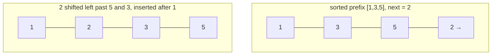

# Insertion Sort

**Categoría:** Sorting

## El problema

Para un lote pequeño — de un puñado a unas pocas docenas de elementos — recurrir a un algoritmo de propósito general con O(n log n) garantizado tiene un costo de configuración real (recursión, particionamiento, arrays auxiliares) que eclipsa el trabajo real una vez que n es lo bastante pequeño. Lo que se necesita en esa escala es el algoritmo con el menor factor constante por comparación, no el mejor techo asintótico — y los sorts de producción reales ya hacen exactamente esa concesión.

## La solución

Haz crecer un prefijo ordenado un elemento a la vez: toma el siguiente elemento y desplázalo hacia la izquierda a través del prefijo ya ordenado hasta que caiga en su posición correcta. El costo de ese desplazamiento es proporcional a cuántos elementos del prefijo están realmente fuera de lugar respecto a él — lo que significa que el costo total sigue el número total de *inversiones* del array, no solo su tamaño. Un array ya ordenado tiene cero inversiones (cada elemento se desplaza cero posiciones, O(n) en total); un array en orden inverso tiene el número máximo posible (cada elemento se desplaza hasta el principio, O(n²) en total). Por eso precisamente `Arrays.sort`/TimSort del propio JDK cambia a insertion sort por debajo de un umbral de tamaño pequeño, en lugar de pagar el costo de configuración de merge/quicksort en una ejecución diminuta.



| Caso | Costo | Por qué |
|---|---|---|
| Mejor caso (ya ordenado, cero inversiones) | O(n) | la distancia de desplazamiento de cada elemento es cero |
| Peor caso (orden inverso, inversiones máximas) | O(n²) | cada elemento se desplaza hasta el principio |
| Promedio / casi ordenado | proporcional al número real de inversiones | el costo sigue directamente el desorden, no solo n |

## Ejemplo clásico

[`classic/InsertionSort`](src/main/java/com/algorithms/sorting/insertionsort/classic/InsertionSort.java) es genérico sobre `Comparator<? super T>` — sin atajo de `Arrays.sort`/`Collections.sort` — el bucle de desplazamiento mueve los elementos una posición a la vez usando asignación simple, sin swaps. [`InsertionSortTest`](src/test/java/com/algorithms/sorting/insertionsort/classic/InsertionSortTest.java) cubre un array desordenado, un array ya ordenado, un array en orden inverso, duplicados, un array de un solo elemento y un array vacío, un comparator personalizado (descendente), y ambas protecciones contra argumento nulo.

## Ejemplo aplicado: ordenamiento por lotes de registros de detalle de llamadas de telecom

[`applied/CallDetailRecordSort`](src/main/java/com/algorithms/sorting/insertionsort/applied/CallDetailRecordSort.java) ordena un pequeño lote de registros de detalle de llamadas por hora de inicio antes de entregarlos a un motor de rating/facturación en tiempo real. Las llamadas de un único suscriptor dentro de una ventana corta de facturación son exactamente la forma en la que este algoritmo destaca: una n pequeña y — dado que la ingesta de eventos del lado del operador es, en sí misma, aproximadamente cronológica — por lo general ya está casi ordenada cuando llega a esta etapa. La clase documenta `RECOMMENDED_MAX_BATCH_SIZE` (64) como el mismo tipo de umbral de tamaño que usan los sorts de producción reales antes de abandonar insertion sort. [`CallDetailRecordSortTest`](src/test/java/com/algorithms/sorting/insertionsort/applied/CallDetailRecordSortTest.java) cubre registros ordenados en la secuencia correcta, que el array de entrada queda intacto (el método devuelve un nuevo array ordenado), y la protección contra argumento nulo.

## Benchmark

```bash
./gradlew :sorting:insertion-sort:jmh
```

Ejecución real en esta máquina (JMH 1.37, JDK 26.0.2, 2 iteraciones de warmup + 3 de medición, 1 fork). Mismos tres ordenamientos y tamaños que el benchmark de Bubble Sort de este repositorio, así que ambos son directamente comparables:

| Costo del sort | size=100 | size=1,000 | size=10,000 |
|---|---:|---:|---:|
| ya ordenado | 0.269 µs | 2.213 µs | 30.636 µs |
| casi ordenado | 0.715 µs | 7.408 µs | 72.491 µs |
| aleatorio | 9.275 µs | 691.996 µs | 73,063.752 µs |

En size=10,000, el caso aleatorio es **~2.384x más lento** que el ya ordenado — la afirmación sobre el conteo de inversiones de "La solución" más arriba, hecha medible. Vale la pena compararlo directamente con el benchmark de [Bubble Sort](../bubble-sort) de este repositorio: mismos ordenamientos, mismos tamaños, misma máquina — el costo del caso aleatorio de insertion sort en size=10,000 (73,063.752 µs) queda bien por debajo de la mitad del de bubble sort (337,009.203 µs), lo cual coincide con el resultado conocido de que insertion sort hace aproximadamente la mitad de los movimientos de elementos que hace bubble sort para el mismo desorden, aunque ambos sean O(n²) en el peor caso. Misma clase asintótica, constante medible distinta.

## Cuándo no usarlo

- ¿Necesitas un límite garantizado de O(n log n) para un dataset grande o genuinamente desordenado? Usa [Merge Sort](../merge-sort) o [Quick Sort](../quick-sort) de este repositorio — el benchmark de arriba muestra exactamente cuánto se degrada O(n²) una vez que n deja de ser pequeño.
- El valor real de este módulo está específicamente en lotes con n pequeña o ya casi ordenados — ese es un nicho estrecho y real (por lo que es el único sort clásico O(n²) que todavía viene incluido en implementaciones de sort de producción hoy en día), no una elección de propósito general.

## Cobertura de pruebas

100% de cobertura de instrucciones, 100% de cobertura de ramas (JaCoCo). Reprodúcelo tú mismo:

```bash
./gradlew :sorting:insertion-sort:jacocoTestReport
```

Informe en `sorting/insertion-sort/build/reports/jacoco/test/html/index.html`.

## Lectura complementaria

- Cormen, Leiserson, Rivest & Stein — *Introduction to Algorithms* (CLRS), 3ª/4ª ed., Capítulo 2, "Getting Started" — insertion sort es el propio algoritmo de apertura de CLRS, usado para introducir invariantes de bucle y análisis asintótico.
- Sedgewick & Wayne — *Algorithms*, 4ª ed., sección 2.1, "Elementary Sorts" — incluye el mismo detalle del mundo real en el que se apoya este módulo: los sorts de producción recurren a insertion sort para subarrays pequeños.
