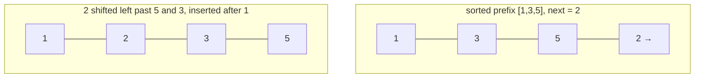

# Insertion Sort

**Category:** Sorting

## The problem

For a small batch — a handful to a few dozen elements — pulling in a general-purpose,
guaranteed-O(n log n) algorithm pays real setup cost (recursion, partitioning, auxiliary arrays)
that dwarfs the actual work once n is small enough. What's needed at that scale is the algorithm
with the lowest constant factor per comparison, not the best asymptotic ceiling — and real
production sorts already make exactly that trade.

## The solution

Grow a sorted prefix one element at a time: take the next element, and shift it left through the
already-sorted prefix until it lands in its correct position. The cost of that shift is
proportional to how many prefix elements are actually out of place relative to it — which means
the total cost tracks the array's total number of *inversions*, not just its size. An
already-sorted array has zero inversions (every element shifts zero positions, O(n) total); a
reverse-sorted array has the maximum possible number (every element shifts all the way to the
front, O(n²) total). This is exactly why the JDK's own `Arrays.sort`/TimSort switch to insertion
sort below a small size threshold instead of paying merge/quicksort's setup cost on a tiny run.



| Case | Cost | Why |
|---|---|---|
| Best (already sorted, zero inversions) | O(n) | every element's shift distance is zero |
| Worst (reverse sorted, maximum inversions) | O(n²) | every element shifts all the way to the front |
| Average / nearly sorted | proportional to the actual inversion count | cost tracks disorder directly, not just n |

## Classic example

[`classic/InsertionSort`](src/main/java/com/algorithms/sorting/insertionsort/classic/InsertionSort.java)
is generic over `Comparator<? super T>` — no `Arrays.sort`/`Collections.sort` shortcut — the
shift loop moves elements one slot at a time using plain assignment, no swaps.
[`InsertionSortTest`](src/test/java/com/algorithms/sorting/insertionsort/classic/InsertionSortTest.java)
covers an unordered array, an already-sorted array, a reverse-sorted array, duplicates, a
single-element and an empty array, a custom (descending) comparator, and both null-argument
guards.

## Applied example: telecom call-detail-record batch sort

[`applied/CallDetailRecordSort`](src/main/java/com/algorithms/sorting/insertionsort/applied/CallDetailRecordSort.java)
sorts a small batch of call detail records by start time before handing them to a real-time
rating/billing engine. A single subscriber's calls within a short billing window is exactly the
shape this algorithm is good at: a small n, and — since carrier-side event ingestion is itself
roughly chronological — usually already close to sorted by the time it reaches this stage. The
class documents `RECOMMENDED_MAX_BATCH_SIZE` (64) as the same kind of size threshold real
production sorts use before switching away from insertion sort.
[`CallDetailRecordSortTest`](src/test/java/com/algorithms/sorting/insertionsort/applied/CallDetailRecordSortTest.java)
covers records sorted into the correct order, that the input array is left untouched (the method
returns a new sorted array), and the null-argument guard.

## Benchmark

```bash
./gradlew :sorting:insertion-sort:jmh
```

Real run on this machine (JMH 1.37, JDK 26.0.2, 2 warmup + 3 measurement iterations, 1 fork).
Same three orderings and sizes as this repo's Bubble Sort benchmark, so the two are directly
comparable:

| Sort cost | size=100 | size=1,000 | size=10,000 |
|---|---:|---:|---:|
| already sorted | 0.269 µs | 2.213 µs | 30.636 µs |
| nearly sorted | 0.715 µs | 7.408 µs | 72.491 µs |
| random | 9.275 µs | 691.996 µs | 73,063.752 µs |

At size=10,000, random is **~2,384x slower** than already-sorted — the inversion-count claim
from "The solution" above, made measurable. Worth comparing directly against this repo's
[Bubble Sort](../bubble-sort) benchmark: same orderings, same sizes, same machine — insertion
sort's random-case cost at size=10,000 (73,063.752 µs) is well under half of bubble sort's
(337,009.203 µs), which matches the well-known result that insertion sort does roughly half the
element moves bubble sort does for the same disorder, even though both are O(n²) in the worst
case. Same asymptotic class, measurably different constant.

## When not to use it

- Need a guaranteed O(n log n) bound for a large or genuinely unordered dataset? Use
  [Merge Sort](../merge-sort) or [Quick Sort](../quick-sort) from this repo — the benchmark
  above shows exactly how badly O(n²) degrades once n stops being small.
- This module's real value is specifically small-n or already-nearly-sorted batches — that's a
  narrow, real niche (which is why it's the one classic O(n²) sort that still ships inside
  production sort implementations today), not a general-purpose choice.

## Test coverage

100% instruction coverage, 100% branch coverage (JaCoCo). Reproduce it yourself:

```bash
./gradlew :sorting:insertion-sort:jacocoTestReport
```

Report at `sorting/insertion-sort/build/reports/jacoco/test/html/index.html`.

## Further reading

- Cormen, Leiserson, Rivest & Stein — *Introduction to Algorithms* (CLRS), 3rd/4th ed.,
  Chapter 2, "Getting Started" — insertion sort is CLRS's own opening algorithm, used to
  introduce loop invariants and asymptotic analysis.
- Sedgewick & Wayne — *Algorithms*, 4th ed., section 2.1, "Elementary Sorts" — includes the
  same real-world detail this module leans on: production sorts fall back to insertion sort for
  small subarrays.
