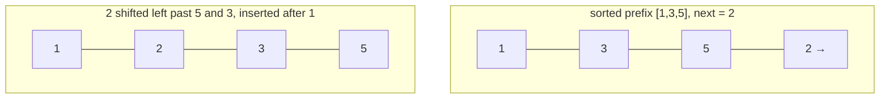

# Insertion Sort

**Categoria:** Sorting

## O problema

Para um lote pequeno — de um punhado a algumas dezenas de elementos — recorrer a um algoritmo de propósito geral com O(n log n) garantido tem um custo de setup real (recursão, particionamento, arrays auxiliares) que ofusca o trabalho de fato quando n é pequeno o suficiente. O que se precisa nessa escala é o algoritmo com o menor fator constante por comparação, não o melhor teto assintótico — e os sorts de produção reais já fazem exatamente essa troca.

## A solução

Cresça um prefixo ordenado um elemento de cada vez: pegue o próximo elemento e desloque-o para a esquerda através do prefixo já ordenado até que ele pouse na posição correta. O custo desse deslocamento é proporcional a quantos elementos do prefixo estão de fato fora de lugar em relação a ele — o que significa que o custo total acompanha o número total de *inversões* do array, não apenas seu tamanho. Um array já ordenado tem zero inversões (todo elemento desloca zero posições, O(n) no total); um array em ordem inversa tem o número máximo possível (todo elemento desloca até o início, O(n²) no total). É exatamente por isso que o próprio `Arrays.sort`/TimSort do JDK muda para insertion sort abaixo de um pequeno limiar de tamanho, em vez de pagar o custo de setup do merge/quicksort numa execução minúscula.



| Caso | Custo | Por quê |
|---|---|---|
| Melhor caso (já ordenado, zero inversões) | O(n) | a distância de deslocamento de cada elemento é zero |
| Pior caso (ordem inversa, inversões máximas) | O(n²) | todo elemento desloca até o início |
| Médio / quase ordenado | proporcional ao número real de inversões | o custo acompanha diretamente a desordem, não apenas n |

## Exemplo clássico

[`classic/InsertionSort`](src/main/java/com/algorithms/sorting/insertionsort/classic/InsertionSort.java) é genérico sobre `Comparator<? super T>` — sem atalho de `Arrays.sort`/`Collections.sort` — o loop de deslocamento move os elementos uma posição de cada vez usando atribuição simples, sem swaps. [`InsertionSortTest`](src/test/java/com/algorithms/sorting/insertionsort/classic/InsertionSortTest.java) cobre um array desordenado, um array já ordenado, um array em ordem inversa, duplicatas, um array de um único elemento e um array vazio, um comparator customizado (decrescente), e ambas as proteções contra argumento nulo.

## Exemplo aplicado: ordenação em lote de registros de detalhe de chamadas de telecom

[`applied/CallDetailRecordSort`](src/main/java/com/algorithms/sorting/insertionsort/applied/CallDetailRecordSort.java) ordena um pequeno lote de registros de detalhe de chamada por horário de início antes de entregá-los a um motor de rating/billing em tempo real. As chamadas de um único assinante dentro de uma janela curta de faturamento são exatamente o formato em que esse algoritmo é bom: um n pequeno e — já que a ingestão de eventos do lado da operadora é, em si, aproximadamente cronológica — geralmente já perto de ordenado quando chega a esse estágio. A classe documenta `RECOMMENDED_MAX_BATCH_SIZE` (64) como o mesmo tipo de limiar de tamanho que sorts de produção reais usam antes de abandonar o insertion sort. [`CallDetailRecordSortTest`](src/test/java/com/algorithms/sorting/insertionsort/applied/CallDetailRecordSortTest.java) cobre registros ordenados na sequência correta, que o array de entrada é deixado intocado (o método retorna um novo array ordenado), e a proteção contra argumento nulo.

## Benchmark

```bash
./gradlew :sorting:insertion-sort:jmh
```

Execução real nesta máquina (JMH 1.37, JDK 26.0.2, 2 iterações de warmup + 3 de medição, 1 fork). Mesmas três ordenações e tamanhos do benchmark de Bubble Sort deste repositório, então os dois são diretamente comparáveis:

| Custo do sort | size=100 | size=1,000 | size=10,000 |
|---|---:|---:|---:|
| já ordenado | 0.269 µs | 2.213 µs | 30.636 µs |
| quase ordenado | 0.715 µs | 7.408 µs | 72.491 µs |
| aleatório | 9.275 µs | 691.996 µs | 73,063.752 µs |

Em size=10,000, o caso aleatório é **~2.384x mais lento** que o já ordenado — a afirmação sobre contagem de inversões de "A solução" acima, tornada mensurável. Vale comparar diretamente com o benchmark de [Bubble Sort](../bubble-sort) deste repositório: mesmas ordenações, mesmos tamanhos, mesma máquina — o custo do caso aleatório do insertion sort em size=10,000 (73,063.752 µs) fica bem abaixo da metade do bubble sort (337,009.203 µs), o que confere com o resultado conhecido de que o insertion sort faz aproximadamente metade dos movimentos de elementos que o bubble sort faz para a mesma desordem, mesmo que ambos sejam O(n²) no pior caso. Mesma classe assintótica, constante mensuravelmente diferente.

## Quando não usar

- Precisa de um limite garantido de O(n log n) para um dataset grande ou genuinamente desordenado? Use [Merge Sort](../merge-sort) ou [Quick Sort](../quick-sort) deste repositório — o benchmark acima mostra exatamente o quanto o O(n²) degrada quando n deixa de ser pequeno.
- O valor real deste módulo está especificamente em lotes com n pequeno ou já quase ordenados — esse é um nicho estreito e real (o que explica por que é o único sort clássico O(n²) que ainda vem embutido em implementações de sort de produção hoje em dia), não uma escolha de propósito geral.

## Cobertura de testes

100% de cobertura de instruções, 100% de cobertura de branches (JaCoCo). Reproduza você mesmo:

```bash
./gradlew :sorting:insertion-sort:jacocoTestReport
```

Relatório em `sorting/insertion-sort/build/reports/jacoco/test/html/index.html`.

## Leitura complementar

- Cormen, Leiserson, Rivest & Stein — *Introduction to Algorithms* (CLRS), 3ª/4ª ed., Capítulo 2, "Getting Started" — o insertion sort é o próprio algoritmo de abertura do CLRS, usado para introduzir invariantes de loop e análise assintótica.
- Sedgewick & Wayne — *Algorithms*, 4ª ed., seção 2.1, "Elementary Sorts" — inclui o mesmo detalhe do mundo real em que este módulo se apoia: sorts de produção recorrem ao insertion sort para subarrays pequenos.
