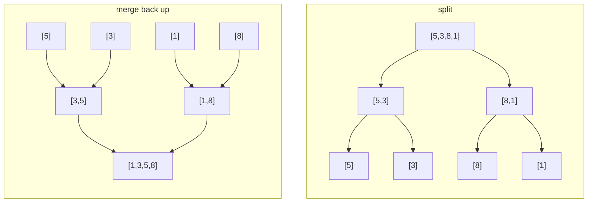

# Merge Sort

**Categoría:** Sorting

## El problema

El [Bubble Sort](../bubble-sort) y el [Insertion Sort](../insertion-sort) de este repositorio son
ambos adaptativos — genuinamente rápidos con entradas casi ordenadas —, pero esa adaptabilidad es
justo lo que los convierte en un riesgo en el momento en que no se puede confiar en el orden de la
entrada: ambos degradan a O(n²) con la entrada equivocada, de forma impredecible, sin ninguna
protección. Un lote grande, o uno cuyo orden un adversario pudiera influenciar, necesita una cota
que se mantenga *sin importar* cómo llegue la entrada — no un mejor caso que solo compensa cuando
tienes suerte.

## La solución

Divide el array por la mitad, ordena recursivamente cada mitad y luego combina (merge) las dos
mitades ya ordenadas en una sola. La división llega a su fondo en elementos individuales
(trivialmente ordenados); combinar dos secuencias ordenadas solo necesita comparar sus cabezas
actuales y tomar la menor, que es justo lo que hace que el propio paso de merge sea lineal. Como
el punto de división siempre es el punto medio — y no depende de los datos, a diferencia del
[Quick Sort](../quick-sort) de este repositorio —, la profundidad de la recursión es siempre
exactamente `log2(n)`, y cada nivel hace O(n) de trabajo total de merge: O(n log n),
incondicionalmente, sin que el orden de la entrada tenga voto. El único costo real: el merge
necesita un buffer auxiliar, así que esto es O(n) de espacio extra, no es in-place. Tomar siempre
de la mitad izquierda cuando el comparador reporta un empate es también lo que hace que esta
ordenación sea **estable** — los elementos iguales mantienen su orden relativo original.



| Operación | Costo | Por qué |
|---|---|---|
| `sort` | O(n log n), en todos los casos | la profundidad de la división siempre es log2(n); cada nivel hace O(n) de trabajo de merge, independiente del orden de la entrada |
| espacio | O(n) auxiliar | el paso de merge necesita un buffer para retener un lado mientras se sobrescribe el rango original |

## Ejemplo clásico

[`classic/MergeSort`](src/main/java/com/algorithms/sorting/mergesort/classic/MergeSort.java) es
genérico sobre `Comparator<? super T>` — sin atajo mediante `Arrays.sort`/`Collections.sort`. Se
asigna un único buffer `Object[]` una vez al principio y se reutiliza a lo largo de toda la
recursión (solo el subrango relevante se copia en él en cada merge), en lugar de asignar un array
nuevo en cada llamada recursiva.
[`MergeSortTest`](src/test/java/com/algorithms/sorting/mergesort/classic/MergeSortTest.java)
cubre un array desordenado, ya ordenado, ordenado en reversa, un array de tamaño impar (ejercita
la división desigual), un array de un solo elemento y uno vacío, un comparador personalizado
(descendente), las dos protecciones contra argumento nulo y — probando directamente la afirmación
de estabilidad — una prueba con elementos etiquetados que ordena por un valor que tiene
duplicados y verifica que los duplicados mantienen su orden relativo original.

## Ejemplo aplicado: ordenamiento de reportes de compliance por fraude

[`applied/ComplianceReportSort`](src/main/java/com/algorithms/sorting/mergesort/applied/ComplianceReportSort.java)
ordena las transacciones marcadas por fraude según el puntaje de riesgo, de mayor a menor, para
un reporte de compliance que debe ser reproducible ejecución tras ejecución: la misma entrada
siempre debe producir exactamente el mismo orden de salida, incluyendo cómo se resuelven los
empates en el puntaje de riesgo. El peor caso garantizado de O(n log n) del merge sort protege
contra la degradación impredecible de un lote grande y con muchos puntajes duplicados, y su
estabilidad hace que las transacciones con el mismo puntaje mantengan el orden en que fueron
marcadas originalmente — un auditor que vuelva a ejecutar este reporte más tarde obtiene un
resultado idéntico, no solo uno igualmente válido.
[`ComplianceReportSortTest`](src/test/java/com/algorithms/sorting/mergesort/applied/ComplianceReportSortTest.java)
cubre el orden descendente por puntaje, los empates preservando el orden original de marcado, que
el array de entrada queda intacto, y la protección contra argumento nulo.

## Benchmark

```bash
./gradlew :sorting:merge-sort:jmh
```

Ejecución real en esta máquina (JMH 1.37, JDK 26.0.2, 2 iteraciones de warmup + 3 de medición, 1
fork). Mismos tres órdenes y tamaños que los benchmarks de Bubble Sort e Insertion Sort de este
repositorio — el objetivo aquí es el contraste:

| Costo de ordenar | size=100 | size=1,000 | size=10,000 |
|---|---:|---:|---:|
| ya ordenado | 5.928 µs | 75.629 µs | 953.786 µs |
| casi ordenado | 6.174 µs | 76.531 µs | 935.094 µs |
| aleatorio | 7.281 µs | 143.539 µs | 1,683.059 µs |

Ya-ordenado y casi-ordenado se comportan de forma casi idéntica en todos los tamaños — el orden
de la entrada realmente no importa aquí, a diferencia de las brechas de más de 1,000x que
[Bubble Sort](../bubble-sort) y [Insertion Sort](../insertion-sort) muestran entre sus mejores y
peores casos en esta misma máquina. El caso aleatorio es consistentemente el más costoso de los
tres, pero solo por aproximadamente 1.8–2x, no órdenes de magnitud — trabajo real, no un caso
degenerado. Y la forma de crecimiento entre tamaños confirma O(n log n), no O(n²): al pasar de
size=1,000 a size=10,000 (10x los datos), el caso aleatorio cuesta ~11.7x más — cerca del ~13.3x
que predice una forma O(n log n) para ese salto (`10,000·log₂(10,000) ÷ 1,000·log₂(1,000)`), lejos
del ~100x que mostraría una ordenación cuadrática para el mismo incremento de tamaño.

## Cuándo no usarlo

- ¿Presupuesto de memoria ajustado, o necesitas una ordenación genuinamente in-place? El buffer
  auxiliar O(n) del merge sort es el único costo real de su cota garantizada — el
  [Quick Sort](../quick-sort) o el [Heap Sort](../heap-sort) de este repositorio ordenan in-place
  en su lugar.
- ¿La entrada es pequeña y ya está cerca de ordenada? El factor constante más bajo del
  [Insertion Sort](../insertion-sort) gana a esa escala — el propio benchmark de este módulo
  muestra que el merge sort paga aproximadamente el mismo costo esté la entrada ordenada o no,
  que es justamente el punto, pero no es gratis.
- ¿No necesitas realmente la garantía de estabilidad y quieres el mejor factor constante de
  *caso promedio* en la práctica? El [Quick Sort](../quick-sort) suele superar al merge sort en
  tiempo de reloj (wall-clock) con entradas típicas (no adversariales), a costa de perder la
  garantía de peor caso que ofrece este módulo.

## Cobertura de pruebas

100% de cobertura de instrucciones, 100% de cobertura de ramas (JaCoCo). Reprodúcelo tú mismo:

```bash
./gradlew :sorting:merge-sort:jacocoTestReport
```

Reporte en `sorting/merge-sort/build/reports/jacoco/test/html/index.html`.

## Lectura complementaria

- Cormen, Leiserson, Rivest & Stein — *Introduction to Algorithms* (CLRS), 3.ª/4.ª ed.,
  Capítulo 2.3, "Designing algorithms" — el merge sort es el ejemplo canónico de divide y
  vencerás de CLRS, con la recurrencia `T(n) = 2T(n/2) + O(n)` cuya forma en el mundo real mide
  el benchmark de este módulo.
- Sedgewick & Wayne — *Algorithms*, 4.ª ed., Capítulo 2.2, "Mergesort" — incluye la variante
  bottom-up (no recursiva) como contraste con la versión recursiva top-down implementada aquí.
