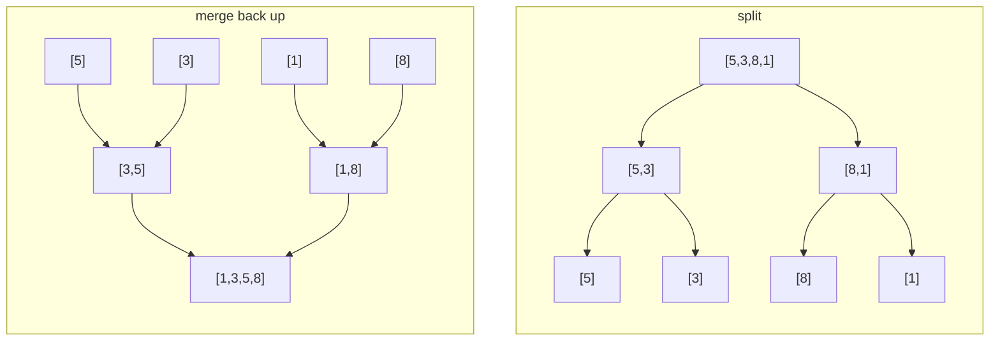

# Merge Sort

**Category:** Sorting

## The problem

This repo's [Bubble Sort](../bubble-sort) and [Insertion Sort](../insertion-sort) are both
adaptive — genuinely fast on nearly-sorted input — but that adaptivity is exactly what makes
them a liability the moment input order can't be trusted: both degrade to O(n²) on the wrong
input, unpredictably, with no guardrail. A large batch, or one whose order an adversary could
influence, needs a bound that holds *regardless* of how the input arrives — not a best case that
only pays off when you get lucky.

## The solution

Split the array in half, recursively sort each half, then merge the two already-sorted halves
back together. Splitting bottoms out at single elements (trivially sorted); merging two sorted
sequences only ever needs to compare their current heads and take the smaller one, which is what
makes the merge step itself linear. Because the split point is always the midpoint — not
data-dependent, unlike this repo's [Quick Sort](../quick-sort) — the recursion depth is always
exactly `log2(n)`, and every level does O(n) total merge work: O(n log n), unconditionally, no
input order gets a vote. The one real cost: merging needs an auxiliary buffer, so this is O(n)
extra space, not in-place. Taking from the left half whenever the comparator reports a tie is
also what makes this sort **stable** — equal elements keep their original relative order.



| Operation | Cost | Why |
|---|---|---|
| `sort` | O(n log n), every case | split depth is always log2(n); every level does O(n) merge work, independent of input order |
| space | O(n) auxiliary | the merge step needs a buffer to hold one side while overwriting the original range |

## Classic example

[`classic/MergeSort`](src/main/java/com/algorithms/sorting/mergesort/classic/MergeSort.java) is
generic over `Comparator<? super T>` — no `Arrays.sort`/`Collections.sort` shortcut. A single
`Object[]` buffer is allocated once up front and reused across the whole recursion (only the
relevant sub-range gets copied into it per merge), instead of allocating a fresh array at every
recursive call.
[`MergeSortTest`](src/test/java/com/algorithms/sorting/mergesort/classic/MergeSortTest.java)
covers an unordered array, already-sorted, reverse-sorted, an odd-sized array (exercises the
uneven split), a single-element and an empty array, a custom (descending) comparator, both
null-argument guards, and — directly proving the stability claim — a tagged-element test that
sorts on a value that has duplicates and asserts the duplicates keep their original relative
order.

## Applied example: fraud compliance report ordering

[`applied/ComplianceReportSort`](src/main/java/com/algorithms/sorting/mergesort/applied/ComplianceReportSort.java)
orders fraud-flagged transactions by risk score, highest first, for a compliance report that has
to be reproducible run over run: the same input must always produce the exact same output
ordering, including how transactions tied on risk score are broken. Merge sort's guaranteed
O(n log n) worst case protects against a large, duplicate-score-heavy batch degrading
unpredictably, and its stability means transactions with the same score keep the order they were
originally flagged in — an auditor re-running this report later gets an identical result, not
just an equally-valid one.
[`ComplianceReportSortTest`](src/test/java/com/algorithms/sorting/mergesort/applied/ComplianceReportSortTest.java)
covers descending ordering by score, ties preserving original flagging order, that the input
array is left untouched, and the null-argument guard.

## Benchmark

```bash
./gradlew :sorting:merge-sort:jmh
```

Real run on this machine (JMH 1.37, JDK 26.0.2, 2 warmup + 3 measurement iterations, 1 fork).
Same three orderings and sizes as this repo's Bubble Sort and Insertion Sort benchmarks — the
point here is the contrast:

| Sort cost | size=100 | size=1,000 | size=10,000 |
|---|---:|---:|---:|
| already sorted | 5.928 µs | 75.629 µs | 953.786 µs |
| nearly sorted | 6.174 µs | 76.531 µs | 935.094 µs |
| random | 7.281 µs | 143.539 µs | 1,683.059 µs |

Already-sorted and nearly-sorted track each other almost exactly at every size — input order
genuinely doesn't matter here, unlike the 1,000x-plus gaps [Bubble Sort](../bubble-sort) and
[Insertion Sort](../insertion-sort) show between their best and worst cases on this same
machine. Random is consistently the most expensive of the three, but only by roughly 1.8–2x, not
orders of magnitude — real work, not a degenerate case. And the growth shape across sizes
confirms O(n log n), not O(n²): going from size=1,000 to size=10,000 (10x the data), the random
case costs ~11.7x more — close to the ~13.3x an O(n log n) shape predicts for that jump
(`10,000·log₂(10,000) ÷ 1,000·log₂(1,000)`), nowhere near the ~100x a quadratic sort would show
for the same size increase.

## When not to use it

- Tight memory budget, or need a genuinely in-place sort? Merge sort's O(n) auxiliary buffer is
  the one real cost of its guaranteed bound — [Quick Sort](../quick-sort) or
  [Heap Sort](../heap-sort) from this repo sort in place instead.
- Input is small and already close to sorted? [Insertion Sort](../insertion-sort)'s lower
  constant factor wins at that scale — this module's own benchmark shows merge sort paying
  roughly the same cost whether the input is sorted or not, which is the point, but it's not
  free.
- Don't actually need the stability guarantee and want the best *average-case* constant factor
  in practice? [Quick Sort](../quick-sort) usually edges out merge sort in wall-clock time on
  typical (non-adversarial) input, at the cost of losing the worst-case guarantee this module
  provides.

## Test coverage

100% instruction coverage, 100% branch coverage (JaCoCo). Reproduce it yourself:

```bash
./gradlew :sorting:merge-sort:jacocoTestReport
```

Report at `sorting/merge-sort/build/reports/jacoco/test/html/index.html`.

## Further reading

- Cormen, Leiserson, Rivest & Stein — *Introduction to Algorithms* (CLRS), 3rd/4th ed.,
  Chapter 2.3, "Designing algorithms" — merge sort is CLRS's canonical divide-and-conquer
  example, with the recurrence `T(n) = 2T(n/2) + O(n)` this module's benchmark measures the
  real-world shape of.
- Sedgewick & Wayne — *Algorithms*, 4th ed., Chapter 2.2, "Mergesort" — includes the bottom-up
  (non-recursive) variant as a contrast to the top-down recursive version implemented here.
