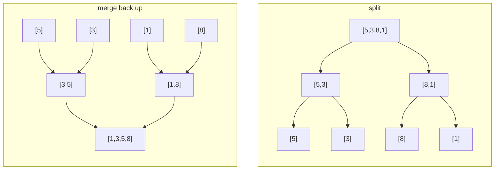

# Merge Sort

**Categoria:** Sorting

## O problema

O [Bubble Sort](../bubble-sort) e o [Insertion Sort](../insertion-sort) deste repositório são
ambos adaptativos — genuinamente rápidos em entradas quase ordenadas —, mas essa adaptatividade é
exatamente o que os torna um risco no momento em que a ordem da entrada não pode ser confiável:
ambos degradam para O(n²) na entrada errada, de forma imprevisível, sem nenhuma proteção. Um lote
grande, ou um cuja ordem um adversário poderia influenciar, precisa de um limite que se mantenha
*independentemente* de como a entrada chega — não de um melhor caso que só compensa quando você
tem sorte.

## A solução

Divida o array ao meio, ordene recursivamente cada metade e depois faça o merge das duas metades
já ordenadas de volta em uma só. A divisão chega ao fundo em elementos únicos (trivialmente
ordenados); o merge de duas sequências ordenadas só precisa comparar suas cabeças atuais e pegar a
menor, o que é o que torna a própria etapa de merge linear. Como o ponto de divisão é sempre o
meio — e não depende dos dados, ao contrário do [Quick Sort](../quick-sort) deste repositório —, a
profundidade da recursão é sempre exatamente `log2(n)`, e cada nível faz O(n) de trabalho total de
merge: O(n log n), incondicionalmente, sem que a ordem da entrada tenha voto. O único custo real:
o merge precisa de um buffer auxiliar, então isso é O(n) de espaço extra, não é in-place. Pegar
sempre da metade esquerda quando o comparador reporta um empate também é o que torna essa
ordenação **estável** — elementos iguais mantêm sua ordem relativa original.



| Operação | Custo | Por quê |
|---|---|---|
| `sort` | O(n log n), em todos os casos | a profundidade da divisão é sempre log2(n); cada nível faz O(n) de trabalho de merge, independente da ordem da entrada |
| espaço | O(n) auxiliar | a etapa de merge precisa de um buffer para armazenar um dos lados enquanto sobrescreve o intervalo original |

## Exemplo clássico

[`classic/MergeSort`](src/main/java/com/algorithms/sorting/mergesort/classic/MergeSort.java) é
genérico sobre `Comparator<? super T>` — sem atalho via `Arrays.sort`/`Collections.sort`. Um único
buffer `Object[]` é alocado uma vez no início e reutilizado ao longo de toda a recursão (apenas o
subintervalo relevante é copiado para ele a cada merge), em vez de alocar um array novo a cada
chamada recursiva.
[`MergeSortTest`](src/test/java/com/algorithms/sorting/mergesort/classic/MergeSortTest.java)
cobre um array desordenado, já ordenado, ordenado de forma inversa, um array de tamanho ímpar
(exercitando a divisão desigual), um array de um único elemento e um array vazio, um comparador
customizado (decrescente), as duas proteções contra argumento nulo e — provando diretamente a
alegação de estabilidade — um teste com elementos marcados que ordena por um valor que tem
duplicatas e verifica que as duplicatas mantêm sua ordem relativa original.

## Exemplo aplicado: ordenação de relatório de compliance de fraude

[`applied/ComplianceReportSort`](src/main/java/com/algorithms/sorting/mergesort/applied/ComplianceReportSort.java)
ordena transações sinalizadas por fraude pelo score de risco, da maior para a menor, para um
relatório de compliance que precisa ser reproduzível execução após execução: a mesma entrada deve
sempre produzir exatamente a mesma ordenação de saída, incluindo como os empates de score de risco
são resolvidos. O pior caso garantido de O(n log n) do merge sort protege contra a degradação
imprevisível de um lote grande e com muitos scores duplicados, e sua estabilidade significa que
transações com o mesmo score mantêm a ordem em que foram originalmente sinalizadas — um auditor
que reexecute esse relatório mais tarde obtém um resultado idêntico, não apenas um igualmente
válido.
[`ComplianceReportSortTest`](src/test/java/com/algorithms/sorting/mergesort/applied/ComplianceReportSortTest.java)
cobre a ordenação decrescente por score, empates preservando a ordem original de sinalização, que
o array de entrada permanece intocado, e a proteção contra argumento nulo.

## Benchmark

```bash
./gradlew :sorting:merge-sort:jmh
```

Execução real nesta máquina (JMH 1.37, JDK 26.0.2, 2 iterações de warmup + 3 de medição, 1
fork). Mesmas três ordenações e tamanhos dos benchmarks de Bubble Sort e Insertion Sort deste
repositório — o objetivo aqui é o contraste:

| Custo da ordenação | size=100 | size=1,000 | size=10,000 |
|---|---:|---:|---:|
| já ordenado | 5.928 µs | 75.629 µs | 953.786 µs |
| quase ordenado | 6.174 µs | 76.531 µs | 935.094 µs |
| aleatório | 7.281 µs | 143.539 µs | 1,683.059 µs |

Já ordenado e quase ordenado seguem quase exatamente o mesmo padrão em todos os tamanhos — a
ordem da entrada genuinamente não importa aqui, ao contrário das diferenças de mais de 1.000x que
[Bubble Sort](../bubble-sort) e [Insertion Sort](../insertion-sort) mostram entre seus melhores e
piores casos nesta mesma máquina. O caso aleatório é consistentemente o mais custoso dos três, mas
apenas por cerca de 1.8–2x, não ordens de grandeza — trabalho real, não um caso degenerado. E o
formato de crescimento entre os tamanhos confirma O(n log n), não O(n²): indo de size=1.000 para
size=10.000 (10x os dados), o caso aleatório custa ~11.7x mais — próximo do ~13.3x que um formato
O(n log n) prevê para esse salto (`10,000·log₂(10,000) ÷ 1,000·log₂(1,000)`), longe do ~100x que
uma ordenação quadrática mostraria para o mesmo aumento de tamanho.

## Quando não usar

- Orçamento de memória apertado, ou precisa de uma ordenação genuinamente in-place? O buffer
  auxiliar O(n) do merge sort é o único custo real do seu limite garantido — o
  [Quick Sort](../quick-sort) ou o [Heap Sort](../heap-sort) deste repositório ordenam in-place
  em vez disso.
- A entrada é pequena e já está próxima de ordenada? O fator constante menor do
  [Insertion Sort](../insertion-sort) vence nessa escala — o próprio benchmark deste módulo
  mostra o merge sort pagando aproximadamente o mesmo custo esteja a entrada ordenada ou não, que
  é exatamente o ponto, mas isso não é de graça.
- Não precisa de fato da garantia de estabilidade e quer o melhor fator constante de *caso
  médio* na prática? O [Quick Sort](../quick-sort) costuma superar o merge sort em tempo de
  relógio (wall-clock) em entradas típicas (não adversariais), ao custo de perder a garantia de
  pior caso que este módulo oferece.

## Cobertura de testes

100% de cobertura de instruções, 100% de cobertura de branches (JaCoCo). Reproduza você mesmo:

```bash
./gradlew :sorting:merge-sort:jacocoTestReport
```

Relatório em `sorting/merge-sort/build/reports/jacoco/test/html/index.html`.

## Leitura complementar

- Cormen, Leiserson, Rivest & Stein — *Introduction to Algorithms* (CLRS), 3ª/4ª ed.,
  Capítulo 2.3, "Designing algorithms" — o merge sort é o exemplo canônico de dividir para
  conquistar do CLRS, com a recorrência `T(n) = 2T(n/2) + O(n)` cujo formato no mundo real o
  benchmark deste módulo mede.
- Sedgewick & Wayne — *Algorithms*, 4ª ed., Capítulo 2.2, "Mergesort" — inclui a variante
  bottom-up (não recursiva) como contraste à versão recursiva top-down implementada aqui.
