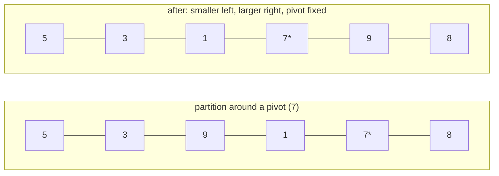

# Quick Sort

**Categoría:** Sorting

## El problema

El [Merge Sort](../merge-sort) de este repositorio garantiza O(n log n) sin importar el orden de
la entrada, pero paga esa garantía con un buffer auxiliar O(n). Lo que se necesita para un lote
grande y con memoria ajustada es O(n log n) en el caso promedio *in place* — sin array auxiliar —
aceptando un peor caso a cambio, siempre que ese peor caso pueda hacerse extremadamente
improbable, en lugar de algo que una entrada real y no confiable pueda disparar a propósito o por
accidente.

## La solución

Elige un pivote, particiona el rango de modo que todo lo menor que él quede a la izquierda y todo
lo mayor quede a la derecha — enteramente mediante intercambios dentro del array original, sin
buffer auxiliar — y luego recurre en cada lado. El paso de partición es O(n); la profundidad
promedio de recursión es O(log n), lo que da O(n log n) en el caso promedio. La trampa: una
elección de pivote *fija* (siempre el último elemento, por ejemplo) alcanza su peor caso O(n²)
exactamente con entradas ya ordenadas o en orden inverso — precisamente los dos órdenes que los
benchmarks de este repositorio ya prueban para todos los demás algoritmos de ordenamiento. Esta
implementación elige el pivote de forma **uniformemente aleatoria** dentro del rango actual antes
de cada partición. Eso no elimina el peor caso — sigue siendo matemáticamente posible — pero ata
el peor caso a la semilla aleatoria en lugar del orden propio de la entrada, que es lo que hace
que quicksort sea seguro de ejecutar sobre una entrada que no controlas, en lugar de una mina
terrestre esperando la única forma de entrada que lo rompe.



| Caso | Costo | Por qué |
|---|---|---|
| Promedio | O(n log n) | el pivote aleatorio divide el rango aproximadamente a la mitad en promedio, la misma forma de recursión que merge sort |
| Peor (teórico) | O(n²) | una racha de elecciones de pivote desafortunadas que cada una separa un solo elemento — posible para cualquier estrategia de pivote, pero la semilla aleatoria controla las probabilidades, no la entrada |
| Espacio | O(log n) auxiliar (pila de recursión) | el particionamiento ocurre in place; sin array de buffer, a diferencia de [Merge Sort](../merge-sort) |

## Ejemplo clásico

[`classic/QuickSort`](src/main/java/com/algorithms/sorting/quicksort/classic/QuickSort.java) es
genérico sobre `Comparator<? super T>` — sin atajo de `Arrays.sort`/`Collections.sort` — usando
particionamiento de Lomuto con un pivote aleatorizado intercambiado a la última posición antes de
cada llamada de partición. El `sort(array, comparator)` público usa un `java.util.Random` sin
semilla; una sobrecarga `sort(array, comparator, random)` package-private acepta un `Random`
inyectado para que las pruebas puedan ser determinísticas.
[`QuickSortTest`](src/test/java/com/algorithms/sorting/quicksort/classic/QuickSortTest.java)
cubre un array desordenado, ya ordenado, ordenado de forma inversa, duplicados, un array de un
solo elemento y uno vacío, un comparador personalizado (descendente), la sobrecarga pública sin
semilla, y ambas protecciones contra argumento nulo.

## Ejemplo aplicado: ordenamiento por percentil de reserva de siniestros de seguros

[`applied/ClaimAmountSort`](src/main/java/com/algorithms/sorting/quicksort/applied/ClaimAmountSort.java)
ordena un gran lote de siniestros de seguros por monto para el cálculo de reserva basado en
percentil (por ejemplo, "qué monto de siniestro marca el percentil 95 este trimestre"). Las
exportaciones de siniestros suelen llegar ya casi ordenadas — por ID de siniestro, que tiende a
correlacionarse con la fecha de presentación, que a su vez se correlaciona débilmente con el
monto para muchos tipos de siniestro — que es exactamente el tipo de entrada casi ordenada que
haría que un quicksort *no aleatorizado* degradara hacia su peor caso. Aleatorizar el pivote es
lo que mantiene esto seguro para ejecutarse sobre un lote real, no aleatorio de forma sintética.
[`ClaimAmountSortTest`](src/test/java/com/algorithms/sorting/quicksort/applied/ClaimAmountSortTest.java)
cubre siniestros ordenados en orden ascendente de monto, que el array de entrada queda intacto, y
la protección contra argumento nulo.

## Benchmark

```bash
./gradlew :sorting:quick-sort:jmh
```

Ejecución real en esta máquina (JMH 1.37, JDK 26.0.2, 2 iteraciones de calentamiento + 3
iteraciones de medición, 1 fork). Ya ordenado y ordenado de forma inversa — los dos órdenes que
serían catastróficos para un quicksort de pivote fijo — frente a una entrada totalmente
aleatoria:

| Costo de ordenamiento | size=100 | size=1,000 | size=10,000 |
|---|---:|---:|---:|
| ya ordenado | 6.127 µs | 81.923 µs | 1,001.669 µs |
| ordenado de forma inversa | 7.764 µs | 82.253 µs | 1,216.873 µs |
| aleatorio | 8.217 µs | 142.259 µs | 2,171.216 µs |

Ese es todo el punto, hecho medible: en size=10,000, lo aleatorio es solo **~2.2x** más costoso
que lo ya ordenado — no el 100x o más que mostraría el peor caso O(n²) de un quicksort no
aleatorizado exactamente con esta entrada. El pivote aleatorizado está haciendo su trabajo. El
crecimiento entre tamaños también confirma O(n log n), no O(n²): lo aleatorio pasa de
size=1,000 a size=10,000 (10x los datos) a ~15.3x el costo — cerca del ~13.3x que predice una
forma O(n log n), lejos del ~100x que mostraría un ordenamiento cuadrático para el mismo salto.
Vale la pena compararlo con el benchmark de [Merge Sort](../merge-sort) de este repositorio en la
misma máquina: ambos caen en un rango similar en size=10,000 (quicksort ~1,000–2,200 µs aquí vs.
merge sort ~950–1,700 µs) — un rendimiento de caso promedio genuinamente comparable, con
quicksort sin pagar asignación de buffer auxiliar y merge sort sin correr riesgo de peor caso.

## Cuándo no usarlo

- ¿Necesitas una cota garantizada de peor caso, no solo abrumadoramente probable — un sistema de
  tiempo real estricto, o una entrada que debas asumir como adversaria? El [Merge
  Sort](../merge-sort) de este repositorio renuncia a la propiedad in-place a cambio de una cota
  que no depende de la suerte aleatoria.
- ¿Necesitas estabilidad (que los elementos iguales mantengan su orden original)? Este esquema de
  particionamiento no la preserva — el [Merge Sort](../merge-sort) sí.
- ¿n muy pequeño? El factor constante menor de [Insertion Sort](../insertion-sort) gana antes de
  que el overhead de recursión se pague solo — que es exactamente la razón por la que las
  implementaciones de quicksort en producción recurren a insertion sort por debajo de un umbral
  de tamaño pequeño, el mismo hecho en el que se apoya el propio módulo de Insertion Sort de este
  repositorio.

## Cobertura de pruebas

100% de cobertura de instrucciones, 100% de cobertura de ramas (JaCoCo). Reprodúcelo tú mismo:

```bash
./gradlew :sorting:quick-sort:jacocoTestReport
```

Informe en `sorting/quick-sort/build/reports/jacoco/test/html/index.html`.

## Lectura complementaria

- Cormen, Leiserson, Rivest & Stein — *Introduction to Algorithms* (CLRS), 3.ª/4.ª ed.,
  Capítulo 7, "Quicksort", incluyendo la sección 7.3, "A randomized version of quicksort" — el
  tratamiento formal exactamente de la estrategia de aleatorización que este módulo implementa.
- Sedgewick & Wayne — *Algorithms*, 4.ª ed., Capítulo 2.3, "Quicksort" — incluye los
  refinamientos prácticos de ingeniería (barajado aleatorio antes de ordenar, corte a insertion
  sort para subarrays pequeños) que las implementaciones de producción añaden sobre el algoritmo
  central.
