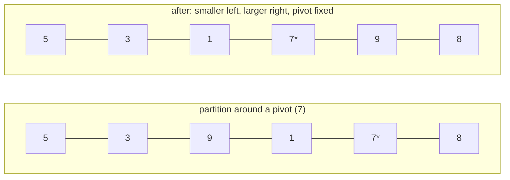

# Quick Sort

**Category:** Sorting

## The problem

This repo's [Merge Sort](../merge-sort) guarantees O(n log n) regardless of input order, but
pays for that guarantee with an O(n) auxiliary buffer. What's needed for a large, memory-tight
batch is average-case O(n log n) *in place* — no auxiliary array — accepting a worst case in
exchange, as long as that worst case can be made vanishingly unlikely rather than something
real, untrusted input could trigger on purpose or by accident.

## The solution

Pick a pivot, partition the range so everything smaller than it ends up to its left and
everything larger ends up to its right — entirely via swaps within the original array, no
auxiliary buffer — then recurse on each side. The partition step is O(n); the average recursion
depth is O(log n), giving average-case O(n log n). The catch: a *fixed* pivot choice (always the
last element, say) hits its O(n²) worst case on exactly already-sorted or reverse-sorted
input — precisely the two orderings this repo's benchmarks already test for every other sort.
This implementation picks the pivot **uniformly at random** from the current range before every
partition. That doesn't remove the worst case — it's still mathematically possible — but it ties
the worst case to the random seed instead of the input's own order, which is what makes
quicksort safe to run on input you don't control, rather than a landmine waiting for the one
input shape that breaks it.



| Case | Cost | Why |
|---|---|---|
| Average | O(n log n) | random pivot splits the range roughly in half on average, same recursion shape as merge sort |
| Worst (theoretical) | O(n²) | a run of unlucky pivot picks that each split off only one element — possible for any pivot strategy, but the random seed controls the odds, not the input |
| Space | O(log n) auxiliary (recursion stack) | partitioning happens in place; no buffer array, unlike [Merge Sort](../merge-sort) |

## Classic example

[`classic/QuickSort`](src/main/java/com/algorithms/sorting/quicksort/classic/QuickSort.java) is
generic over `Comparator<? super T>` — no `Arrays.sort`/`Collections.sort` shortcut — using
Lomuto partitioning with a randomized pivot swapped into the last position before every
partition call. The public `sort(array, comparator)` uses an unseeded `java.util.Random`; a
package-private `sort(array, comparator, random)` overload accepts an injected `Random` so tests
can be deterministic.
[`QuickSortTest`](src/test/java/com/algorithms/sorting/quicksort/classic/QuickSortTest.java)
covers an unordered array, already-sorted, reverse-sorted, duplicates, a single-element and an
empty array, a custom (descending) comparator, the public unseeded overload, and both
null-argument guards.

## Applied example: insurance claim reserve percentile sort

[`applied/ClaimAmountSort`](src/main/java/com/algorithms/sorting/quicksort/applied/ClaimAmountSort.java)
sorts a large batch of insurance claims by amount for percentile-based reserve calculation (e.g.
"what claim amount marks the 95th percentile this quarter"). Claim exports are commonly already
close to sorted — by claim ID, which tends to correlate with filing date, which itself
correlates loosely with amount for many claim types — which is exactly the kind of near-sorted
input that would make a *non-randomized* quicksort degrade toward its worst case. Randomizing
the pivot is what keeps this safe to run on a real, not synthetically-random, batch.
[`ClaimAmountSortTest`](src/test/java/com/algorithms/sorting/quicksort/applied/ClaimAmountSortTest.java)
covers claims sorted into ascending amount order, that the input array is left untouched, and
the null-argument guard.

## Benchmark

```bash
./gradlew :sorting:quick-sort:jmh
```

Real run on this machine (JMH 1.37, JDK 26.0.2, 2 warmup + 3 measurement iterations, 1 fork).
Already-sorted and reverse-sorted — the two orderings that would be catastrophic for a
fixed-pivot quicksort — against fully random input:

| Sort cost | size=100 | size=1,000 | size=10,000 |
|---|---:|---:|---:|
| already sorted | 6.127 µs | 81.923 µs | 1,001.669 µs |
| reverse sorted | 7.764 µs | 82.253 µs | 1,216.873 µs |
| random | 8.217 µs | 142.259 µs | 2,171.216 µs |

That's the whole point, made measurable: at size=10,000, random is only **~2.2x** more
expensive than already-sorted — not the 100x-plus a non-randomized quicksort's O(n²) worst case
would show on exactly this input. The randomized pivot is doing its job. Growth across sizes also
confirms O(n log n), not O(n²): random goes from size=1,000 to size=10,000 (10x the data) at
~15.3x the cost — close to the ~13.3x an O(n log n) shape predicts, nowhere near the ~100x a
quadratic sort would show for the same jump. Worth comparing against this repo's
[Merge Sort](../merge-sort) benchmark on the same machine: both land in a similar range at
size=10,000 (quicksort ~1,000–2,200 µs here vs. merge sort's ~950–1,700 µs) — genuinely
comparable average-case performance, with quicksort paying no auxiliary-buffer allocation and
merge sort paying no worst-case risk.

## When not to use it

- Need a guaranteed worst-case bound, not just an overwhelmingly likely one — a hard real-time
  system, or input you have to assume is adversarial? [Merge Sort](../merge-sort) from this repo
  gives up the in-place property in exchange for a bound that doesn't depend on random luck.
- Need stability (equal elements keeping their original order)? This partitioning scheme doesn't
  preserve it — [Merge Sort](../merge-sort) does.
- Very small n? [Insertion Sort](../insertion-sort)'s lower constant factor wins before
  recursion overhead pays for itself — which is exactly why production quicksort
  implementations fall back to insertion sort below a small size threshold, the same fact this
  repo's own Insertion Sort module leans on.

## Test coverage

100% instruction coverage, 100% branch coverage (JaCoCo). Reproduce it yourself:

```bash
./gradlew :sorting:quick-sort:jacocoTestReport
```

Report at `sorting/quick-sort/build/reports/jacoco/test/html/index.html`.

## Further reading

- Cormen, Leiserson, Rivest & Stein — *Introduction to Algorithms* (CLRS), 3rd/4th ed.,
  Chapter 7, "Quicksort", including section 7.3, "A randomized version of quicksort" — the
  formal treatment of exactly the randomization strategy this module implements.
- Sedgewick & Wayne — *Algorithms*, 4th ed., Chapter 2.3, "Quicksort" — includes the
  practical engineering refinements (random shuffle before sorting, cutoff to insertion sort for
  small subarrays) production implementations layer on top of the core algorithm.
