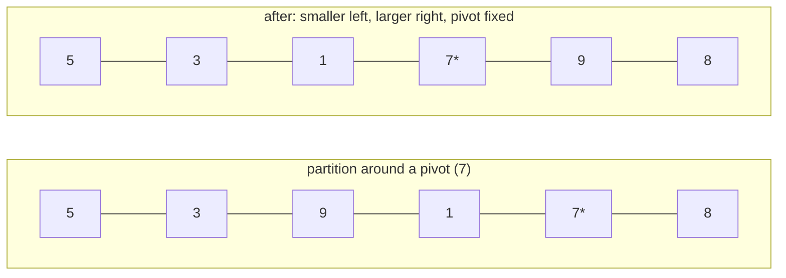

# Quick Sort

**Categoria:** Sorting

## O problema

O [Merge Sort](../merge-sort) deste repositório garante O(n log n) independentemente da ordem de
entrada, mas paga por essa garantia com um buffer auxiliar O(n). O que é necessário para um lote
grande e com restrição de memória é O(n log n) em caso médio *in place* — sem array auxiliar —
aceitando um pior caso em troca, desde que esse pior caso possa ser tornado extremamente
improvável, em vez de algo que uma entrada real e não confiável possa disparar de propósito ou
por acidente.

## A solução

Escolha um pivô, particione o intervalo de forma que tudo menor que ele fique à esquerda e tudo
maior fique à direita — inteiramente por meio de trocas dentro do array original, sem buffer
auxiliar — e então recorra em cada lado. A etapa de particionamento é O(n); a profundidade média
de recursão é O(log n), o que resulta em O(n log n) em caso médio. A pegadinha: uma escolha de
pivô *fixa* (sempre o último elemento, por exemplo) atinge seu pior caso O(n²) exatamente com
entradas já ordenadas ou ordenadas de forma reversa — precisamente as duas ordenações que os
benchmarks deste repositório já testam para todo outro algoritmo de ordenação. Esta implementação
escolhe o pivô de forma **uniformemente aleatória** dentro do intervalo atual antes de cada
particionamento. Isso não elimina o pior caso — ele ainda é matematicamente possível — mas
vincula o pior caso à semente aleatória em vez da ordem da própria entrada, o que é o que torna o
quicksort seguro para rodar sobre entradas que você não controla, em vez de uma mina terrestre
esperando pela única forma de entrada que o quebra.



| Caso | Custo | Por quê |
|---|---|---|
| Médio | O(n log n) | o pivô aleatório divide o intervalo aproximadamente ao meio em média, mesmo formato de recursão do merge sort |
| Pior (teórico) | O(n²) | uma sequência de escolhas de pivô azaradas que cada uma separa apenas um elemento — possível para qualquer estratégia de pivô, mas a semente aleatória controla as chances, não a entrada |
| Espaço | O(log n) auxiliar (pilha de recursão) | o particionamento acontece in place; sem array de buffer, diferente do [Merge Sort](../merge-sort) |

## Exemplo clássico

[`classic/QuickSort`](src/main/java/com/algorithms/sorting/quicksort/classic/QuickSort.java) é
genérico sobre `Comparator<? super T>` — sem atalho de `Arrays.sort`/`Collections.sort` — usando
particionamento de Lomuto com um pivô randomizado trocado para a última posição antes de cada
chamada de particionamento. O `sort(array, comparator)` público usa um `java.util.Random` sem
semente; uma sobrecarga `sort(array, comparator, random)` package-private aceita um `Random`
injetado para que os testes possam ser determinísticos.
[`QuickSortTest`](src/test/java/com/algorithms/sorting/quicksort/classic/QuickSortTest.java)
cobre um array desordenado, já ordenado, ordenado de forma reversa, duplicatas, um array de
elemento único e um vazio, um comparador customizado (descendente), a sobrecarga pública sem
semente, e ambas as proteções contra argumento nulo.

## Exemplo aplicado: ordenação por percentil de reserva de sinistros de seguros

[`applied/ClaimAmountSort`](src/main/java/com/algorithms/sorting/quicksort/applied/ClaimAmountSort.java)
ordena um grande lote de sinistros de seguro por valor para o cálculo de reserva baseado em
percentil (por exemplo, "qual valor de sinistro marca o percentil 95 neste trimestre"). Exportações
de sinistros comumente já chegam quase ordenadas — por ID do sinistro, que tende a se correlacionar
com a data de abertura, que por sua vez se correlaciona frouxamente com o valor para muitos tipos
de sinistro — que é exatamente o tipo de entrada quase ordenada que faria um quicksort *não
randomizado* degradar em direção ao seu pior caso. Randomizar o pivô é o que mantém isso seguro
para rodar sobre um lote real, não sinteticamente aleatório.
[`ClaimAmountSortTest`](src/test/java/com/algorithms/sorting/quicksort/applied/ClaimAmountSortTest.java)
cobre sinistros ordenados em ordem crescente de valor, que o array de entrada permanece intocado,
e a proteção contra argumento nulo.

## Benchmark

```bash
./gradlew :sorting:quick-sort:jmh
```

Execução real nesta máquina (JMH 1.37, JDK 26.0.2, 2 iterações de aquecimento + 3 iterações de
medição, 1 fork). Já ordenado e ordenado de forma reversa — as duas ordenações que seriam
catastróficas para um quicksort de pivô fixo — comparados a uma entrada totalmente aleatória:

| Custo de ordenação | size=100 | size=1,000 | size=10,000 |
|---|---:|---:|---:|
| já ordenado | 6.127 µs | 81.923 µs | 1,001.669 µs |
| ordenado de forma reversa | 7.764 µs | 82.253 µs | 1,216.873 µs |
| aleatório | 8.217 µs | 142.259 µs | 2,171.216 µs |

Esse é todo o ponto, tornado mensurável: em size=10,000, o aleatório é apenas **~2.2x** mais caro
que o já ordenado — não o 100x ou mais que o pior caso O(n²) de um quicksort não randomizado
mostraria exatamente com essa entrada. O pivô randomizado está fazendo seu trabalho. O
crescimento entre os tamanhos também confirma O(n log n), não O(n²): o aleatório vai de
size=1,000 para size=10,000 (10x os dados) a ~15.3x o custo — próximo do ~13.3x que um formato
O(n log n) prevê, longe do ~100x que uma ordenação quadrática mostraria para o mesmo salto. Vale
a pena comparar com o benchmark do [Merge Sort](../merge-sort) deste repositório na mesma
máquina: ambos ficam em uma faixa semelhante em size=10,000 (quicksort ~1,000–2,200 µs aqui vs.
merge sort ~950–1,700 µs) — desempenho de caso médio genuinamente comparável, com o quicksort não
pagando alocação de buffer auxiliar e o merge sort não correndo risco de pior caso.

## Quando não usar

- Precisa de um limite garantido de pior caso, não apenas extremamente provável — um sistema de
  tempo real rígido, ou uma entrada que você precisa assumir como adversária? O [Merge
  Sort](../merge-sort) deste repositório abre mão da propriedade in-place em troca de um limite
  que não depende de sorte aleatória.
- Precisa de estabilidade (elementos iguais mantendo sua ordem original)? Este esquema de
  particionamento não a preserva — o [Merge Sort](../merge-sort) preserva.
- n muito pequeno? O fator constante menor do [Insertion Sort](../insertion-sort) vence antes que
  o overhead de recursão se pague — que é exatamente o motivo pelo qual implementações de
  quicksort em produção recorrem ao insertion sort abaixo de um pequeno limiar de tamanho, o
  mesmo fato em que o próprio módulo de Insertion Sort deste repositório se apoia.

## Cobertura de testes

100% de cobertura de instruções, 100% de cobertura de branches (JaCoCo). Reproduza você mesmo:

```bash
./gradlew :sorting:quick-sort:jacocoTestReport
```

Relatório em `sorting/quick-sort/build/reports/jacoco/test/html/index.html`.

## Leitura complementar

- Cormen, Leiserson, Rivest & Stein — *Introduction to Algorithms* (CLRS), 3ª/4ª ed.,
  Capítulo 7, "Quicksort", incluindo a seção 7.3, "A randomized version of quicksort" — o
  tratamento formal exatamente da estratégia de randomização que este módulo implementa.
- Sedgewick & Wayne — *Algorithms*, 4ª ed., Capítulo 2.3, "Quicksort" — inclui os
  refinamentos práticos de engenharia (embaralhamento aleatório antes da ordenação, corte para
  insertion sort em subarrays pequenos) que implementações de produção acrescentam sobre o
  algoritmo central.
