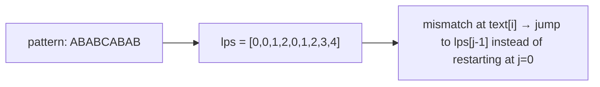

# Knuth-Morris-Pratt

**Categoría:** String Matching

## El problema

Encontrar todas las posiciones donde aparece un patrón dentro de un texto. Verificar cada posición
inicial desde cero — comparando el patrón con el texto carácter por carácter, reiniciando en la
siguiente posición ante cualquier discrepancia — es O(n × m). Para la mayoría de las entradas esto
ya es rápido en la práctica, pero para un texto que sigue *casi* coincidiendo con el patrón antes
de fallar cerca del final, es realmente así de lento: cada casi-coincidencia obliga a una
recomparación casi completa.

## La solución

La idea clave: cuando ocurre una discrepancia después de que ya coincidieron varios caracteres,
esos caracteres coincidentes no son información descartable — indican exactamente hasta dónde
puede reconocerse que el patrón ya coincide parcialmente consigo mismo, que es exactamente cuánto
puede avanzar el escaneo con seguridad sin retroceder nunca en el texto. Eso se precalcula una sola
vez por patrón como la **función de falla** (también llamada arreglo LPS — el prefijo propio más
largo que también es sufijo, calculado en cada posición del patrón). Con eso en mano, el texto se
escanea exactamente una vez — O(n + m) en total: una pasada de preprocesamiento sobre el patrón,
una pasada sobre el texto, sin retroceso.



## Ejemplo clásico

[`classic/KnuthMorrisPratt`](src/main/java/com/algorithms/stringmatching/knuthmorrispratt/classic/KnuthMorrisPratt.java)
expone `failureFunction` directamente (no solo como un paso interno) para que pueda verificarse
contra un ejemplo resuelto conocido, además de `search` y un `bruteForceSearch` incluido
específicamente para el benchmark de abajo.
[`KnuthMorrisPrattTest`](src/test/java/com/algorithms/stringmatching/knuthmorrispratt/classic/KnuthMorrisPrattTest.java)
verifica la función de falla contra el ejemplo clásico estándar `"ABABCABAB"`
(`[0,0,1,2,0,1,2,3,4]`), comprueba coincidencias solapadas y no solapadas, y — la prueba
importante — ejecuta tanto `search` como `bruteForceSearch` sobre el mismo texto de
casi-coincidencia deliberadamente patológico y verifica que devuelven el resultado idéntico. Que
dos algoritmos implementados de forma independiente coincidan en cada resultado, incluso en la
entrada construida para ser la más difícil, es la evidencia real de que la lógica de salto de la
función de falla no hace que KMP pierda nada.

## Ejemplo aplicado: escaneo de lista de vigilancia en una plataforma antifraude

[`applied/TransactionNarrationScanner`](src/main/java/com/algorithms/stringmatching/knuthmorrispratt/applied/TransactionNarrationScanner.java)
escanea el campo de texto libre de la narración de una transacción en busca de tokens conocidos de
la lista de vigilancia — fragmentos de comercios en lista negra, subcadenas de nombres de
entidades sancionadas — el tipo de escaneo que una plataforma antifraude ejecuta en cada
transacción de un flujo de alto volumen. Eso hace que el peor caso importe, no solo el caso
promedio: el peor caso O(n × m) de la búsqueda de subcadenas por fuerza bruta es aquí una
superficie de ataque de complejidad algorítmica genuina, no una preocupación teórica — el campo de
memo de una transferencia bancaria es texto influenciable por un atacante, y un patrón de
casi-coincidencia diseñado deliberadamente podría ralentizar a propósito un escáner de fuerza
bruta. La garantía O(n + m) de KMP se mantiene sin importar cuán adversarial sea la entrada.
[`TransactionNarrationScannerTest`](src/test/java/com/algorithms/stringmatching/knuthmorrispratt/applied/TransactionNarrationScannerTest.java)
cubre una narración marcada, una limpia y la protección ante valores nulos.

## Benchmark

```bash
./gradlew :string-matching:knuth-morris-pratt:jmh
```

Ejecución real en esta máquina (JMH 1.37, JDK 26.0.2, 2 iteraciones de warmup + 3 de medición, 1
fork). El texto es `size` copias de `'A'` más una `'B'` final; el patrón es `size/2` copias de
`'A'` más una `'B'` final — el verdadero peor caso de la fuerza bruta, ya que casi cada posición
inicial coincide con toda la secuencia de casi-coincidencia antes de fallar finalmente en el
último carácter:

| Costo | size=200 | size=2,000 | size=20,000 |
|---|---:|---:|---:|
| KMP | 2.29 µs | 20.32 µs | 221.20 µs |
| fuerza bruta | 23.33 µs | 2,279.27 µs | 225,178.79 µs |

El crecimiento de la fuerza bruta coincide de cerca con la predicción cuadrática: un aumento de
10x en `size` debería multiplicar el costo por aproximadamente 100x, y se midió **97.7x**
(200→2,000) y **98.8x** (2,000→20,000) en los dos pasos. El crecimiento de KMP se mantuvo cercano
a lineal en ambos pasos (**8.9x**, **10.9x**) — exactamente la brecha entre O(n²) y O(n) que la
función de falla existe para crear. En size=20,000, la fuerza bruta es **~1,018x más lenta** que
KMP en una entrada construida específicamente para ser su peor caso.

## Cuándo no usarlo

- ¿Se busca un patrón fijo una sola vez en un texto corto? La simplicidad de la fuerza bruta puede
  no justificar la sobrecarga de preprocesamiento de la función de falla — el punto de equilibrio
  solo compensa en textos más largos o en muchas búsquedas repetidas.
- ¿Se necesita buscar *muchos* patrones contra el mismo texto, o un patrón contra *muchos*
  textos? Otros algoritmos de coincidencia de cadenas (Aho-Corasick para muchos patrones a la vez,
  Boyer-Moore para patrones largos con un alfabeto grande) pueden superar a KMP en esos escenarios
  específicos — la fortaleza de KMP es su garantía de peor caso, no necesariamente el mejor caso
  promedio en cada escenario.
- ¿Se necesita coincidencia aproximada/difusa (permitiendo errores de tipeo o ediciones) en lugar
  de coincidencia exacta de subcadenas? Esto es un problema completamente distinto — ver la
  familia de algoritmos de distancia de edición.

## Cobertura de pruebas

100% de cobertura de instrucciones, 100% de cobertura de ramas (JaCoCo). Reprodúcelo tú mismo:

```bash
./gradlew :string-matching:knuth-morris-pratt:jacocoTestReport
```

Informe en `string-matching/knuth-morris-pratt/build/reports/jacoco/test/html/index.html`.

## Lectura complementaria

- Cormen, Leiserson, Rivest & Stein — *Introduction to Algorithms* (CLRS), 3.ª/4.ª ed.,
  Capítulo 32.4, "The Knuth-Morris-Pratt algorithm" — deriva la función de falla desde primeros
  principios y demuestra la cota O(n + m) que el benchmark de este módulo confirma
  empíricamente.
- Sedgewick & Wayne — *Algorithms*, 4.ª ed. — presenta KMP junto a Boyer-Moore y Rabin-Karp como
  una comparación directa de estrategias de coincidencia de cadenas, contexto útil para los
  compromisos de "Cuándo no usarlo" mencionados arriba.
