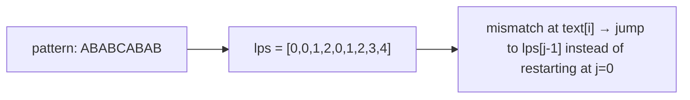

# Knuth-Morris-Pratt

**Category:** String Matching

## The problem

Finding every position where a pattern occurs inside a text. Checking every starting position
from scratch — comparing the pattern against the text character by character, restarting at the
next position on any mismatch — is O(n × m). For most inputs that's already fast in practice, but
for a text that keeps *almost* matching the pattern before failing near the end, it's genuinely
that slow: every near-miss forces a near-complete re-comparison.

## The solution

The insight: when a mismatch happens after several characters have already matched, those
matched characters aren't discarded information — they tell you exactly how far the pattern can
be recognized as already partially matching itself, which is exactly how far the scan can safely
skip ahead without ever stepping backward through the text. That's precomputed once per pattern as
the **failure function** (also called the LPS array — longest proper prefix that's also a suffix,
computed at every position of the pattern). With it in hand, the text is scanned exactly once —
O(n + m) total: one preprocessing pass over the pattern, one pass over the text, no backtracking.



## Classic example

[`classic/KnuthMorrisPratt`](src/main/java/com/algorithms/stringmatching/knuthmorrispratt/classic/KnuthMorrisPratt.java)
exposes `failureFunction` directly (not just as an internal step) so it can be checked against a
known worked example, plus `search` and a `bruteForceSearch` included specifically for the
benchmark below.
[`KnuthMorrisPrattTest`](src/test/java/com/algorithms/stringmatching/knuthmorrispratt/classic/KnuthMorrisPrattTest.java)
verifies the failure function against the standard `"ABABCABAB"` textbook example
(`[0,0,1,2,0,1,2,3,4]`), checks overlapping and non-overlapping matches, and — the important
proof — runs both `search` and `bruteForceSearch` against the same deliberately pathological
near-miss text and asserts they return the identical result. Two independently-implemented
algorithms agreeing on every match, including on the input built to be hardest, is the actual
evidence that the failure-function skipping logic doesn't cause KMP to miss anything.

## Applied example: fraud platform watchlist scanning

[`applied/TransactionNarrationScanner`](src/main/java/com/algorithms/stringmatching/knuthmorrispratt/applied/TransactionNarrationScanner.java)
scans the free-text narration field of a transaction for known watchlist tokens — blacklisted
merchant fragments, sanctioned-entity name substrings — the kind of scan a fraud platform runs on
every single transaction in a high-volume stream. That makes the *worst* case matter, not just the
average case: brute-force substring search's O(n × m) worst case is a genuine algorithmic-
complexity attack surface here, not a theoretical concern — a wire-transfer memo field is
attacker-influenced text, and a near-miss pattern crafted deliberately could slow a brute-force
scanner down on purpose. KMP's O(n + m) guarantee holds no matter how adversarial the input is.
[`TransactionNarrationScannerTest`](src/test/java/com/algorithms/stringmatching/knuthmorrispratt/applied/TransactionNarrationScannerTest.java)
covers a flagged narration, a clean one, and the null guard.

## Benchmark

```bash
./gradlew :string-matching:knuth-morris-pratt:jmh
```

Real run on this machine (JMH 1.37, JDK 26.0.2, 2 warmup + 3 measurement iterations, 1 fork).
The text is `size` copies of `'A'` plus a trailing `'B'`; the pattern is `size/2` copies of `'A'`
plus a trailing `'B'` — brute force's true worst case, since almost every starting position
matches the entire near-miss run before finally failing on the last character:

| Cost | size=200 | size=2,000 | size=20,000 |
|---|---:|---:|---:|
| KMP | 2.29 µs | 20.32 µs | 221.20 µs |
| brute force | 23.33 µs | 2,279.27 µs | 225,178.79 µs |

Brute force's growth matches the quadratic prediction closely: a 10x increase in `size` should
roughly 100x the cost, and it measured **97.7x** (200→2,000) and **98.8x** (2,000→20,000) on the
two steps. KMP's growth stayed close to linear on both steps (**8.9x**, **10.9x**) — exactly the
gap between O(n²) and O(n) that the failure function exists to create. At size=20,000, brute
force is **~1,018x slower** than KMP on an input built specifically to be its worst case.

## When not to use it

- Searching for a fixed pattern only once in a short text? Brute force's simplicity may not be
  worth the failure-function preprocessing overhead — the crossover only pays off on longer texts
  or many repeated searches.
- Need to search for *many* patterns against the same text, or one pattern against *many* texts?
  Other string-matching algorithms (Aho-Corasick for many patterns at once, Boyer-Moore for long
  patterns with a large alphabet) can outperform KMP in those specific shapes — KMP's strength is
  its worst-case guarantee, not necessarily the best average case in every scenario.
- Approximate/fuzzy matching (allowing typos or edits) is needed rather than exact substring
  matching? This is a different problem entirely — see the edit-distance family of algorithms.

## Test coverage

100% instruction coverage, 100% branch coverage (JaCoCo). Reproduce it yourself:

```bash
./gradlew :string-matching:knuth-morris-pratt:jacocoTestReport
```

Report at `string-matching/knuth-morris-pratt/build/reports/jacoco/test/html/index.html`.

## Further reading

- Cormen, Leiserson, Rivest & Stein — *Introduction to Algorithms* (CLRS), 3rd/4th ed.,
  Chapter 32.4, "The Knuth-Morris-Pratt algorithm" — derives the failure function from first
  principles and proves the O(n + m) bound this module's benchmark confirms empirically.
- Sedgewick & Wayne — *Algorithms*, 4th ed. — presents KMP alongside Boyer-Moore and Rabin-Karp
  as a direct comparison of string-matching strategies, useful context for the "When not to use
  it" tradeoffs above.
