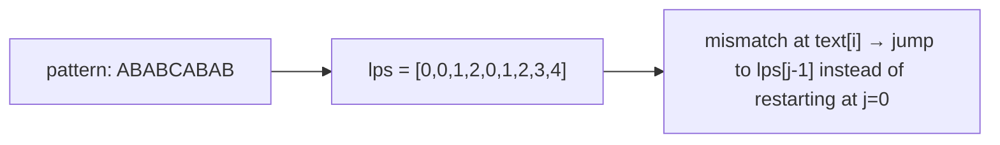

# Knuth-Morris-Pratt

**Categoria:** String Matching

## O problema

Encontrar toda posição em que um padrão ocorre dentro de um texto. Verificar cada posição inicial
do zero — comparando o padrão com o texto caractere a caractere, reiniciando na próxima posição a
cada incompatibilidade — é O(n × m). Para a maioria das entradas isso já é rápido na prática, mas
para um texto que fica quase combinando com o padrão antes de falhar perto do fim, essa lentidão é
real: cada quase-acerto força uma recomparação quase completa.

## A solução

A percepção-chave: quando ocorre uma incompatibilidade depois que vários caracteres já
combinaram, esses caracteres combinados não são informação descartável — eles dizem exatamente até
onde o padrão pode ser reconhecido como já parcialmente combinando consigo mesmo, que é exatamente
até onde a varredura pode avançar com segurança sem nunca retroceder no texto. Isso é
pré-computado uma única vez por padrão como a **função de falha** (também chamada de array LPS —
o maior prefixo próprio que também é sufixo, calculado em cada posição do padrão). Com ela em
mãos, o texto é varrido exatamente uma vez — O(n + m) no total: uma passada de pré-processamento
sobre o padrão, uma passada sobre o texto, sem retrocesso.



## Exemplo clássico

[`classic/KnuthMorrisPratt`](src/main/java/com/algorithms/stringmatching/knuthmorrispratt/classic/KnuthMorrisPratt.java)
expõe `failureFunction` diretamente (não apenas como um passo interno) para que possa ser
verificada contra um exemplo trabalhado conhecido, além de `search` e um `bruteForceSearch`
incluído especificamente para o benchmark abaixo.
[`KnuthMorrisPrattTest`](src/test/java/com/algorithms/stringmatching/knuthmorrispratt/classic/KnuthMorrisPrattTest.java)
verifica a função de falha contra o exemplo clássico padrão `"ABABCABAB"` (`[0,0,1,2,0,1,2,3,4]`),
verifica correspondências sobrepostas e não sobrepostas, e — a prova importante — executa tanto
`search` quanto `bruteForceSearch` contra o mesmo texto de quase-acerto deliberadamente
patológico e verifica que retornam o resultado idêntico. Dois algoritmos implementados de forma
independente concordando em cada correspondência, inclusive na entrada construída para ser a mais
difícil, é a evidência real de que a lógica de salto da função de falha não faz o KMP perder nada.

## Exemplo aplicado: varredura de lista de vigilância de plataforma antifraude

[`applied/TransactionNarrationScanner`](src/main/java/com/algorithms/stringmatching/knuthmorrispratt/applied/TransactionNarrationScanner.java)
varre o campo de texto livre de narração de uma transação em busca de tokens conhecidos de lista
de vigilância — fragmentos de comerciantes na lista negra, substrings de nomes de entidades
sancionadas — o tipo de varredura que uma plataforma antifraude executa em cada transação de um
fluxo de alto volume. Isso faz o pior caso importar, não apenas o caso médio: o pior caso O(n × m)
da busca de substring por força bruta é aqui uma superfície de ataque de complexidade algorítmica
genuína, não uma preocupação teórica — o campo de memo de uma transferência bancária é texto
influenciável por um atacante, e um padrão de quase-acerto criado deliberadamente poderia
propositalmente deixar um scanner de força bruta mais lento. A garantia O(n + m) do KMP se mantém
não importa quão adversarial seja a entrada.
[`TransactionNarrationScannerTest`](src/test/java/com/algorithms/stringmatching/knuthmorrispratt/applied/TransactionNarrationScannerTest.java)
cobre uma narração sinalizada, uma limpa e a proteção contra nulo.

## Benchmark

```bash
./gradlew :string-matching:knuth-morris-pratt:jmh
```

Execução real nesta máquina (JMH 1.37, JDK 26.0.2, 2 iterações de warmup + 3 de medição, 1 fork).
O texto é `size` cópias de `'A'` mais um `'B'` no final; o padrão é `size/2` cópias de `'A'` mais
um `'B'` no final — o verdadeiro pior caso da força bruta, já que quase toda posição inicial
combina com toda a sequência de quase-acerto antes de finalmente falhar no último caractere:

| Custo | size=200 | size=2,000 | size=20,000 |
|---|---:|---:|---:|
| KMP | 2.29 µs | 20.32 µs | 221.20 µs |
| força bruta | 23.33 µs | 2,279.27 µs | 225,178.79 µs |

O crescimento da força bruta acompanha de perto a previsão quadrática: um aumento de 10x em `size`
deveria multiplicar o custo por aproximadamente 100x, e mediu-se **97.7x** (200→2,000) e **98.8x**
(2,000→20,000) nos dois passos. O crescimento do KMP se manteve próximo do linear em ambos os
passos (**8.9x**, **10.9x**) — exatamente a diferença entre O(n²) e O(n) que a função de falha
existe para criar. Em size=20,000, a força bruta é **~1,018x mais lenta** que o KMP em uma entrada
construída especificamente para ser seu pior caso.

## Quando não usar

- Buscando um padrão fixo apenas uma vez em um texto curto? A simplicidade da força bruta pode não
  valer a sobrecarga de pré-processamento da função de falha — o ponto de equilíbrio só compensa
  em textos mais longos ou em muitas buscas repetidas.
- Precisa buscar *muitos* padrões no mesmo texto, ou um padrão em *muitos* textos? Outros
  algoritmos de correspondência de strings (Aho-Corasick para muitos padrões de uma vez,
  Boyer-Moore para padrões longos com um alfabeto grande) podem superar o KMP nesses cenários
  específicos — a força do KMP é sua garantia de pior caso, não necessariamente o melhor caso
  médio em todo cenário.
- É necessária correspondência aproximada/fuzzy (permitindo erros de digitação ou edições) em vez
  de correspondência exata de substring? Isso é um problema completamente diferente — veja a
  família de algoritmos de distância de edição.

## Cobertura de testes

100% de cobertura de instruções, 100% de cobertura de branches (JaCoCo). Reproduza você mesmo:

```bash
./gradlew :string-matching:knuth-morris-pratt:jacocoTestReport
```

Relatório em `string-matching/knuth-morris-pratt/build/reports/jacoco/test/html/index.html`.

## Leitura complementar

- Cormen, Leiserson, Rivest & Stein — *Introduction to Algorithms* (CLRS), 3ª/4ª ed.,
  Capítulo 32.4, "The Knuth-Morris-Pratt algorithm" — deriva a função de falha a partir de
  princípios básicos e prova o limite O(n + m) que o benchmark deste módulo confirma
  empiricamente.
- Sedgewick & Wayne — *Algorithms*, 4ª ed. — apresenta o KMP ao lado de Boyer-Moore e Rabin-Karp
  como uma comparação direta de estratégias de correspondência de strings, contexto útil para os
  trade-offs de "Quando não usar" acima.
